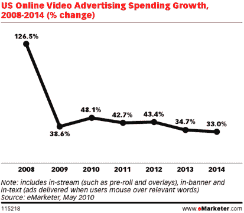
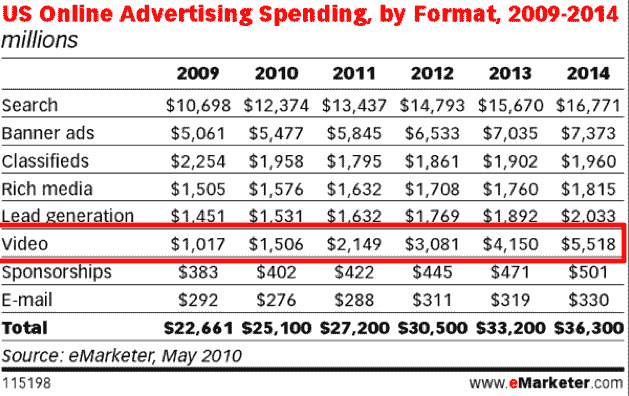

# 业内人士表示，在线视频广告正在达到一个“疯狂点”

> 原文：<https://web.archive.org/web/https://techcrunch.com/2010/08/20/online-video-advertising-frenzy/>

随着洪水而来的是盛宴。广告费正涌入在线视频。一些最大的在线视频广告网络本季度收入增长加速，预计第四季度会更大。“去年我们增长了 40%，今年增长了 90%，”T2 媒体公司首席执行官基思·里奇曼说。他预计，Break 第三季度的总收入(不仅仅包括视频广告)将首次超过 1，000 万美元。

最大的视频广告网络之一的震颤媒体(T4)提供的视频广告数量仅次于 Hulu(T6 ),广告收入也翻了一番。"在过去的三个季度里，它已经达到了疯狂的程度."首席执行官杰森.格利克曼告诉我。“我们看到电视资金正转向在线视频，”他宣称。第四季度“正在成为一个庞然大物”，明年震颤的收入有望突破 1 亿美元。

电视广告仍然让在线视频相形见绌，美国在这方面的支出约为 700 亿美元。根据 eMarketer 的数据，在线视频广告预计今年将达到 15 亿美元，高于去年的 10 亿美元。“与即将到来的预算相比，我们在 10 亿或 20 亿美元的在线视频市场份额微不足道，”格利克曼说。

广告预算从电视向网络的相对较小的转移，可能会给在线视频的增长带来巨大的波动。eMarketer 估计，2010 年在线视频广告将增长 48%，高于去年的 39%(与 2008 年 127%的高速增长相比，这是一个疲软的一年)。但从震颤和破裂的情况来看，15 亿美元的估计可能是保守的。格利克曼预计明年的收入将超过 1 亿美元。警告:将他们的经历视为恰好相符的行业轶事快照。

很可能只有像 Hulu 这样的大型广告网络和公司才能获得绝大部分的新广告收入。“如果你不在 comScore 的前 10 名之内，你的日子会很难过，”Richman 指出，“钱会流向大公司。”电视广告客户希望匹配他们在电视上的影响力，被认为是安全、专业内容的在线视频正开始达到这些水平。格利克曼说:“它不是美国偶像，但它就像一个大型有线电视网。“通过单一媒体在线购买，广告商还无法在一小时内接触到 3000 万人，但他们可以在一周内接触到这么多人，他们可以瞄准特定的人口统计数据，并获得关于广告效果的一些反馈，这是电视广告仍然不能做得很好的。

广告商越来越习惯将视频广告放到网上。Hulu 是这一趋势的最大受益者，它可能正在[申请 IPO](https://web.archive.org/web/20230325151751/https://techcrunch.com/2010/08/16/hulu-not-ready-public/) 。如果一个广告商已经在电视上投放了反对豪斯或办公室的广告，那么在 Hulu 上进行匹配是显而易见的。但他们也开始信任更大的视频广告网络，如震颤和突破，这些广告针对更广泛的专业制作的视频，从男生视频到体育剪辑和电影预告片。

“我从未见过从 50 万美元开始的测试预算，”格利克曼说。通常广告公司开始测试的时候只有十分之一。此外，在这一年中，他还看到了十几个更大的承诺，金额达到两位数百万，他称之为“在线视频预付”，因为它们像普通的电视预付一样提前谈判。根据 comScore 的数据，Hulu 在 7 月份展示了最多的视频广告，达到 7.83 亿次，但震颤以 4.52 亿次的视频广告浏览量位居第二。

对于较大的玩家和广告网络来说，视频肯定会成为一个庞大且不断增长的业务，但这些广告收入也会渗透到较小的玩家身上吗？

*图片来源:Flickr/ [凯茜·斯坦利-埃里克森](https://web.archive.org/web/20230325151751/http://www.flickr.com/photos/madcitycat/3585726415/)。*

