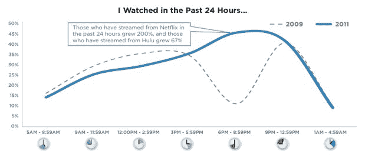
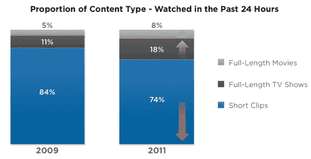

# 雅虎研究显示在线视频观看转向黄金时段

> 原文：<https://web.archive.org/web/http://techcrunch.com/2011/06/29/online-video-shift-primetim/>

# 雅虎研究显示在线视频观看转向黄金时段

雅虎的一项新研究显示，在线视频观看习惯正在转变。人们正在观看更长的视频，并且在晚上的黄金时段看得更多。上面的图表显示了人们在线观看视频的时间。蓝线是今天(2011 年)，虚线是两年前(2009 年)。这两条线显示了黄金时段超过 30%的背离。

那么是什么改变了呢？今天的在线视频观看高峰是在下午 6 点到 9 点的黄金时段。仅仅两年前，黄金时段的在线视频观看量出现了最大幅度的下降，因为人们关掉了电脑，打开了电视。但现在，越来越多的人正在从网飞和 Hulu 等服务上观看电视节目和电影，他们倾向于在以前观看普通电视的同一时间段观看这些视频。虽然人们可能还没有断网，但这一数据表明，在线观看确实侵占了常规的有线电视和卫星电视观看。

毫不奇怪，人们正在在线观看更长的视频(见下图)。今天，18%的在线视频是完整长度的电视节目，而两年前只有 11%。8%是完整长度的电影，高于 2009 年的 5%。与此同时，由在线观看的短片组成的整体视频内容的比例下降了 10 个百分点，从 84%降至 74%。

其他一些有趣的数据:

*   分享视频的人比例有所下降，从 2009 年的 34%下降到 26%。这可能是因为老年人观看在线视频，分享较少。
*   专业制作的视频上的广告(45%)比“像我这样的人制作的”视频上的广告(36%)更能唤起广告客户的回忆。
*   当在线视频显示在文章中时，更有可能被观看，57%的人说他们喜欢视频+文章的组合。

[scribd id = 58986289 key = key-yvy 8 LX 3s 0 RS 7t 54 Izz 7 mode = list]