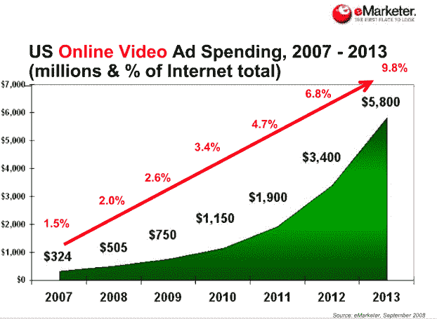
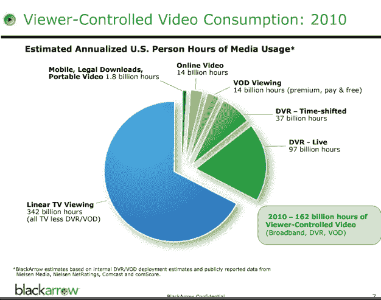

# 网络视频:钱在哪里？TechCrunch

> 原文：<https://web.archive.org/web/https://techcrunch.com/2008/11/13/online-video-wheres-the-money/>

以下是在线视频的严峻现实:没有人赚到多少钱，对在线视频广告从 2008 年的 5 亿美元到五年内超过 50 亿美元的热情预测无疑将在未来几周内下调，因为分析师们会重新审视这些数字。(这些数据来自 8 月份— [eMarketer](https://web.archive.org/web/20221006024334/http://www.emarketer.com/Article.aspx?id=1006485) )。

写作已经在墙上。YouTube 正在向[最性感的竞标者](https://web.archive.org/web/20221006024334/http://www.beta.techcrunch.com/2008/11/12/more-sex-videos-for-everyone-youtube-sells-video-search-results-to-the-highest-bidder/)出售视频搜索结果，就在今天[宣布](https://web.archive.org/web/20221006024334/http://adsense.blogspot.com/2008/11/now-serving-overlay-ads-in-embedded.html)将 YouTube 合作伙伴视频中的叠加广告扩展到其他网站的嵌入视频(以前这些广告只会出现在 YouTube 本身)。它正竭尽全力让这些收入流动起来。与此同时，规模较小的视频初创公司，如 [Veoh](https://web.archive.org/web/20221006024334/http://www.beta.techcrunch.com/2008/11/05/video-startup-veoh-cuts-18-of-staff/) 和[revision 3](https://web.archive.org/web/20221006024334/http://www.beta.techcrunch.com/2008/10/27/revision3-cuts-back-on-shows-and-staff/)为了生存，已经削减了员工和节目。所以你可以把这张幻灯片扔出窗外:

视频库存很多，只是广告商想要的不多。尽管 YouTube 每月播放超过 50 亿个视频，但据估计，这些视频中只有 3%到 4%有广告。这仍然是一个很大的视频数量，但这意味着像 Hulu 这样的小得多的竞争对手，只专注于专业制作的，广告客户友好的视频，在收入上比视频流的原始数量更接近 YouTube。

但是，即使是电视网制作和在线发行的视频，其广告收入也只是普通电视的一小部分。NBC 首席执行官杰夫·朱克担心网络会把“模拟美元”变成“数字便士”,这种担心正在成为现实。据 [BlackArrow](https://web.archive.org/web/20221006024334/http://www.blackarrow.tv/) (一家为有线和网络视频点播提供广告管理系统的公司)的首席执行官迪恩·登哈特称，主流视频在广播和有线电视上每小时平均能为每一千~~观众带来 50 美分的收入，相比之下，在网络上每小时每一千~~观众观看同一视频的收入为 16 美分。【**更正**:这个我有点弄错了。BlackArrow 对电视和网络视频价值的比较不是根据广告印象，而是根据每小时观看的视频，并在前面的句子中进行了修正。正确的比较结果是电视观众每名 50 美分，而网络观众每名 16 美分】。~~~~

换句话说，电视和媒体公司把视频放在电视上比放在网上能赚十倍的钱，即使视频吸引了同样多的观众。在线视频初创公司可以将此视为缩小差距的机会，但他们也应该意识到，网络不是唯一的游戏。事实上，有线电视公司正在通过逐渐将其视频点播频道转向更大规模的免费广告支持视频来进行反击。有线电视对 YouTube 的回应将是更多的视频点播频道，提供更好的视频，广告商将以十倍于他们愿意为 Youtube 或 Hulu 上的广告支付的价格排队购买广告。

这是登哈特喜欢展示的一张幻灯片，它让我们看清了事物的本质。2008 年，他估计美国人看了 3890 亿小时的普通电视。相比之下，点播电视的时长为 950 亿小时，他将其分为直播 DVR(590 亿小时)、时移 DVR(230 亿小时)、有线和卫星视频点播(60 亿小时)、在线视频(70 亿小时)和数字下载(8 亿小时)。因此，今年美国人将花费 4840 亿小时观看视频，其中只有 1.4%是在线视频。

丹哈特认为，到 2010 年，观众控制的视频份额将从观看视频总时间的 20%增加到 32%。在线视频和视频点播都将增长到 2.7%的观看时间，即大约 140 亿小时。你认为两年后哪个领域会从广告中赚更多的钱？

上个月，我参与了一个甜菜项目。在线视频电视圆桌会议，我们讨论了其中的一些问题。很明显，刚刚起步的在线视频行业仍在努力寻找盈利的最佳途径。下面是那次活动的两个片段。

在第一个片段中，Brightcove 高管亚当·贝里(Adam Berrey)表示，过于关注视频广告库存本身(前期、后期等)。)是错误的思考方式。相反，媒体公司应该更全面地考虑销售他们的观众，而不是他们的库存。视频只是其中一种方式。此外，使用在线视频讲述产品故事的品牌可能最终会与消费者建立更紧密的联系，而不是简单地在别人制作的 100 万个视频上粘贴 15 秒钟的广告。

[http://blip.tv/play/hRbY91LUSQ 电视台]

在第二个片段中，MSNBC.com 总裁查理·提林哈斯特描绘了一幅网络视频初创公司退出的黯淡图景。希望被更大的媒体公司收购的网络视频初创公司可能会对他们能得到的价格感到失望。简单地建立一个受众群体，然后初创公司可以把它卖给更大的媒体公司，这已经不够了。唯一会被收购的初创公司是那些收入“可观”的公司，或是那些吸引了大公司所缺乏的合适受众的公司。

[http://blip.tv/play/hRbZyh3USQ 电视台]