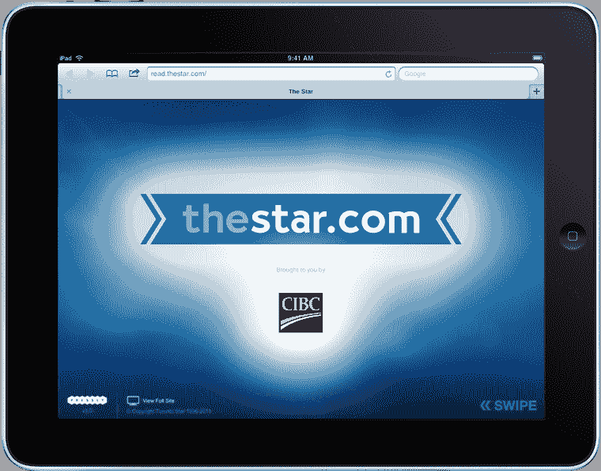
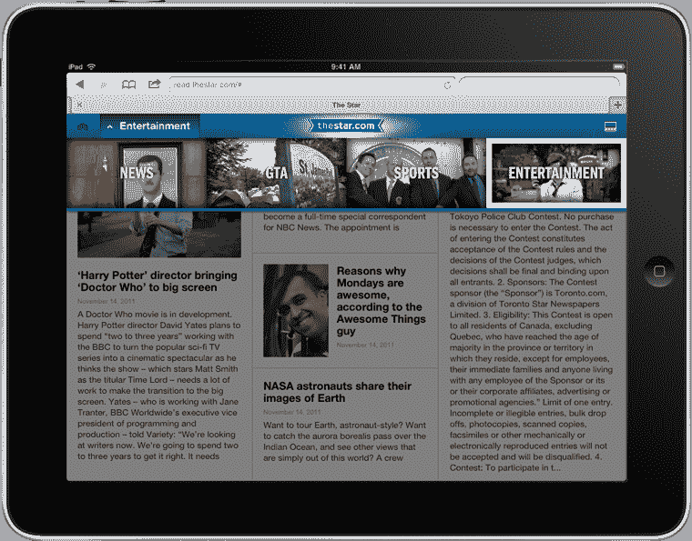

# OnSwipe 竞争对手 Pressly 推出，目标是每月 10 亿次翻转 TechCrunch

> 原文：<https://web.archive.org/web/http://techcrunch.com/2011/11/15/onswipe-competitor-pressly-launches-aims-for-1-billion-flips-per-month/>

竞争对手和 [TechCrunch Disrupt 决赛入围者](https://web.archive.org/web/20230203212627/https://techcrunch.com/2011/09/12/pressly-turns-websites-into-tablet-friendly-html5-web-apps/) [Pressly](https://web.archive.org/web/20230203212627/http://www.pressly.com/) 今天将推出其第一家主要出版商，加拿大最大的报纸[多伦多星报](https://web.archive.org/web/20230203212627/http://read.thestar.com/)。像 OnSwipe 甚至 iPad mag [Flipboard](https://web.archive.org/web/20230203212627/http://www.crunchbase.com/company/flipboard) 一样，Pressly 的服务旨在通过使其更适合平板电脑来改造传统的网络内容。但在 Pressly 的情况下，它不是将内容重新包装为原生应用程序，而是使用 HTML5 和可定制模板的组合，让出版商能够更多地控制平板电脑的浏览体验。

乍一看， [Pressly](https://web.archive.org/web/20230203212627/http://www.pressly.com/) ，第一个真正替代 [OnSwipe](https://web.archive.org/web/20230203212627/http://www.crunchbase.com/company/onswipe) 的，看起来很像它的竞争对手。这两项服务都让出版商能够让他们的内容更易于平板电脑阅读。然而，据 Pressly CTO[Peter Kieltyka](https://web.archive.org/web/20230203212627/http://www.crunchbase.com/person/peter-kieltyka)称，两者之间的关键区别在于引擎盖下的东西。“OnSwipe 最初是作为优化 WordPress 博客的一种方式，”他说。“但 Pressly 更像是一个引擎……就像平板电脑的 [Sencha](https://web.archive.org/web/20230203212627/http://www.sencha.com/) 。”他的意思是，Pressly 从一开始就是为构建下一代 HTML5 网站而构建的框架，而不是一个你输入一个 RSS 提要，它就会吐出一个平板电脑优化的网站的工具。(尽管这也即将到来——Pressly 将在 2012 年 Q1 奥运会上推出自己的自助服务平台，正是为了做到这一点。)

在发布时，目前有五个模板可用于让出版商开始使用 Pressly，但实际上，任何事情都可以。基尔蒂卡解释说，想要维护自己品牌的出版商可以创建自己的模板，“你在页面上看到的内容没有限制。”换句话说，如果你能想象得到，Pressly 就能帮你造出来。与此同时，OnSwipe 网站看起来更统一一些。*(基尔蒂卡说他们看起来* *一模一样。哦，燃烧吧，让战斗开始吧！)*

“这就像黑莓和 iPhone 的区别，”基尔蒂卡说。是的，它们都是智能手机，可以运行应用程序，可以让你浏览网页等等。“但归根结底，这是执行的问题。”

Pressly 现在还提供了一些与 OnSwipe 不同的东西——一种货币化的消费模式。以前，像 OnSwipe 一样，Pressly 会从广告收入中提成。现在，出版商可以在这和每 1000 次点击收取 1 美元之间做出选择。应该指出的是，这个数字还不是一成不变的。

至于它在《多伦多星报》上的发布，事情进行得相当顺利。自从美国东部时间昨晚 6:30 首次亮相以来，Pressly 已经观看了 18 万次翻转，平均每人 22.6 次翻转。该公司表示，其目标是在未来 12 个月内达到每月 10 亿次交易。它也可能会实现，这要归功于其他几个出版商合作伙伴，他们的发布就在前面:《经济学人》媒体集团将在几周内推出一个印刷网站，随后不久，NBC 将推出一个专注于新闻的网站。

想要从 iPad 或 Android 平板电脑上看到 Pressly 运行的平板电脑读者现在可以访问 read.thestar.com。

【T2

