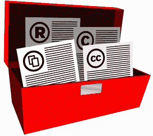

# 开源软件:合规基础和最佳实践

> 原文：<https://web.archive.org/web/https://techcrunch.com/2012/12/14/open-source-software-compliance-basics-and-best-practices/>

# 开源软件:合规基础和最佳实践

** 编者按:** * [希瑟·米克](https://web.archive.org/web/20230326125747/http://www.heathermeeker.com/)是国际律师事务所格林伯格·特劳里格·LLP 的股东兼 IP/IT 许可和交易小组主席，也是开源软件许可方面的权威人士。*

初创公司站在巨人的肩膀上，在大量利用开源组件的软件环境之上开发专有应用程序。但俗话说，自由软件不自由，使用开源软件需要组织了解开源的法律框架。

不遵守开源软件的许可条件会导致诉讼、不良公共关系等等。为了降低风险，各种规模的公司都需要对开源许可条件有一个基本的了解，并有一个可操作的最佳实践列表，包括在必要时寻求法律指导。

开源软件用户必须遵守他们正在使用的每个包的许可条件，包括子组件。这可能令人困惑，因为有数百种不同的开源许可证，每一种都有自己的、有时是独特的条件。好消息是，大多数开源软件都有少量的许可证，只有两种主要的许可证类别:“版权所有”要求开发者提供源代码和文档；“许可”适用于最低限度的条件，如作者归属。

 组织必须制定符合这两个类别的许可证和合规性策略。首先要记录适用于您正在使用的开源软件的许可条款——包括子组件和依赖项。一旦您知道您使用的是什么以及适用于它的许可证，您就需要一个法规遵从性策略。一些开源软件许可有简单的要求，一些有更复杂的要求，比如源代码交付。您的策略需要在一个简化的过程中处理这样的需求。

例如，所有开源软件许可证都有通知要求。如果您分发包含开放源代码软件的产品，通知要求可能会要求您在产品中提供一个简单的版权通知，甚至是管理该软件的整个许可证文本。虽然通知要求通常不难理解，但遵守这些要求可能会非常耗时，而且在产品发布截止日期前会很有挑战性。Copyleft 许可证更进一步，限制了开发者将开源软件与专有软件集成的方式。他们还要求您每次交付二进制文件时都提供源代码和构建文档。

许多公司已经意识到，管理开放源码的使用而不进行自动化转移了商业、技术和法律资源，这是自由软件真正成本的一部分。在过去的十年中，帮助识别、跟踪和管理开源软件使用的自动化工具得到了发展。最好的工具可以帮助以一种集成的方式管理软件的使用，而不是专注于开源或专有软件而排斥其他软件。

其中一种方法是组件生命周期管理(CLM)。CLM 是在应用程序生命周期的每个阶段为开发人员提供协作工具、智能和控制的过程，解决了基于组件的开发的许可风险管理。CLM 的产品，如 Sonatype 的 [Insight](https://web.archive.org/web/20230326125747/http://www.sonatype.com/) ，提供了一套软件管理工具，旨在帮助组织将 CLM 实践轻松融入他们的开发过程。例如，这样的工具使组织能够在设计和开发期间选择适当的许可组件；在构建阶段识别和管理组件许可，以快速解决问题并避免代价高昂的返工；并扫描现有应用程序以识别许可证和依赖项，以便您可以根据公司策略对其进行评估。

如果你习惯于生活在专有许可的世界中，开源许可可能会很复杂和令人困惑。因此，当谈到评估使用开源软件组件的法律条件时，请不要犹豫寻求帮助。请法律专家帮助您了解如何在不同的许可下组合开源软件，并为产品发布或收购/退出交易做好准备。