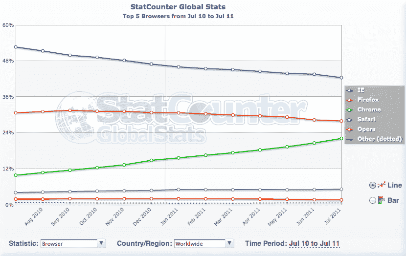

# “开放”的网络浏览器现在是网络的主流——WebKit 继续崛起 

> 原文：<https://web.archive.org/web/https://techcrunch.com/2011/08/01/open-web-browsers/>

一个月刚刚结束，这意味着新的统计数据。在网络浏览器的世界里，有两个特别有趣的重要问题。有人指出，在网上冲浪的人群中，现在“开放”的网络浏览器占大多数。另一个人指出 WebKit 浏览器超越了 Firefox，在网民中占据了第二的位置。

正如谷歌的 Peter Beverloo 今天早上第一次注意到的那样，StatCounter 的 T2 7 月份的数据显示，Firefox 和 Chrome 合并后，现在占据了超过 50%的网页浏览量。从技术上讲，火狐现在拥有 27.95%的份额，而 Chrome 拥有 22.14%的份额。他们的 50.09%轻松击败了 IE 的 42.45%。

“根据 StatCounter 的说法，开源浏览器现在服务于大多数网络！”贝弗卢今早写道。从技术上来说，这有点不准确，因为是*Chrome*而不是 Chrome 本身是开源的，但是我们会让它滑动。无论你怎么看，这个里程碑都是相当惊人的。特别是当你考虑到直到 2006 年，IE 仍然拥有超过 90%的市场份额。

StatCounter 的数据还显示了其他一些东西:Chrome 正在快速崛起，它应该会在未来几个月内超过 Firefox。正如上面的数字所显示的，两者现在的差距不到 6%，这是他们有史以来最接近的差距。虽然 Chrome 继续上升，但 Firefox 在过去一年一直在下滑。如果这种趋势继续下去，Chrome 应该会在今年年底之前超过 Firefox。

当然，那只是一种测量工具。外面有很多。另一份报告显示了 7 月份其他有趣的事情:正如 AppleInsider 今天早些时候指出的那样，WebKit 浏览器现在仅次于 IE 浏览器。

NetMarketShare 的数字指向了这个里程碑。他们的 Chrome 占 13.49%，Safari 占 8.10%。综合来看，基于 WebKit 的浏览器占 21.59%，略高于 Firefox 的 21.47%。根据他们的统计，IE 仍然拥有 52.71%的份额。

为什么两组数据有差异？一个原因是，NetMarketShare 的数字包括了所有平台上的所有浏览器，而 StatCounter 的数字侧重于基于计算机的浏览。换句话说，移动浏览包含在一个中，但不包含在另一个中。这就是为什么 Safari 在 NetMarketShare 的份额要高得多(StatCounter 的 Safari 份额为 5.17%，仍然是历史最高水平)。

差异的另一个原因是这两个服务依赖于不同的获取号码的方式。无论如何，当你看两组数据时，趋势是明显的:IE 继续下滑，Firefox 继续萎缩，Safari 继续缓慢上升，而 Chrome 继续飙升。这对“开放”的网络浏览器(Chrome + Firefox)和 WebKit 浏览器(Chrome + Safari)来说都是好事。

值得一提的是，TechCrunch 自己的数据显示了同样的基本趋势:Chrome 和 Safari 已经上升了一段时间，而 Firefox 和 IE 一直在下降。不同的是，Chrome 已经是 TechCrunch 上的主导浏览器([)并且已经有一段时间了](https://web.archive.org/web/20230201032559/https://techcrunch.com/2010/11/30/top-browsers/))——事实上，它现在已经超过第二名(和长期冠军)Firefox 将近整整 10%。7 月份，Chrome 浏览器在 TechCrunch 读者中的份额为 32.64%，而 Firefox 为 23.59%。

https://twitter.com/#!/bever loo/status/97961803170058240