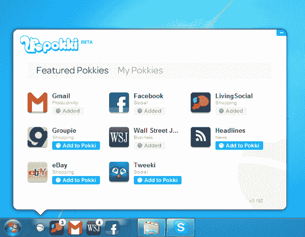

# OpenCandy 的 Pokki 将 Web 应用程序带到桌面，风格 

> 原文：<https://web.archive.org/web/https://techcrunch.com/2011/06/28/opencandys-pokki-brings-web-apps-to-the-desktop-with-style/>

 “未来是网络。”谷歌、脸书和许多较小的科技公司似乎都在重复这句口头禅，它们将网络视为避开本地应用平台造成的碎片化的解决方案。他们几乎肯定是对的。

但是网络仍然有很长的路要走——很少会遇到和桌面应用程序有任何相似之处的网络应用程序。现在，总部位于圣地亚哥的初创公司 OpenCandy 认为它有一个解决方案:一个名为 [Pokki](https://web.archive.org/web/20221209174354/http://www.pokki.com/) 的新产品，它在浏览器和本地应用程序之间架起了一座桥梁。换句话说，他们正在提供比网络应用更方便的网络应用。

首先，一些逻辑消息:到目前为止，OpenCandy 的唯一产品是 Windows 的原生应用安装程序，它向用户追加销售高质量的应用程序(这有点争议——你可以在这里找到我们过去的报道)。鉴于今天的新品发布会，OpenCandy 正在将公司名称改为 SweetLabs(安装程序仍称为 OpenCandy)。

那么到底什么是 Pokki 呢？这是一个建立在 Chromium 上的框架，它允许开发者使用标准的 web 技术构建基本的应用程序，但是增加了一些关键的东西。首先，这些应用在菜单栏中支持好看的通知标签(类似于 iOS 的徽章系统)。它们的设计也很方便——点击一个，它会在一个小窗口中弹出，你可以用它来访问你的脸书墙、Gmail 收件箱或你安装的任何其他应用程序。在 Pokki 外部单击，它就会消失。它非常轻便。

Pokki 最初向用户提供一套八款应用，包括 Gmail、脸书、Groupon、易贝、华尔街日报、Living Social 和 Twitter 的应用。这是一个坚实的开端，但今天的发布主要是向开发人员介绍 Pokki SDK，该 SDK 从今天开始可用，将允许开发人员将他们喜欢的任何网站(如果它有 API)变成 Pokki。请注意，今天发布的大多数 Pokkis 都是由 SweetLabs 内部制造的。

要使用 Pokki，用户必须首先安装基本框架，但这将与所有 Pokki 应用程序捆绑在一起——该公司预计用户将从他们最喜欢的网站之一下载一个 Pokki，然后使用集成的 Pokki 应用程序浏览器继续添加更多应用程序。这些应用程序今天开始支持 Windows，并支持 Mac 和 Linux。

Pokki 并不是第一个试图在 web 和本地应用程序之间架起桥梁的项目。你可能听说过 [Fluid](https://web.archive.org/web/20221209174354/http://fluidapp.com/) ，它为 Mac 做了类似的事情。在某种程度上，这也与谷歌的 Chrome 网络商店竞争，后者也从事分发网络应用的业务。

但是 Pokki 对这些快速、灵活的应用程序的关注(至少从一开始)可能会给它带来优势。我完全可以想象自己使用 Pokki 应用程序查看每天的 Groupon 交易或脸书新闻订阅更新，而不必打开新的浏览器标签。我不是唯一一个:Pokki 已经和“一家大型社交游戏公司”一起测试了这些应用，结果非常令人鼓舞。这种东西似乎是为 CityVille 上瘾者量身定制的，让他们可以快速查看他们的城镇，而不必实际访问脸书。

【T2
