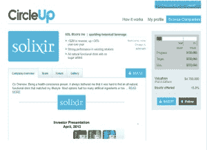

# 向众包投资开放消费产品，CircleUp 融资 1400 万美元

> 原文：<https://web.archive.org/web/https://techcrunch.com/2014/03/26/opening-consumer-products-to-crowdsourced-investment-circleup-raises-14-million/>

技术驾驭大众智慧的能力创造了大量新的企业，支持围绕[艺术、工艺和技术](https://web.archive.org/web/20230316034232/https://techcrunch.com/2014/03/02/kickstarter-is-about-to-crowdfund-its-1-billionth-dollar/)的[创业](https://web.archive.org/web/20230316034232/https://techcrunch.com/2014/01/28/indiegogo-raises-40-million-in-series-b-to-expand-their-crowdfunding-reach/)，同时[重塑](https://web.archive.org/web/20230316034232/https://techcrunch.com/2014/03/21/with-over-100m-raised-p2p-lending-platform-commonbond-expands-to-100-programs-to-help-grad-students-reduce-debt/)个人贷款[市场](https://web.archive.org/web/20230316034232/https://techcrunch.com/2014/03/19/google-backed-lending-club-brings-peer-to-peer-lending-to-business-loans/)。

凭借其 1400 万美元的新融资， [CircleUp](https://web.archive.org/web/20230316034232/http://www.crunchbase.com/company/circleup) 希望通过股权众筹改变消费品的发展。

B 轮由迦南投资公司(Canaan Partners)领投，之前的投资者谷歌风险投资公司(Google Ventures)、联合广场风险投资公司(Union Square Ventures)、Maveron 和玫瑰公园顾问公司(Rose Park Advisors)也做出了承诺。

投资完成后，Dan Ciporin(迦南的普通合伙人，Lending Club 的董事会成员)将在 CircleUp 董事会中占有一席之地。

“众筹，或 peerfunding，代表了客户、用户、产品或项目的根本重新排序，”联合广场风险投资公司(Union Square Ventures)的合伙人安迪·韦斯曼(Andy Weissman)说，该公司已经资助了 [Lending Club](https://web.archive.org/web/20230316034232/http://www.crunchbase.com/company/lendingclub) 、CircleUp、 [Kickstarter](https://web.archive.org/web/20230316034232/http://www.crunchbase.com/company/kickstarter) 和 [Auxmoney](https://web.archive.org/web/20230316034232/http://www.crunchbase.com/company/auxmoney) 。“我们认为这是关系的根本重组，你可以用许多不同的方式来分割它。CircleUp 代表了这种根本性的重新排序，以及企业家创建消费品公司的低效率。

首席运营官 Rory Eakin 表示，CircleUp 这轮融资在大约一个月内完成，距离该公司成立两周年只有几天时间，这笔现金将用于为使用该公司股权投资平台的投资者开发新的数据和分析产品。

可以把 CircleUp 看作是消费品公司的一种天使。CircleUp 投资者并没有资助像 T2 Apptimize T3 这样的公司，而是在寻找像 T4 绿色斑马杂货店 T5 这样的有机食品杂货店；或者户外服装和装备制造商[kly MIT](https://web.archive.org/web/20230316034232/http://www.klymit.com/)；或者甚至是在布鲁克林推出的最新的具有社会意识的巧克力制造商。

CircleUp 要解决的问题是规模问题，销售消费品的公司规模太小，无法像最初聘用 CircleUp 首席执行官瑞安·卡德贝克(Ryan Caldbeck)的私募股权公司那样引起投资者的兴趣。但这些公司需要的支票比典型的众筹活动更大。

“我们合作的公司有不同的用例，”Caldbeck 说。“CircleUp 的平均融资额约为 100 万美元。“当你有一家在全国所有全食超市都有分销点或者在每个诺德斯特龙超市都有销售点的正常运营的企业时，筹集 1 万美元没什么用。”

CircleUp 已经与许多主要的私人股本公司以及包装消费品公司建立了关系，如通用磨坊公司和宝洁公司。

在 CircleUp 平台上筹集资金似乎对使用这个网站的企业家来说是有回报的。“在 CircleUp 上融资的公司，自融资以来，收入平均每年增长 80%，”埃金说。

自从投资平台推出以来，CircleUp 已经帮助 30 多家公司筹集了超过 3000 万美元的资金。该公司表示，CircleUp 在 2013 年第四季度的特色公司平均增长率为 185%，毛利率为 37%，销售倍数为 2.9 倍。

CircleUp 通过向其平台上的公司收取基于其融资额的佣金来盈利，同时还持有在平台上融资的公司的认股权证。该公司还从与大型消费品公司的合作费中获得资金。

过去五年，众筹领域的风险投资不断增长，公司的成本也越来越高。仅在过去一个季度，就有五家公司在众筹中筹集了 7500 万美元的新资金。

*图片来自 Flickr 用户[罗西奥拉拉](https://web.archive.org/web/20230316034232/http://www.flickr.com/photos/analogica/)*