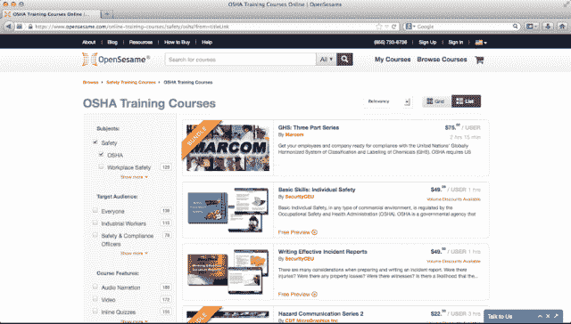
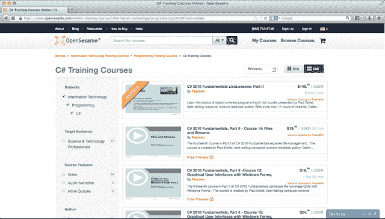

# OpenSesame 获得 800 万美元成为企业培训内容的 iTunes | TechCrunch

> 原文：<https://web.archive.org/web/https://techcrunch.com/2014/01/14/opensesame-lands-8m-to-become-the-itunes-of-corporate-training-content/>

随着新技术让分享和分发高质量的学习内容变得比以往任何时候都更容易，企业正争先恐后地利用这一优势。此外，随着这些天技术变化的速度，公司希望帮助他们的员工跟上速度并熟悉最新版本的 Salesforce、Excel 或任何情况。

在线培训资源已经存在多年，但 OpenSesame 的使命是让在线学习课程和内容的买卖变得像在 iTunes 上购买歌曲或电影一样简单。随着在线培训市场的起飞，OpenSesame 希望成为最好内容的应用商店或市场，任何公司都可以购买课程，而无需支付订阅费或昂贵的许可费。

通过 OpenSesame 的市场，企业可以搜索到来自 300 多家卖家的 20，000 多门课程。他们可以预览内容，阅读其他买家的评论，并了解销售内容的公司的更多信息。OpenSesame 允许卖家设定内容的价格，向所有者提供 60/40 的利润份额，用于通过其市场进行分销。

但 OpenSesame Joshua Blank 表示，真正的价值是该公司在技术上所做的事情，以确保通过其市场提供的内容与学习管理系统(LMS)或购买公司用来显示内容并提供给员工的任何平台兼容。公司使用各种各样的 LMS 平台来组织和管理他们的企业培训内容，Blank 说，OpenSesame 的内容现在与大约 75%的选项兼容。

布兰克说，凭借来自出版商的内容和 FranklinCovey、Pearson 和 John Wiley 等资源，OpenSesame 已经能够获得 DISH networks、Five Guys 和 Dun & Bradstreet 等客户，目前正在与数百家企业客户合作。

作为其成为以商业为中心的电子学习课程的最大单一来源的努力的一部分，OpenSesame 今天宣布，它已经筹集了 800 万美元的 A 轮融资，由 Partech Ventures 领投。在这轮融资中，Partech 的普通合伙人 Nicolas El Baze 加入了这家初创公司的董事会，并使 OpenSesame 的总融资额超过 1000 万美元。

随着 MOOCs 改变了教育内容的交付方式，OpenSesame 正在努力改变购买机制，借鉴 iTunes 和其他许多公司久经考验的真实市场模式。为员工和企业提供培训课程，这个想法是让 OpenSesame 成为一个在线商店，客户可以按菜单购买，在他们需要的时候支付他们需要的费用，最终比面对面培训便宜得多——或者至少是这个想法。

Blank 表示，这种模式已经为 OpenSesame 带来了 100%的月环比收入增长，该公司希望通过今年年初的新资金和一系列新产品和补充产品(特别是移动产品)继续保持这种增长。

