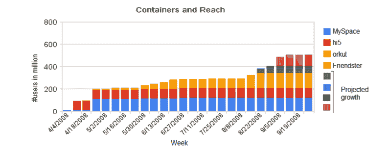

# OpenSocial 现在拥有 3.5 亿用户，并且还在增长 

> 原文：<https://web.archive.org/web/https://techcrunch.com/2008/08/20/opensocial-now-reaches-350-million-users-and-growing/>

# OpenSocial 现在拥有 3.5 亿用户，并且还在增长

六个月前，OpenSocial 只是一个承诺合作的列表。但谷歌支持的社交网络应用平台自那以来取得了很大进展，因为这些合作伙伴开始使用他们的 OpenSocial 应用程序。首先是 MySpace 和 Orkut[，然后是 Hi5](https://web.archive.org/web/20221001074255/http://www.beta.techcrunch.com/2008/03/13/hi5-gets-ready-to-take-opensocial-global/) ，最近是 Friendster[。](https://web.archive.org/web/20221001074255/http://www.beta.techcrunch.com/2008/08/18/friendster-launches-support-for-opensocial-apps/)总而言之，如果你把现在使用 OpenSocial 的各种社交网络加起来，它总共有 3.5 亿用户。随着另外四个社交网络和服务准备在 9 月底推出，这个数字将很快达到 5 亿(见上图)。

谷歌的乔·克劳斯今天给了我一份关于 OpenSocial 进展的更新。他没有透露下一个合作伙伴会是谁，但从上图中粉色条的大小来看，其中一个相对较大——和 Orkut 差不多大。(我的猜测是，要么会是 Bebo，要么会是 Six Apart)。他还提到了一些合作伙伴，如 imeem，他们甚至没有联系过谷歌(多亏了 Apache Shindig ),而且在这一点上，只有 10%的负责 OpenSocial 规范的工程师来自谷歌。

那么实际上有多少 OpenSocial 应用在使用呢？到目前为止，大约有 4500 种不同的应用程序，安装次数超过 1.5 亿次。我无法获得所有 OpenSocial 合作伙伴的每日活跃用户数量，但对于 Hi5，大约 50%的成员每天至少使用一次 OpenSocial 应用程序。仅 hi5 上就有 1，800 个 OpenSocial 应用程序，安装次数达 6，600 万次，因此这可能代表了 OpenSocial 的总体使用情况。

相比之下，脸书为开发者开源了自己的平台，有将近 37000 个应用，这些应用已经被安装了 7 . 15 亿次。仅 RockYou 的应用程序在脸书就被安装了 1.24 亿次。

尽管 OpenSocial 在如此短的时间内取得了长足的进步，但它仍有许多工作要做。