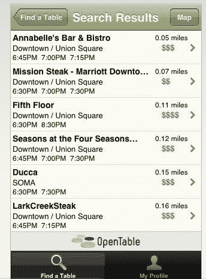
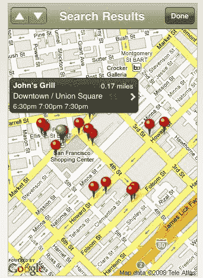

# OpenTable 预订来到 iPhone 

> 原文：<https://web.archive.org/web/https://techcrunch.com/2008/11/17/opentable-reservations-come-to-the-iphone/>

# OpenTable 预订来到 iPhone

iPhone 上一些最有用的应用程序是餐馆应用程序，它会告诉你附近有什么吃的。有 UrbanSpoon、Yelp 和 LocalEats 等等。但是一旦找到餐厅，还是要打电话订座。现在，你不必再浪费这些时间了。在线预订服务 [OpenTable](https://web.archive.org/web/20221006041549/http://www.opentable.com/) 今天发布了一款 iPhone 应用，它不仅能让你找到附近的餐馆，还能让你预订桌子。你不必打电话等着。该应用程序使用 OpenTable 的在线预订系统来预订和确认桌子。无论你在哪里，它甚至会告诉你去餐馆的方向。

你只能看到附近的餐馆，不能像在网站上那样方便地按菜肴类型过滤或细化搜索。但这款应用功能完善。关键是它只显示你想吃饭的时候附近有*空位*的餐馆。

OpenTable 特别适合在高端餐厅预订餐桌。如果你在出差，或者和一些朋友在镇上闲逛，想要制定即兴晚餐计划，我可以看到这个应用程序变得不可或缺。我是 OpenTable 的忠实粉丝，并且已经有了一个帐户，所以对于像我这样的人来说，这是一个必备的 iPhone 应用程序。

这款应用是免费的，你可以从 iTunes[下载(链接打开 iTunes)。](https://web.archive.org/web/20221006041549/http://itunes.apple.com/WebObjects/MZStore.woa/wa/viewSoftware?id=296581815&mt=8)

