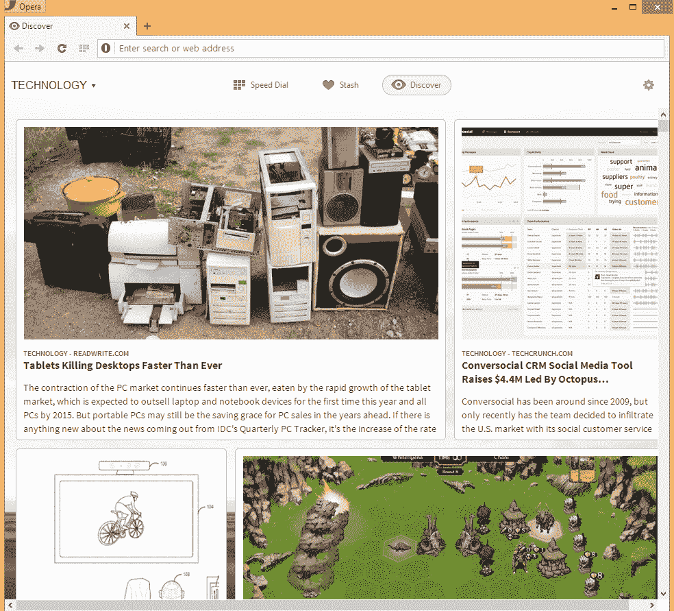
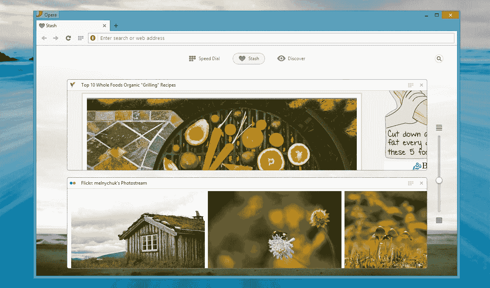

# Opera 发布其基于 Chromium 的桌面浏览器的首个预览版，剥离电子邮件客户端 

> 原文：<https://web.archive.org/web/https://techcrunch.com/2013/05/28/opera-launches-first-preview-of-its-chromium-based-desktop-browser-spins-off-email-client/>

Opera today [发布了](https://web.archive.org/web/20221006101123/http://business.opera.com/press/releases/desktop/2013-05-28)其基于 Chromium 的桌面浏览器的第一个预览版，用于 Windows 和 Mac，这是该公司在二月份宣布[从其自有浏览器引擎切换到谷歌浏览器引擎](https://web.archive.org/web/20221006101123/https://beta.techcrunch.com/2013/02/13/opera-confirms-gradual-shift-to-webkit-starting-with-smartphones-as-it-clocks-up-300m-users/)以来的第一个预览版。这一转变允许 Opera 在其浏览器中添加新功能，如支持谷歌的 SPDY 协议，但 Opera Next 包括了相当多的新功能，而不仅仅是一个新引擎。

例如，Opera 已经改进了它的快速拨号新标签页，允许你很容易地过滤你的快捷方式并把它们分类到文件夹中。这款浏览器现在也终于像 Chrome 一样，只有一个网址和搜索栏。它还进行了全面的用户界面重新设计，现在给了浏览器一个明显更现代的外观。

该团队还开发了一个新的可定制的新闻发现功能，“让你可以靠在椅背上，从你的国家或任何你想获得灵感的地区获得新文章，就在你的浏览器中——所有这些都在一个地方。”它基本上是你浏览器中的谷歌新闻，包括按类别过滤故事的能力(艺术、食品、科技等。).尚不清楚 Opera 如何选择在这里显示哪些故事，但经过短暂测试后，感觉该服务聚合了大量相关来源，类似 Pinterest 的布局对于快速浏览新闻非常有效。

这个版本中的新功能还有 Opera 的新“Stash”视图，它允许你快速标记网站(只需按下地址栏中的心形图标)，然后将它们与可调整大小的页面预览进行比较。该公司表示，这一功能在你比较购物或进行旅游研究时尤其有用。这看起来是这样的:

很明显，改用 Chromium 和谷歌的渲染引擎已经让浏览器感觉更快了，并让该公司能够更加专注于能够使其从竞争中脱颖而出的功能，而不必担心自己的渲染引擎。

然而，作为回报，新版本也少了不少功能。当然，浏览器仍然包括一些 Opera 的主要功能，如涡轮模式(现在称为“越野模式”)，但 Opera 笔记、链接、标签缩略图和 Opera 用户已经习惯的许多其他功能已经消失了。目前还不清楚它们是否会在以后的版本中回归。

【YouTube http://www.youtube.com/watch?v=sD2mYdtvSBs？feature=player_detailpage]

## 歌剧邮件

 随着这次发布，Opera 还剥离了以前内置的电子邮件客户端，现在可以作为[独立产品](https://web.archive.org/web/20221006101123/http://my.opera.com/desktopteam/blog/opera-next-15-0-released)使用。这是一个令人惊讶的轻量级邮件客户端，实际上可能会对最近试图重新发明电子邮件的一些初创公司有所帮助。Opera Mail 可以让您轻松地给邮件添加标签，并过滤掉带有附件的电子邮件，如文档、图像、视频和音频文件。