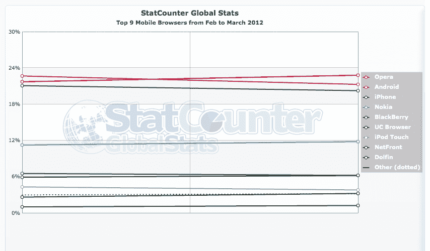

# 面向 Android 的 Opera Mini 7 今天发布:对网络浏览器领导地位的反击？

> 原文：<https://web.archive.org/web/https://techcrunch.com/2012/03/27/opera-mini-7-for-android-out-today-a-fightback-to-regain-web-browser-leadership/>

# 面向 Android 的 Opera Mini 7 今天发布:对网络浏览器领导地位的反击？

本月早些时候，当一家分析公司发现谷歌的操作系统 Android 最终取代 Opera 成为世界上最大的移动浏览器时，Opera 和 Android 短暂地一起成为头条新闻。今天，这两家公司再次出现在新闻中，原因略有不同:Opera 正在[发布最新版本的流行(免费)Opera Mini 和 Opera 移动浏览器，增加了摄像头、HTML5 和 3D 图形支持——这是 Opera 在 Android 上夺回一些份额的一种方式，Android 是目前世界上最大的智能手机平台。](https://web.archive.org/web/20221207230657/http://my.opera.com/chooseopera/blog/2012/02/27/opera-mini-7-next-and-opera-mobile-12)

新版浏览器是 Opera 早在二月份就暗示正在开发的东西，当时它宣布了一些交易，以进一步扩大其在[移动支付](https://web.archive.org/web/20221207230657/https://beta.techcrunch.com/2012/02/28/opera-app-store-yandex-payments/)领域的影响力。和这个消息一样，今天的发布是移动浏览器开发者如何寻求添加更多功能以使他们的产品更像原生平台体验的又一个例子。这次发布的同时，Opera 也发布了一个新版本的 Symbian 浏览器。

Opera 作为世界上最大的浏览器的头衔部分是因为它是先行者，可以在一系列功能手机和智能手机平台上工作。据说目前全世界有大约 1 . 6 亿人在使用它。鉴于 Android 现在是最大的智能手机平台，并能够通过这一市场份额在 Opera 上取得进展，Opera 必须更新并比以前更进一步。

新功能包括创建无限数量的书签(“快速拨号”)以快速找到您最喜爱的网址，而以前只有 9 个。这个新版本的 Opera Mobile 现在还包括摄像头支持，以及通过其 Ragnarö技术对 HTML5 网站功能的更好支持。它还为 3D 功能增加了 WebGL 支持。WebGL 用于跨平台游戏的开发。

Opera 长期以来一直表示，相对于其他浏览器和平台的原生客户端，它的最大优势之一是页面压缩技术，该技术提高了移动网络的浏览速度。在 Opera Mini 的新版本中，它更进一步，声称使用它实际上比竞争对手更便宜，因为它将网页压缩了 90%。它说，其他改进包括更快地浏览网站。

具有讽刺意味的是，来自 StatCounter 的最新数据显示，事实上，Opera Mini 已经超过 Android 成为世界上最受欢迎的浏览器。排名变化如此频繁的事实表明，不断创新功能以保持用户忠诚度是多么重要。

【T2