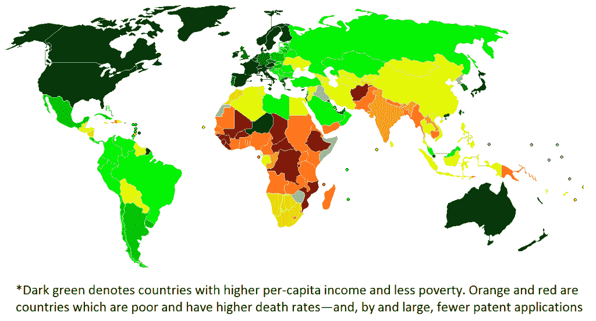

# 无专利区的机遇 

> 原文：<https://web.archive.org/web/https://techcrunch.com/2010/08/01/opportunities-in-the-patent-free-zone/>

今年，中国可能会超过 T2 成为世界第二大经济体。紧随其后的是 T4，巴西和俄国等国家紧随其后。这对创业者意味着什么？大机会越来越多地出现在美国以外。大多数人都没有意识到新兴市场的另一个优势:你可以自由地利用发达经济体已经创造的成熟知识产权财富。美国和欧洲之外的大多数国家都处于 *[无专利区](https://web.archive.org/web/20221201040845/http://www.patentfreezone.com/)*——公司没有申请专利，因为他们认为他们的产品没有市场。因此，这些国家的任何人都可以利用这些知识产权。

以 iPhone 为例:它拥有超过 1000 项专利；然而，苹果并没有在秘鲁、加纳或厄瓜多尔等国家申请专利保护，也没有在大多数发展中国家申请专利保护。因此，企业家可以利用这些专利申请获取信息，制造一种类似 iPhone 的设备，解决这些国家的独特问题。到目前为止，苹果已经获得了 3287 项美国颁发的专利，还有 1767 项申请待批:总共 5054 项(针对其所有产品)。然而，它在中国仅申请了约 300 项专利，并获得了 19 项授权。在印度，该公司仅提交了 38 项专利申请，并获得了 4 项专利。在墨西哥，它申请了 109 项专利，获得了 59 项专利。因此，即使是印度、中国和墨西哥也是完全开放的领域。

现在考虑糖尿病技术。截至 2009 年底，美国已颁发或正在申请的专利超过 12，070 项，而在约旦只有 36 项，而且在非洲大部分地区都没有申请。大型制药公司认为这些市场要么太小，要么太穷；它也没有为非洲和发展中国家越来越多遭受疾病折磨的数百万绝望的人生产出负担得起的药物。但是没有什么能阻止企业家完成这些任务。这些蓝图在美国专利数据库中很容易找到。

北卡罗莱纳州的专利律师兼 [NeoPatents](https://web.archive.org/web/20221201040845/http://www.neopatents.com/) 的首席执行官 JiNan Glasgow 一直在研究全球专利系统，并开发技术来探索和绘制专利数据库。她发现，在美国申请的专利中，只有 5-10%真正用于提供商业价值。其余的都被浪费了。

格拉斯哥还发现，大多数美国公司一直忽视新兴市场，没有在那里申请任何专利。当她将专利申请的地理分布与联合国人类发展指数进行比较时，她注意到了一种强烈的相关性:国家越富裕，专利数量就越多。这意味着发达国家的知识产权财富可以在新兴地区自由使用，因为这些地区没有专利申请。格拉斯哥称之为无专利区——覆盖了除美国和西欧以外的世界大部分地区。金砖四国(巴西、俄罗斯、印度、中国)的专利申请量只是在最近才出现增长，因此过去几十年在美国申请的所有专利仍在自由区内。

专利系统的工作方式是，当你有一个新的独特的想法，你想保护它，你向美国专利商标局(USPTO)提交专利申请。如果 USPTO 确定你确实是最初的发明者，它会授予专利，这是一种暂时的垄断，禁止其他人在 20 年内制造、使用、销售、出售或进口你的发明。但这只是在美国限制其他国家的人，你需要在那个国家申请专利，并且要在申请美国专利的一年内这样做。大多数美国发明家不在乎，因为他们专注于本地市场。但是跨国公司通常会在他们希望开展业务的每个国家申请专利。在没有申请专利的国家，任何人使用这些想法都是合法的。这为这些国家带来了巨大的机遇。

以海水淡化为例，通用电气是其中最大的参与者之一。通用电气已经花费了超过 41 亿美元收购其海水淡化业务。然而，十年后的今天，他们仍然无法让海水淡化变得可承受和可持续。通用电气的进步依赖于其拥有的专利。截至 2009 年，通用电气发明了该领域 832 项美国专利中的 47 项——仅占 5.6%，或略高于二十分之一。想想如果通用电气也能使用它不属于*的*专利，它将会取得怎样的进步——这种专利有很多。

如果我们不用再花十年时间等待海水淡化领域的创新，这个世界会变得多美好？在无专利区有许多合作领域，可以为我们的世界产生创新的解决方案。太阳能、电动汽车、穷人的移动技术、疾病根除、医疗设备、食品加工——仅举几例。如果穷国最终解决了富人的问题，岂不是很讽刺？我会问我的企业家朋友我以前问过的同样的问题:[拯救世界和打造另一个脸书应用哪个更好？](https://web.archive.org/web/20221201040845/https://beta.techcrunch.com/2010/02/13/what%e2%80%99s-better-saving-the-world-or-building-another-facebook-app/ "What’s Better: Saving the World or Building Another Facebook app?")

***编者按:**客座作家 [Vivek Wadhwa ](https://web.archive.org/web/20221201040845/http://www.crunchbase.com/person/vivek-wadhwa) 是一位企业家转学者。他是加州大学伯克利分校信息学院的访问学者，哈佛大学法学院的高级研究员，杜克大学创业和研究商业化中心的研究主任。你可以在推特 [@vwadhwa ](https://web.archive.org/web/20221201040845/http://twitter.com/vwadhwa) 关注他，在[www.wadhwa.com](https://web.archive.org/web/20221201040845/http://www.wadhwa.com/)找到他的研究。*

图片:非洲[的女性赤脚太阳能工程师](https://web.archive.org/web/20221201040845/http://www.flickr.com/photos/barefootcollege/4028688322/)由蒂洛尼亚的[赤脚摄影师](https://web.archive.org/web/20221201040845/http://www.barefootcollege.org/)[杰瑞·斯蒂弗尔曼](https://web.archive.org/web/20221201040845/http://www.thechangecreation.com/)和联合国[人类发展指数](https://web.archive.org/web/20221201040845/http://en.wikipedia.org/wiki/en:Human_Development_Index "w:en:Human Development Index")拍摄