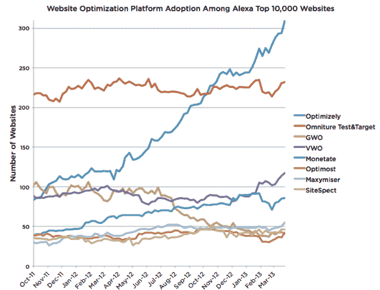

# 网站测试服务优化融资 2800 万美元由 Benchmark 牵头，计划全球扩张 

> 原文：<https://web.archive.org/web/https://techcrunch.com/2013/04/10/optimizely-series-a/>

# 网站测试服务优化筹集 2800 万美元，由 Benchmark 牵头，计划全球扩张

Y Combinator 孵化的初创公司 Optimizely 帮助公司 A/B 测试其网站的不同版本，已经筹集了 2800 万美元的首轮融资。

对于大多数初创公司来说，这将是一个相当大的 A 轮融资，但对于 Optimizely 来说，这是一个特别大的步骤，迄今为止，它只筹集了 320 万美元。[上一轮融资是在一年前](https://web.archive.org/web/20230124210400/https://techcrunch.com/2012/05/30/optimizely-funding/)宣布的，但该公司当时没有披露金额。

联合创始人兼首席执行官丹·西罗克(Dan Siroker)告诉我，尽管资金相对较少，但该公司已经达到了“两位数百万”的年化收入增长率，而且收入每年增长 400%。它还签下了一些高知名度的客户，包括奥巴马和罗姆尼 2012 年的总统竞选。(西罗克在 2008 年是奥巴马的分析主任。)在 Siroker 发给我的图表中，你可以看到 Optimizely 相对于 Alexa 排名前 10，000 的网站中的竞争产品的增长情况(使用来自 [BuiltWith](https://web.archive.org/web/20230124210400/http://www.builtwith.com/) 的数据)。

这轮融资由基准公司牵头，贝恩资本投资公司和 Optimizely 的现有投资者 Battery Ventures、InterWest Partners 和谷歌风险投资公司参与。Benchmark 的彼得·芬顿(他过去的投资包括 Yelp 和 Twitter)将加入 Optimizely 董事会。西罗克说芬顿是第一个外部成员；直到现在，董事会只有西罗克和他的联合创始人皮特·库门。因此，他们用一种不寻常的方式来面试风投——与潜在投资者举行“模拟董事会”。

当我问西罗克是否计划筹集这么多资金时，他说，“我们知道我们可能永远也不会花这笔钱。”然而，他表示，这笔资金让该公司有机会在许多方面“真正雄心勃勃”。

首先，它正在向国际扩张迈出第一步。Optimizely 去年在阿姆斯特丹开设了第一家欧洲办事处，并计划在下个季度推出 9 种语言，代表 36 个国家。Siroker 说，该团队选择这些语言(还没有说是哪种语言)是基于它已经找到客户的地方。

该公司还将搬进旧金山一个 56，000 平方英尺的新办公室。Optimizely 目前有 68 名员工，新办公室有超过 450 人的空间，Siroker 说，但他仍然希望最终超过它。

Siroker 计划投资的其他领域包括销售和营销，以及基础设施和客户支持。正如他在之前告诉我的，这里的大愿景[是超越测试的优化扩展，将它变成一个平台，允许网站为每个访问者进行个性化设置。该公司已经允许客户为不同的访客群体提供不同的体验，但 Siroker 希望更进一步。](https://web.archive.org/web/20230124210400/https://techcrunch.com/2012/10/09/optimizely-vs-omniture/)

他说，“今后人们会更容易做到这一点。”。“我们将帮助企业在正确的时间向正确的人展示正确的东西。”