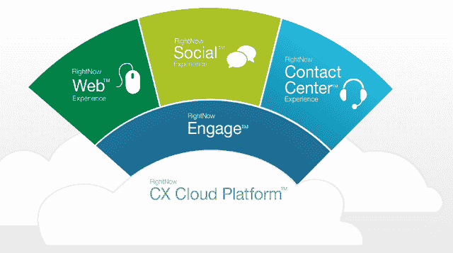

# 甲骨文以 15 亿美元收购基于云的客户服务公司 right now 

> 原文：<https://web.archive.org/web/http://techcrunch.com/2011/10/24/oracle-buys-cloud-based-customer-service-company-rightnow-for-1-5-billion/>

# 甲骨文以 15 亿美元收购基于云的客户服务公司 RightNow

[甲骨文](https://web.archive.org/web/20230205045858/http://www.crunchbase.com/company/oracle)今天早上[宣布](https://web.archive.org/web/20230205045858/http://www.oracle.com/us/corporate/press/519740)已经[收购了](https://web.archive.org/web/20230205045858/http://www.oracle.com/us/corporate/acquisitions/rightnow/index.html)[RightNow](https://web.archive.org/web/20230205045858/http://www.crunchbase.com/company/rightnow-technologies)——两家公司都在纳斯达克上市——每股 43 美元，约合 15 亿美元的 right now 现金和债务净额。通过此次收购，甲骨文为其自身的[公共云解决方案](https://web.archive.org/web/20230205045858/http://cloud.oracle.com/)增加了一个强大的[基于云的客户服务产品](https://web.archive.org/web/20230205045858/http://www.rightnow.com/)(见下图)——更多信息请点击。RightNow 的股价上周收于 35.96 美元，因此这笔交易比 10 月 21 日周五的收盘价溢价约 20%。

RightNow 的[解决方案](https://web.archive.org/web/20230205045858/http://www.rightnow.com/cx-suite.php)帮助公司处理多种渠道的客户互动，包括呼叫和联络中心、网络和社交网络。

该公司表示，其产品被全球近 2000 家组织使用。

RightNow 成立于 1997 年，于 2004 年上市。上周收盘时，该公司的市值达到 12 亿美元。

甲骨文的收购预计将在今年晚些时候或 2012 年初完成。像往常一样，这项交易受到许多因素的影响，包括 RightNow 股东的批准、监管机构的批准和其他惯常的成交条件。

甲骨文今年已经完成了 6 笔收购。虽然对 RightNow 和 [Endeca](https://web.archive.org/web/20230205045858/https://techcrunch.com/2011/10/18/oracle-buys-enterprise-search-and-data-management-company-endeca/) 的收购仍在进行中，但该公司仅在 2011 年就完成了对 Datanomic、 [FatWire](https://web.archive.org/web/20230205045858/https://techcrunch.com/2011/06/21/oracle-buys-web-content-management-company-fatwire-software/) 、Inquira、Ndevr 的精选知识产权资产、Ksplice 和 [Pillar Data Systems](https://web.archive.org/web/20230205045858/https://techcrunch.com/2011/06/29/oracle-acquires-larry-ellison-backed-storage-company-pillar-data-systems/) 的收购。

