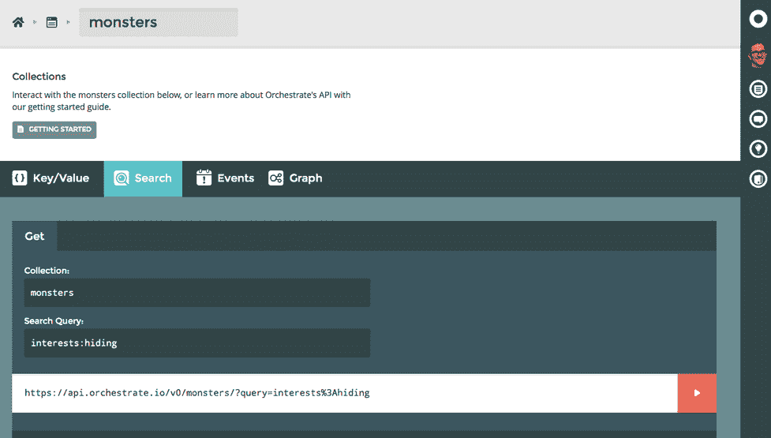

# Orchestrate 用一个 API TechCrunch 取代了多个 NoSQL 数据库

> 原文：<https://web.archive.org/web/https://techcrunch.com/2014/02/04/orchestrate-replaces-multiple-nosql-databases-with-a-single-api/>

开发人员在单一数据库上构建应用程序的日子已经一去不复返了。如今，许多服务使用各种数据库——尤其是 NoSQL 数据库——来支持其应用程序的不同方面。这增加了很多复杂性、故障点和成本。与此同时，开发人员也越来越习惯于 Amazon Web Services (AWS)模型，在这种模型中，您可以轻松地从每秒 1，000 个查询增加到 10，000 个查询，而不会超出本地本地数据库的处理能力。

Orchestrate 在去年筹集了 300 万美元的种子资金后于今天推出测试版，旨在让所有这些复杂性成为过去。它为开发人员提供了处理数据的单一 REST API。该公司获取您的数据，使用最合适的 NoSQL 数据库，如 MongoDB 或 CouchDB，您只需通过 Orchestrate API 访问它。

该公司的联合创始人兼首席执行官安东尼·法尔科(Antony Falco)告诉我，目前，大多数编排基础设施都在 AWS 上运行。不过，随着时间的推移，该计划将使用多种云，并为欧洲和亚洲的数据中心提供支持。Falco 指出，这将允许一家公司在东海岸的亚马逊和欧洲的 Softlayer 上托管其数据，并根据需要在不同的云之间复制数据。Orchestrate 还考虑允许有特殊安全顾虑的开发者在内部运行其服务。

Falco 表示，该公司仍希望在发布后添加一些功能，包括对老式 SQL 数据库和地理空间数据的支持。他强调说，每个人对地理数据的实际含义都有不同的定义，所以我们的计划是看看客户会要求什么，然后开发一个适合用户需求的产品。

Falco 之前是 T2 Basho T3 的首席运营官，这家公司背后有非常成功的 Riak NoSQL 数据库和云存储服务。Orchestrate 目前有 12 名员工。大多数在俄勒冈州波特兰的总部工作。，但该公司也有相当一部分远程员工。

Orchestrate 的定价也是为了简单。该公司为每月需要少于 100 万次查询操作的开发人员提供了一个免费层。为需要更多服务的用户提供付费服务，起价为每月 39 美元，并提供 1000 万次操作，超过限额后每 100 万次操作额外支付 2 美元。Orchestrate 不收取存储费用。所有这些层都包括监控、支持、使用情况报告以及到客户选择的位置(例如 S3)的每日备份。有了这些备份，实际上就没有锁定，因为所有数据都存储为 JSON 对象。

