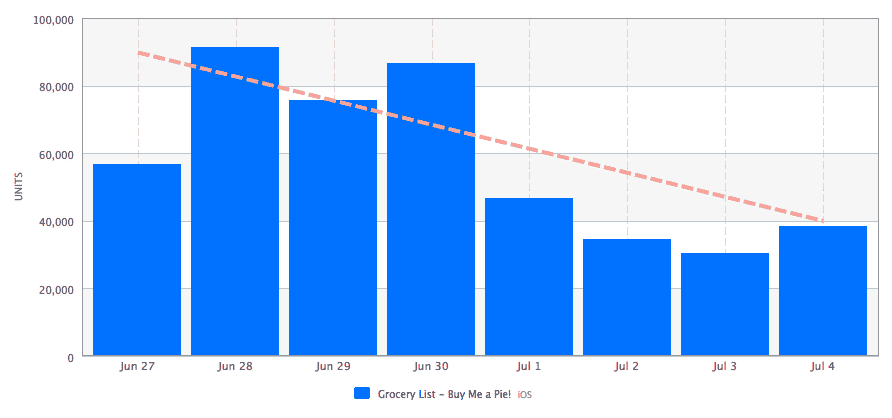

# 有机(增长)只:杂货清单应用程序给我买一个馅饼！声称 2M iOS 下载，增加赠送功能 TechCrunch

> 原文：<https://web.archive.org/web/https://techcrunch.com/2012/09/04/organic-growth-only-grocery-list-app-buy-me-a-pie-claims-2m-ios-downloads-adds-gifting-functionality/>

自费，来自俄罗斯，[给我买个馅饼！](https://web.archive.org/web/20221208110112/http://buymeapie.com/)正在吹嘘一些大数据:基于云技术的 iOS 杂货清单制造商现在声称其应用程序的全功能版本有 200 万次下载——该版本通常定价为 2.99 美元，但有时会大幅打折，甚至免费赠送，作为“有机”增长战略的一部分，该应用程序的开发者说这种战略正在取得成效。

给我买个馅饼！今天也获得了重大更新，引入了“应用程序礼物”功能，使朋友、室友和家庭成员可以方便地为彼此购买应用程序，这是由共享和同步他们的杂货购物清单的便利性推动的。

“如今，iOS 应用程序很难获得任何下载，甚至是免费下载”，该应用程序背后的公司 Skript 的首席执行官 Oleg Nederev 说。“获得免费用户的成本非常高，从每个用户 50 美分开始，最高可达几美元，但我们获得了这些有机下载，这是一个好应用的标志。”

或许，这是一个好应用的标志。给我买个馅饼！设计精良，使用简单，在应用商店[全球](https://web.archive.org/web/20221208110112/http://www.apptrace.com/app/grocery-list-buy-me-a-pie!/id491322606)的平均用户评分为 4.5/5。它也很强大——内置的云存储和跨网络和 iOS 客户端的同步使它有别于大多数简单的列表应用，最直接地与风投资助的 [ZipList](https://web.archive.org/web/20221208110112/http://www.crunchbase.com/company/ziplist) 竞争。但这也是良好营销的标志。这种有机增长策略包括定期的应用程序促销和赠品，暂时将应用程序的价格降至零，以提高应用程序商店的知名度。

内德列夫告诉我，在意大利、巴西、俄罗斯、西班牙和加拿大等国家，它经常出现在生产率类别的前 25 名中。与此同时，周末的下载量最高，内德列夫说，大多数人都去杂货店购物，这经常会看到给我买个馅饼！进入美国生产力前十名

在这些促销活动中，该应用程序的排名甚至更高，并已进入全球前 60 名，一周内下载量高达 50 万次。这转化成了令人印象深刻的增长——就在最近的五月，给我买个馅饼吧！声称总共只有 100 万次下载——尽管 Nederev 不愿谈论收入，只是说该应用程序是盈利的。

进一步细分数据，该应用程序获得最多下载量的国家是美国，内德列夫认为美国是最成熟的 iOS 市场。接下来是德国，接下来是意大利、俄罗斯和巴西。有趣的是，英国不在前 5 名，但是给我买个馅饼吧！是一部全球性的戏剧，已被翻译成七种语言:英语，法语，意大利语，德语，俄语，以及今天更新的西班牙语和葡萄牙语。

该应用的“付费”版本平均每天约有 4 万用户使用，每周约有 12 万用户使用。

Skript，背后的公司给我买个馅饼！本身也许是一个有趣的故事。它来自俄罗斯的乌里扬诺夫斯克市，该市距离莫斯科约 900 公里，与俄罗斯的初创公司如 ECWID.com、aboutecho.com 和 T4 共享一个家园。但是仅仅根据公司的历史很难将 Skript 归类为一家初创公司。它成立于 2004 年，已经有一段时间了，最近改变了策略，只专注于移动应用。

“2010 年，我们决定尝试开发移动产品，现在两年后，我们公司的所有资源都被用于开发移动产品”，Nederev 说。

给我买个馅饼！到目前为止是最成功的，该公司计划继续改进它，包括发布一个 Android 版本，Nederev 说目前正在工作中。该团队还在开发 iOS 游戏，该游戏尚未正式发布。