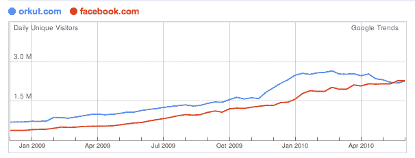

# Orkut 即将落入印度脸书手中 

> 原文：<https://web.archive.org/web/https://techcrunch.com/2010/07/07/orkut-facebook-india/>

# Orkut 即将落入脸书之手

尽管谷歌因不理解社交网络而感到悲伤，但人们经常忘记它拥有一个相当大的社交网络，即 [Orkut](https://web.archive.org/web/20230213024304/http://www.orkut.com/) 。虽然 Orkut 在全球范围内比脸书小得多，但它至少在两个大国占据主导地位:巴西和印度。但这种情况可能很快会改变。

印度看起来就要倒向脸书了。2010 年 5 月，脸书吸引了 1800 万印度独立访客，相比之下 Orkut 吸引了 1970 万。在过去的一年里，脸书的 650 万印度游客增长了 177 %,相比之下 Orkut 增长了 35%。当 6 月份的数据出来时，脸书很可能在那个国家超过 Orkut。事实上，谷歌自己的网站趋势显示[脸书上个月挤掉了印度](https://web.archive.org/web/20230213024304/http://trends.google.com/websites?q=orkut.com,+facebook.com&geo=IN&date=all&sort=0)的 Orkut。

脸书在印度投入了大量资源，目前正在印度雇佣 500 名员工。这是该公司的一个主要的全球优先事项。然而，巴西对 Orkut 来说仍然是安全的，每月有 2900 万访问者，而脸书只有 800 万。

但是谷歌不再把社交网络的希望寄托在 Orkut 身上。它已经转移到了其他事情上，比如用它并不秘密的谷歌我项目克隆脸书。好吧，如果一位谷歌研究员的想法有任何暗示的话，这可能不是一个完全的克隆。