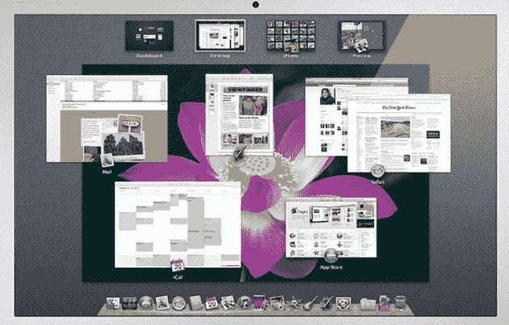
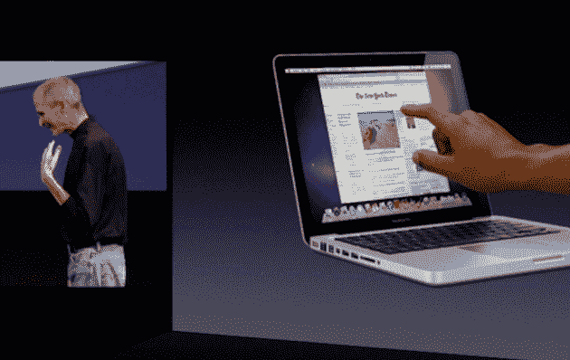
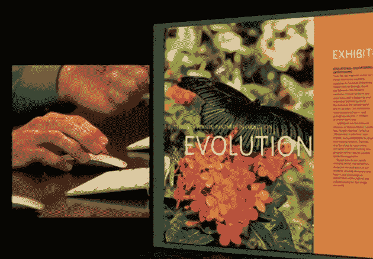

# 有了 OS X 狮子，不再是点击，而是轻击 

> 原文：<https://web.archive.org/web/https://techcrunch.com/2010/10/25/os-x-lion-multi-touch/>

感觉我们就在某件事的边缘——“感觉”是关键词。几十年来，个人电脑基本上还是老样子。它是鼠标、键盘、显示器和机器。对于笔记本电脑之类的东西，这一点有所改变，但它的基本思想是一样的。但随着智能手机和平板电脑的兴起，整个概念终于开始演变。看起来 OS X 狮子[将会是这个转变](https://web.archive.org/web/20230127141317/https://techcrunch.com/2010/10/13/os-x-lion-10-7/)的关键。

在上周的“回到 Mac”活动中，苹果公司在舞台上偷偷展示了他们为下一版本 OS X 准备的一些东西。值得注意的是，首席执行官史蒂夫·乔布斯非常明确地表示，它诞生于“OS X 遇见 iPad”的概念。换句话说， [OS X 遇上了 iOS](https://web.archive.org/web/20230127141317/https://techcrunch.com/2010/10/20/os-x-lion/) ，苹果基于触控的操作系统。

乔布斯还明确表示，苹果不会很快推出触屏 MAC 电脑。注意到这些概念“给出了很好的演示”，他还说，多年来的广泛测试已经证明，触摸垂直屏幕并不符合人体工程学。取而代之的是，苹果致力于开发允许用户在屏幕上使用触摸元素的产品，而无需实际触摸屏幕。在他们的 MacBooks 中，多点触控触控板是内置的。对于他们的台式机来说，Magic Mouse 和 Magic Trackpad 是为了给所有 Mac 用户带来多点触控而设计的。

显然，这两种产品都不是偶然的。正如我们之前提到的，苹果正在迎来一个触摸的时代，而这些东西都是这一转变的关键。现在，随着 OS X 狮子的功能，我们将首次看到触摸概念完全融入传统操作系统。

当然，苹果在 OS X 推出某些多点触控选项已经有一段时间了；首先是 MacBook 用户使用多点触控触控板，然后是 Magic Mouse 和 Magic Trackpad 用户。但所有这些基本上都是你通常用鼠标点击完成的事情的附加快捷方式。一些新的 OS X 狮子功能似乎是经过深思熟虑的多点触控功能。

正如苹果 OS X 副总裁 Craig Federighi 上周在舞台上演示的那样，导航全屏应用程序和任务控制等新功能，不再是点击，而是滑动和滑动。这是一个向左或向右的双指轻击，可以在全屏应用程序之间移动，然后返回到您的桌面。有趣的是，现在也可以从你的桌面向左滑动两个手指来访问你的桌面小部件(看起来它们不再覆盖在你的实际桌面上)。要进入任务控制中心，需要向下滑动三个手指。要预览 Mission Control 中许多打开的窗口，只需用两个手指向上滑动。

是的，指向和点击仍然是其中的一部分，但现在似乎更多的是后退。毫无疑问，也将会有键盘快捷键，但同样，作为后备/高级用户选项。我不禁想知道，在不太遥远的将来，触控板的“点击”选项是否会成为常态。

正如你可能已经注意到的，在他的演示中，费德里吉有几次在魔法鼠标上启动任务控制时遇到了麻烦。一部分是因为他紧张，但另一部分也是因为尽管多点触控是该设备的一个不错的功能，但表面不够大，无法实现更高级的手势。但是 Magic Trackpad(和 MacBook trackpad)非常适合这些应用。请记住，现在 Mac 笔记本电脑用户比 Mac 台式机用户多。这款[触控板多点触控操控是未来的](https://web.archive.org/web/20230127141317/https://techcrunch.com/2010/07/27/apple-magic-trackpad-mouse/)。

鉴于目前我们对 OS X 狮子的了解甚少，我对它的兴奋程度已经超过了我对 OS X 雪豹的兴奋程度。对我来说，很明显，苹果将利用这个新的操作系统开始向触摸计算的黄金时代过渡。我等不及了。

