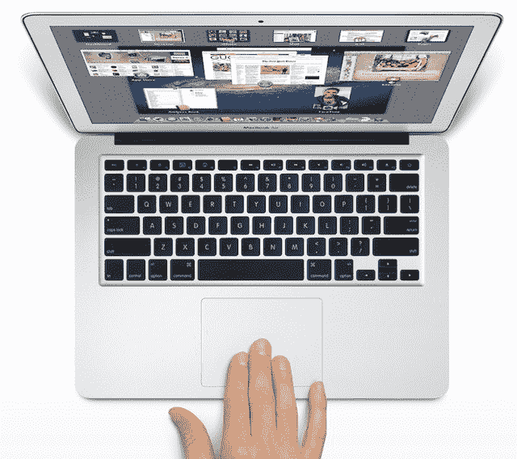
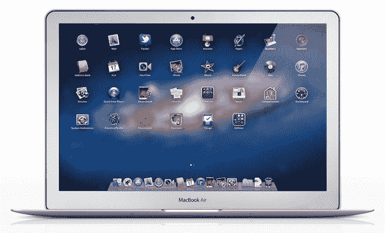
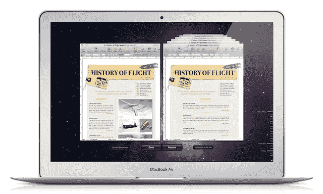
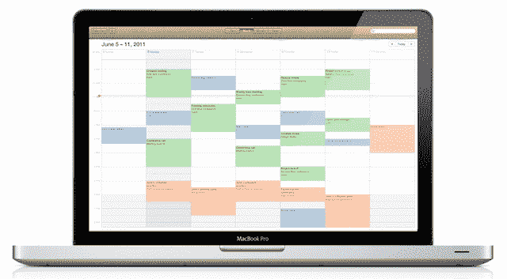
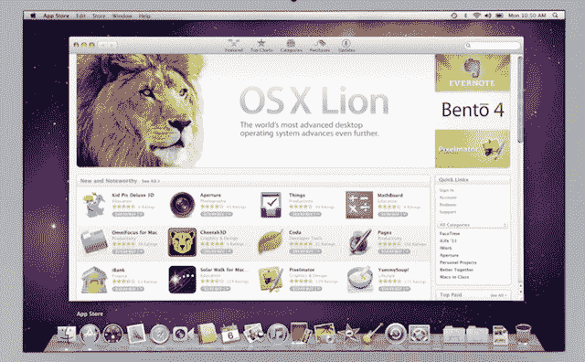

# 凭借《OS X 雄狮》，苹果触及操作系统的下一个十年——技术危机

> 原文：<https://web.archive.org/web/https://techcrunch.com/2011/07/20/os-x-lion-upgrade/>

十年前，我还不是 Mac 的用户。我从来没有过 Mac。我想我可能永远也不会拥有一台 Mac。我一直都是做 Windows 的。当然，Windows Me 很差劲，但 Windows 95 和 98 很可靠。当时我们正处在 Windows XP 的边缘。Mac 是我在学校被迫使用的东西。

然后，2001 年 3 月 24 日，OS X 来袭。这和我以前见过的任何景象都不一样。很漂亮。

当时我是大学一年级的新生。我记得我曾骑着单车去工程学院观看苹果公司正在安装的新操作系统的演示。我站在那里看了一些演示，但大多数时候我只是玩新的操作系统。我记得当时我在想，我真希望 Windows 能变成这样。

但我并没有完全被说服。这个最初版本的 OS X 狮子称为“猎豹”似乎有缺陷，和缓慢。确实如此。到 9 月份，苹果已经推出了第一个大升级，OS X 10.1“彪马”。我记得曾经去 CompUSA 的一家商店看过这个新版本。好多了。不过仍然没有卖出去，Windows XP 在第二个月就上市了。

我是在 Windows XP 发布的那一天买的它比 Puma 晚了整整一个月——2001 年 10 月 25 日。我在百思买买了一个免费的 MP3 播放器。这是个情报。这很糟糕，但这是免费的。iPod 在上市前两天刚刚发布，但直到 11 月份才发布。

即使在十年前，这也是一个不同的时代。

我基本上没有想过苹果，OS X，甚至 iPod，直到近三年后，当我打破了，买了一个 40 GB 的 iPod，所以我会与我所有的音乐在一个驱动器到加州。这是我买的第一款苹果产品。这不会是最后一次。

几个月后，我在加州的好莱坞工作。如果你不能从流行的电视节目和电影中分辨出，好莱坞是一个 Mac 主导的城市。我在华纳兄弟的停车场有一份工作，我桌子上的电脑是一台 Mac。每天使用几周后，我给自己买了一本——这是我能找到的最便宜的 iBook。我觉得和相对来说已经过时的戴尔笔记本电脑相比，硬件的速度太慢了。我沉迷的正是 OS X——确切地说，是当时 10.3 辆的“黑豹”。

快进到今天。现在是 OS X 发布整整 10 年后的今天，最新版的 OS X 即将面世，它的名字叫 OS X 莱昂(用老话说就是“10.7”)。现在，这两只大猫的昵称已经正式确定下来。苹果公司用“丛林之王”的名字为这个版本命名也就不足为奇了。这既是我们所知的 OS X 的顶峰，也预示着未来十年的情况。

**摸狮子**

当苹果去年秋天首次推出 OS X 狮子时，它被宣传为“ [OS X 遇上 iOS](https://web.archive.org/web/20230203101223/https://techcrunch.com/2010/10/20/os-x-lion/) ”。事实是，它仍然更接近 OS X 的事物，但它是 OS X 的更新版本。这是一个喜欢笔记本电脑和基于触摸/手势的环境的版本。

考虑到现在苹果 Mac 销售的近四分之三是笔记本电脑，这一点也不奇怪。iOS 设备本身完全是围绕基于触摸/手势的环境构建的，[现在远远超过了 Mac 的销量](https://web.archive.org/web/20230203101223/https://techcrunch.com/2011/07/19/apples-big-q3-2011-earnings/)。这就是现在大多数用户与苹果产品互动和体验的方式。OS X 要么迎头赶上，要么就躲开。

有了狮子，OS X 赶上了。作为一个重度 iPad 用户，我更喜欢在 iPad 和运行 Lion 的笔记本电脑之间切换。虽然 iPad/电脑的切换曾经让我伤透了脑筋，但一个最小的小调整就把它修好了:反向滚动。

有趣的是，对操作系统的一个小小的改动将会成为人们谈论最多的话题，并且会让一些用户非常生气。是的，在 Lion 中滚动被反转了。但这不仅是为了匹配 iOS，也是为了修复长期以来一直存在的问题。

你看，以前是在带窗口的小屏幕上(小写，不一定是 *Windows* )，你真的是用鼠标移动视窗。仔细想想，这并没有太大的意义——但这是唯一的方法，因为你必须移动滚动条。现在我们实际上可以移动*内容*。

是的，用户需要一点时间来适应这一点。但是一旦你习惯了，你会感觉更自然。我大概花了 15 分钟，就准备好了。当然，换回一台旧的 OS X 雪豹机器现在让我彻底疯了——我为了评论产品所做的努力。幸运的是，过了今天这就不是问题了。

是的，如果你真的，真的讨厌它，有一个选项可以回到旧的方式(但新的方式是 Lion 中的默认方式)。

稍微回顾一下，你会注意到 Lion 的另一个大的美学变化是不再有你通常会看到的滚动条。再说一遍，这是过去的遗迹。流体滚动直到 20 世纪 90 年代才真正出现，所以仍然需要滚动条来完整地查看内容(再次强调，实际上是通过移动视口)。但是现在有了多点触控和手势，我们就很少用了。所以他们不在那里，直到你需要看到他们在狮子。这基本上只是在页面上给自己定位(尽管你仍然可以手动点击和滚动它们)。当您完成滚动时，它们会再次消失。所有的内容，无论是在网上还是其他地方，这样看起来都更好。

**狮子的特征**

苹果称 Lion 拥有超过 250 个新功能。当然，大部分都是一些小东西，很多用户一开始会忽略，但最终会慢慢欣赏。在 WWDC，苹果选择[展示十款更大的](https://web.archive.org/web/20230203101223/https://techcrunch.com/2011/06/06/top-10-new-mac-ox-lion-desktop-features/)。如果你对 Lion 很感兴趣，你可能已经知道它们了，所以我想我应该谈谈实际使用它们中的一些，以及在过去六年多的时间里作为 OS X 的日常用户使用 Lion 是什么感觉。

首先，作为一个主要使用笔记本的人，我热爱全屏 app。当我第一次听说这个概念时，我并不完全赞成，因为很久以来就有全屏模式的应用程序，例如谷歌 Chrome，我从来没有使用过这个功能。但因为它完全融入了 Lion，所以在全屏应用之间进行转换似乎更加自然，感觉就像是整个环境中经过深思熟虑的一部分，而不是一个附加的功能。

iPad/iPhone 也可能让我更加欣赏全屏应用程序的使用。在许多情况下，打开多个窗口仍然是首选，但全屏应用程序加上多点触控手势可以在各种运行的程序之间快速切换，这在许多情况下对我来说似乎是理想的。

说到多点触控，这确实是 OS X 狮子的核心。随着苹果继续扩大 MacBooks 上触控板的尺寸，多点触控和手势逐渐成为 OS X 的一部分。现在这些手势终于对系统至关重要了。

现在，访问系统上运行的所有内容就像在触控板上向上滑动三个手指一样简单。这将启动任务控制，它或多或少是你的系统的“鸟瞰图”。这就像是 OS X 的老功能 Expose 更强大的版本。

Mission Control 确实需要一点时间来适应，但一旦你习惯了，你就不会想以任何其他方式管理你正在运行的应用程序。事实上，当你能够以更像这样的方式管理 iOS 应用程序时，那将是非常棒的。

Lion 最像 iOS 的一个元素是 Launchpad。这实际上是一个叠加屏幕，显示你所有的应用程序，并允许你点击一个来运行它。它本质上给了你的 Mac 一个 iPad 主屏幕界面。

同样，这需要一些时间来适应——我一直在寻找我的应用程序文件夹(默认情况下没有安装)。但一旦你用四个手指捏下(启动 Launchpad 的手势)，就很棒了。

自动保存和版本是如此显而易见的功能类型，你无法相信它们已经存在多年了。长期以来，人们对像文字处理这样的简单计算都有这种固有的恐惧，因为你认为你会忘记保存一些东西并丢失你所有的工作——或者更糟的是，你会覆盖你不想覆盖的东西。这发生在我们所有人身上。这些功能消除了这种恐惧。

像这样的事情还没有变得更普遍的一个原因是因为版本控制的想法对用户来说很复杂。OS X 狮子试图通过给版本一个类似时间机器的界面来解决这个问题。它工作得很好，尽管我发现性能有点问题。在 Pages 版本中，我的机器风扇经常会超速运转。有几次，我可以简单地通过点击锁定系统几分钟。

通常情况下，版本会按预期工作，但是旧机器上的用户仍然应该小心进入这种状态。当我遇到一些问题时，我正在使用一台全新的机器(尽管公平地说，我确实打开了几个其他应用程序)。

那些担心 AutoSave 和 Versions 会占用你太多硬盘空间的人不用担心。OS X·莱昂非常聪明，他只跟踪和记录文档不同副本之间的变化。这意味着没有保存 400 个完整的副本，只是版本之间的部分更改。

根据对计算的恐惧，Resume 是一个功能，它允许你在重启机器后从每个应用程序的中断处重新开始(无论是故意的还是被迫的)。说实话，我还在习惯这个功能。我是一个喜欢每天打开电脑重新开始的人(如果我不想，我就让它开着)。当然，关闭对话框中的一个简单的复选框也提供了这个选项。

隔空投送听起来像狮子的一个更酷、更微妙的特征。因为我现在只有一台 Lion 机器，所以我不能完全试用它。但是我看到了一个完美运行的演示。最棒的是，建立连接的任何一方都不需要连接(甚至靠近)WiFi 来传输文件。这都是使用 WiFi 无线电从本地机器本身进行的点对点通信。

回想我在 Windows 时代，还有一个新的 Windows 迁移工具听起来很有用。我没有尝试过，因为我不再使用 Windows，但再次，它听起来很棒。

**狮子的感觉**

好吧，但是所有这些听起来都很棒。与 OS X 的其他版本相比，使用 Lion 的实际感受如何？同样，一些功能需要一些时间来适应，但一旦你习惯了，这将是比以往任何时候都更优雅的体验——如果你是 iOS 用户(现在大多数 Mac 用户可能都是这样)就更是如此。

正如我所怀疑的，Lion 确实看起来好像是从[点&点击到轻击&滑动](https://web.archive.org/web/20230203101223/https://techcrunch.com/2010/10/25/os-x-lion-multi-touch/)的重大转变的开始。也就是说，从鼠标向触控板移动。虽然 OS X 狮子将与普通鼠标一起工作，但我建议你至少买一个魔法鼠标(带多点触控顶部)来利用许多导航功能。

事实是，如果你使用的是台式机，Magic Mouse 也没有 Lion 的 Magic Trackpad 那么健壮。(实际上，它只是不同，因为一个手指在触控板上的触摸与四处移动鼠标是一回事，但触控板为手势提供了更多的表面区域。)但是，现在绝大多数 Mac 用户都有笔记本，而且这些笔记本已经内置了多点触控触控板。

也许我最喜欢的基于狮子的手势是在屏幕之间滑动(用三个或四个手指)以在“桌面”和应用程序之间快速跳转。在以前的 OS X 版本中，你可以在空间之间切换，但这种严重依赖多点触摸的线性模式在 iOS 世界中更有意义。iOS 5 也将为 iPad 带来类似的功能。

甚至 Dashboard 在 Lion 中也有自己的垂直空间——一直到最左边(有点像 iOS 中的搜索)。我怀疑这与这样一个事实有关，即它以前是一个覆盖层，现在 Launchpad 是一个覆盖层，这将会令人困惑。但是，如果您愿意，您仍然可以更改设置，使 Dashboard 成为覆盖图。

在 Lion 的最新版本 Safari 中，滑动也开始起作用。现在，您可以在网页之间无缝地来回滑动，以查看其他内容。这是那些微小的关注细节的特点之一，使苹果产品，苹果产品。

就稳定性而言，OS X 雄狮似乎很稳固。我找不到任何一款为 OS X 雪豹开发的旧应用程序不能在 Lion 上运行。有几个小错误(例如，当你在全屏模式下时，Twitter for Mac 的托盘图标是不可点击的)，但没什么大问题。

更大的问题可能是像 Quicken T3 这样的应用程序[，它们在 Lion 上无法运行，因为像 Intuit 这样的应用程序制造商已经多年没有更新它们了。](https://web.archive.org/web/20230203101223/https://techcrunch.com/2011/07/19/apples-lion-creates-dilemma-for-older-quicken-fans/)

总的来说，操作系统本身似乎是完美的。一些开发人员抱怨说，Lion 的早期版本充满了 bug，由于速度慢而停滞不前，但这个最终版本感觉很快，而且基本上没有问题。是的，这里和那里有一些小错误(例如，当在全屏应用程序和桌面之间转换时，dock 有时会卡住)，但我没有发现任何会让我告诉人们等到第一次更新的错误。

OS X 狮子优化应用已经登陆应用商店。我知道并且能够测试的一个是电子邮件客户端[麻雀](https://web.archive.org/web/20230203101223/http://sparrowmailapp.com/)。例如，它现在有一个非常好的、针对 Lion 优化的全屏模式。

**狮子的逼近**

《OS X 雄狮》值得注意的还有它的发行方式。而《OS X》的最后七个版本都是通过标准光盘发行的。《OS X 雄狮》将仅在苹果应用商店发售。这意味着 OS X 雪豹的用户需要确保他们拥有最新版本的软件，包括应用商店。OS X 豹用户必须先安装雪豹，才能安装狮子。

这有点不方便，但据我所知，受影响的用户相对较少。此外，虽然苹果并没有真的大肆宣传，但用户可以将机器带到苹果商店为他们安装 Lion(无疑是收费的)。

同样有趣的是:我被告知将会有一个 USB 版本的 OS X 狮子在八月份上市。苹果拒绝透露更多细节，只是暗示价格仍在制定中。你们中的一些人可能还记得去年的 MacBook Airs 配备了 USB 恢复密钥，而不是光盘(因为 Air 没有光驱)。这是一个类似的想法。

是的，不管你喜不喜欢，苹果真的在光盘已死这件事上全力以赴。正如普通读者所知，[我完全支持](https://web.archive.org/web/20230203101223/https://techcrunch.com/2010/10/15/new-macbook-air/)。(还有，[这么跟你说的](https://web.archive.org/web/20230203101223/https://techcrunch.com/2010/10/20/a-compact-death/)。)

但是怎么恢复电脑呢？安装后，Lion 会在您的硬盘上创建一个恢复分区，允许您在系统出现故障时做一些有限的事情——比如修复您的系统，是的，甚至访问 web 浏览器。我听说，预装在新款 MAC 电脑上的 OS X Lion 将走得更远，因为它们将能够与云对话，根据需要自动重新安装 Lion。

为了安装 Lion，您至少需要一个英特尔酷睿 2 双核系统。换句话说，你需要一台 64 位的 Mac 电脑。你还需要至少 2 GB 的内存和 7 GB 的硬盘空间。Lion 本身只有 4 GB 的下载空间——大约相当于一部高清电影的大小——但是你需要更多的空间来安装。

如果你有苹果应用商店的雪豹，要安装 Lion，你只需要点击苹果应用商店的 Lion 链接，支付 29.99 美元，然后等待下载。它可以按原样安装，而不会被刻录到光盘上或类似的东西。29.99 美元的价格可以让你在所有的机器上安装它——是的，不需要更多的家庭包。

**一只骄傲的狮子**

随着围绕触觉的所有变化，人们不禁会觉得 OS X 狮子可能是 OS X 家族中的最后一只了。OS X 狮子仍然感觉像 OS X，但我不确定接下来的 Mac OS 会不会。这不是一件坏事，只是随着基于触摸的移动计算越来越受欢迎，这是不可避免的。

如果是这样的话，OS X 狮子是一个了不起的操作系统的一个伟大的送别。这也是迈向下一个十年可能被视为“传统”计算的适当的第一步。[触摸](https://web.archive.org/web/20230203101223/https://techcrunch.com/2009/09/29/touching-all-rumors-point-to-the-end-of-keysbuttons/)和[手势](https://web.archive.org/web/20230203101223/https://techcrunch.com/2011/06/23/oblong-mezzanine/)准备冲击主流。

**更新** : OS X 雄狮现已登陆苹果应用商店。[你可以在这里找到](https://web.archive.org/web/20230203101223/http://itunes.apple.com/us/app/os-x-lion/id444303913?mt=12)。

