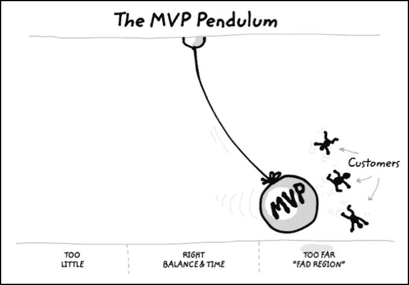

# 我们对 MVP TechCrunch 的危险痴迷

> 原文：<https://web.archive.org/web/https://techcrunch.com/2014/03/01/our-dangerous-obsession-with-the-mvp/>

More posts by this contributor

**编者按:** *比尔·奥莱特是[麻省理工学院创业马丁信托中心](https://web.archive.org/web/20221007154240/https://entrepreneurship.mit.edu/)的常务董事，也是[麻省理工学院斯隆管理学院](https://web.archive.org/web/20221007154240/http://sloan.mit.edu/)的高级讲师。他是最近出版的新书《自律的企业家精神:成功创业的 24 个步骤》的作者。*

制造东西并不能让你成为一个创业者。

"但是我们不需要快速构建和迭代吗？"我经常被问到。

好吧，当然。曾几何时，当公司使用“老派”瀑布模型来开发产品时，推动企业家以尽可能快地构建最小可行产品的方式来思考是有意义的。它大大加快了开发过程。通过将产品范围缩小到核心特性，您可以更快地启动客户反馈循环，并且可以更快地基于该反馈进行迭代。

但是钟摆已经摆得太过偏向于构建东西，而不是先花些时间去了解你的客户。结果是更多的创业公司盲目建设，没有重点，成为“宜家效应”的受害者。

插图:马里乌斯·乌尔萨奇

由迈克尔·诺顿、丹尼尔·莫琼和丹·艾瑞里创造的宜家效应是，当你自己制作某样东西时，你会比你应该的更珍惜它。[三人组做了测试，表明业余折纸制作者](https://web.archive.org/web/20221007154240/http://hbr.org/web/2009/hbr-list/ikea-effect-when-labor-leads-to-love)认为他们的作品与专家的作品同等重要——即使专家创作的作品客观上质量更高。这个短语是以著名的瑞典家具连锁店命名的，在那里“需要一些组装”是一种轻描淡写的说法。因此，一旦我们建立了一些东西，我们都倾向于在需要前者而后者可能蒙蔽我们的时候，越来越多地从询问模式转向倡导模式。

> 一旦我们建立了一些东西，我们都倾向于在需要前者而后者会蒙蔽我们的时候，越来越多地从询问模式转向倡导模式。

我们最近的一个校友团队，由于你很快就会看到的原因，将保持匿名，绝对热爱他们创造的技术。他们开发了一些令人印象深刻的获奖技术，有望显著改善人机界面。他们制作了一个需求很高的演示，每次有人对他们的技术表示兴趣时，他们都会感到兴奋，并添加更多内容来满足感兴趣者的愿望。凭借他们的演示和令人印象深刻的技术技能，他们从商业计划竞赛和投资者那里获得了资金，我认为这可能是他们遇到的最糟糕的事情。

无论是在会议上观看演示的“某人”,还是商业计划评审或投资者都不是付费客户。这个团队所谓的“MVP”只是一个性感的概念证明。他们说他们在测试假设，但他们测试的假设与技术可行性有关。他们声称自己经常“转向”——这意味着他们已经耗尽了商业创意，但不是资金。因此，他们没有取得进展。

作为一家初创公司，他们几乎没有宝贵的资源，为什么要把所有的时间和金钱都投入到建设中呢？因为他们自己建立了它，他们喜欢它，如果你告诉他们他们的 MVP 没有吸引任何付费客户，他们应该专注于关于客户需求的诚实对话，他们会感到很糟糕。他们过于依赖宜家效应。他们声称处于调查模式，但实际上更多的是在宣传他们开发的东西。

与最近的另一个校友团队相比， [FINsix](https://web.archive.org/web/20221007154240/http://www.finsix.com/) 。该公司[因其产品](https://web.archive.org/web/20221007154240/http://techland.time.com/2014/01/09/new-laptop-charger-fits-in-your-pocket-has-apple-acquisition-written-all-over-it/)在上个月的 CES 上赢得了认可和一系列奖项，T3 是一种微型笔记本电脑电源适配器，只有今天电源插头的四分之一大小。

但是当他们第一次出现在我的课堂上时，他们只有一项来自实验室的有前途的技术。我相信，电源极客会对超高频(VHF)开关留下深刻印象，这种开关速度快 1000 倍，转换器尺寸小 10 倍。根据他们网站上的说法，“取消重部件，如磁芯变压器，可以更好地抵抗机械冲击和振动，”这听起来也是一件好事。

然而，这些都不能帮助定义明确的客户群解决他们愿意花钱解决的难题。FINsix 认识到了这一点，因此他们花了一些时间去了解客户的需求，而不是去建造、建造、再建造。

“我们能够使用电子手册和广泛的调查在许多不同的市场测试[VHF 开关]概念，以确定我们笔记本电脑电源供应商的滩头市场，”联合创始人兼首席执行官 Vanessa Green 告诉我。一本小册子。

与工程师制作的 MVP 相比，在电子宣传册上的情感投入要少得多。他们的分析使他们能够考虑从手机到 LED 照明的一系列市场，然后确定笔记本电脑电源适配器是获得核心付费客户群的最佳方式，这些客户将维持公司的发展，以便开发更多产品。

> 如果你爱上了一个没人想买的原型，你就无法为你的客户开发出合适的产品。

如果他们爱上了他们的技术，或者他们制造的第一个原型，他们可能永远也不会销售一个消费者笔记本电脑充电器。你认为应用开发者对 MVP 的危险免疫吗？当然，一个应用程序需要的初始投资较少，但除此之外，企业就是企业。当你不需要那么多前期资金或维持资金时，旋转轮盘赌会更容易，但这并不意味着你有一个稳固的创业公司。

如果没有一个定义明确的客户，你不可能在黑暗中开发出伟大的产品。如果你爱上了一个没人想买的原型，你就无法为你的客户开发出合适的产品。

因此，除非你的最终目的是希望在资金耗尽之前，竞争对手会购买你的工程师或技术，否则你需要停止痴迷地建设，开始与潜在客户就他们的需求进行诚实的对话。这可能没有修补“产品”有趣，但远没有玩收购彩票压力大。这就是我们所说的“自律的企业家精神”，你可以同时拥有伟大的技术和伟大的营销，从而创造出史诗般的产品。认为你只能拥有伟大的技术或伟大的营销是错误的二分法，正如一些评论者最近在对斯坦福大学和麻省理工学院毕业生的短视比较中声称的那样。

觉得我是个落伍的保守的东海岸创业导师？上周，当我在三藩市与 [T3 顾问](https://web.archive.org/web/20221007154240/http://www.crunchbase.com/company/t3-advisors)的[大卫·伯杰龙](https://web.archive.org/web/20221007154240/http://www.crunchbase.com/person/david-bergeron)以及 Rapt 工作室的科里·西斯特伦克和埃德·霍尔聊天时，他们达成了共识。“MVP 的心态无意中让我们远离了‘以用户为中心的设计’和对客户的关注，”他们告诉我。“我们[必须先关注为什么](https://web.archive.org/web/20221007154240/http://www.youtube.com/watch?v=sioZd3AxmnE&sns=em)，然后才能关注如何做和做什么。”

对于企业家来说，不要再纠结于你的 MVP 了。在“如何做”和“做什么”之前，你的第一个问题必须是“为谁做？”