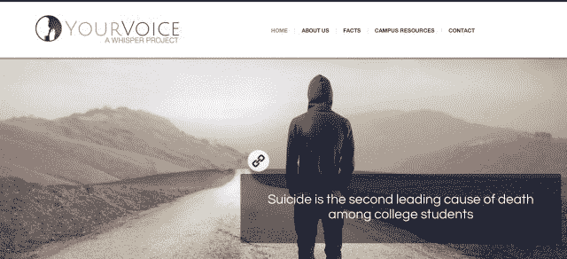
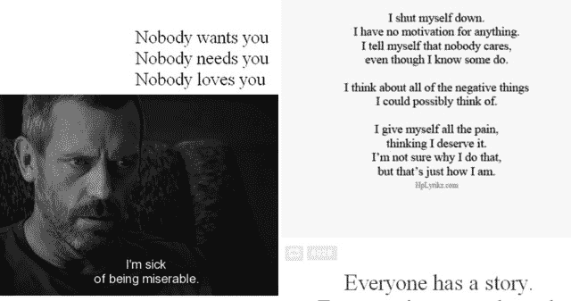
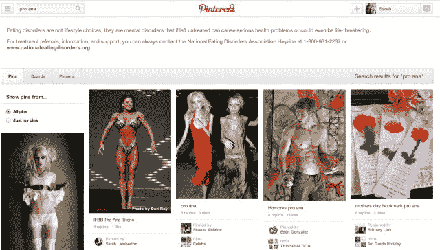
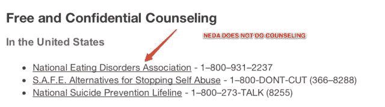
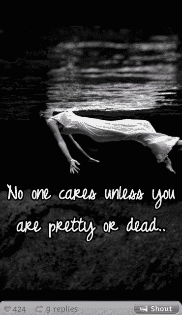

# 在新的内容政策出台一年多后，“自残社交媒体”仍然盛行 TechCrunch

> 原文：<https://web.archive.org/web/https://techcrunch.com/2013/06/20/over-a-year-after-new-content-policies-self-harm-social-media-still-thrives/>

大约一年半前，就在全国饮食失调宣传周期间， [Tumblr 对其网络上鼓励“自残”的博客采取了强硬立场该公司表示，这包括那些美化或宣传厌食症、贪食症和其他饮食失调症的网站，以及那些专注于自残和自杀的网站。该公司还表示，将修改其内容政策，并开始在用户在网站上搜索某些关键词时显示公共服务公告(PSAs)，例如“thinspo”或“proana”。Pinterest 和 Instagram 等其他服务很快跟进。](https://web.archive.org/web/20230214152032/http://staff.tumblr.com/post/18132624829/self-harm-blogs)

这就是今天的效果。

## 挑战

Tumblr 因年轻人群的情绪化、[有时像日记一样的](https://web.archive.org/web/20230214152032/https://techcrunch.com/2013/05/06/tumblrs-teenaged-double-edged-sword/)输出而蓬勃发展，这些人避开脸书以及妈妈、爸爸、同事和老板的窥探，成为一个伪匿名的飞地，人们可以在这里发帖、分享、发表意见、发泄和谈论他们的兴趣——即使这些兴趣是不健康的。

该公司已经因“色情问题”而众所周知——也就是说，它在允许成人内容但不想直接托管它之间小心翼翼。就像他们说的那样，这完全是另一回事，尽管观看色情会上瘾，但对观众来说并没有潜在的致命性。

然而，对于寻找自残内容的 Tumblr 用户来说，情况就不一样了。

在美国，2000 万女性和 1000 万男性在他们人生的某个阶段患有临床上显著的饮食紊乱。厌食症是所有精神疾病中死亡率最高的，因为患者实际上是在饿死自己。

根据[你的声音](https://web.archive.org/web/20230214152032/http://www.your-voice.org/)的说法，除了饮食失调，自杀是大学生死亡的第二大原因，但其中 75%的人没有寻求心理健康问题的帮助。

换句话说，与患者接触和联系的机会少之又少。

 饮食失调症以及其他涉及“自残”的精神疾病的问题在于，持续接触描绘某种赞美相关行为的内容——无论是极瘦的模特还是标有切割痕迹的手臂照片——对那些易受疾病或病症影响的人来说都是极其有害的。

美国国家饮食失调协会(T4)NEDA 项目主任苏西·罗曼解释说:“我们确实知道，接触美化危险行为的内容是一个真正的问题，这种行为是那些与可能危及生命的饮食失调症作斗争的人的特征——特别是对于那些具有易患饮食失调症的遗传倾向的人来说。”。她说，社交媒体网站可以进一步加深那些查看图像和信息的人的障碍，也可以推迟或阻止他们寻求帮助或参加康复计划。

不幸的是，Tumblr 是罪魁祸首。

“我们听说 Tumblr 是人们不断看到非常具有触发性和非常有害的内容的地方，就 [pro-ana](https://web.archive.org/web/20230214152032/http://en.wikipedia.org/wiki/Pro-ana) 和 [thinspo](https://web.archive.org/web/20230214152032/http://www.urbandictionary.com/define.php?term=thinspo) 图像和内容而言。罗曼说:“实际上，我们并没有收到很多关于脸书的抱怨……我们只是听到了更多关于 Tumblr 的抱怨。”。

纽约市心理健康协会(MHA-纽约)下属机构的沟通主任阿什利·沃姆布(Ashley Womble)也同意，就其本质而言，Tumblr 比其他网站有更多的自残内容。

“如果你在 Tumblr 上键入‘自杀’或‘自杀’，你会发现一些非常黑暗的东西，”她说。“你会发现很多人在网上写关于自杀意念的文章；他们上传自残的照片，我认为这已经到了令人不安的程度。如果你在 Pinterest 上输入同样的搜索词，你不会找到。事实上，你可能什么也找不到。”

她的组织也与脸书、谷歌和 Pinterest 合作，从 Tumblr 获得的推荐比任何其他社交媒体网站都多。

抑郁、压力和自杀的想法在 [Tumblr 的顶级人群](https://web.archive.org/web/20230214152032/http://www.quantcast.com/tumblr.com#!demo&anchor=panel-GENDER)中也并不少见。“一半的大学生说，在过去的一年里，他们要么压力太大，要么太焦虑，他们无法正常工作，”[耳语](https://web.archive.org/web/20230214152032/http://whisper.sh/)的联合创始人迈克尔·海沃德解释道。最危险的是那些可能首先转向 Tumblr 这样的网站的人——被欺负的人，或者那些感觉被排斥或与众不同的人。例如，LGBT 儿童自杀的可能性是普通儿童的四倍。“这些数字令人震惊，”海沃德补充道。

根据[similar web](https://web.archive.org/web/20230214152032/http://www.similarweb.com/)的研究团队，他们研究了 160 万个 Tumblr 博客的样本，**只有 0.17%包含一个更明显的自残标签**(例如，切割、自杀、自残、遗书、自杀、自杀想法、自杀、瘦、瘦、厌食、厌食症、消瘦、暴食症、暴食症、饮食失调、暴食症、净化等)。).如果将这一数字外推到 Tumblr 的整体用户基础上，将会有近 20 万个关于这些主题的博客。如果它包括“替代”单词——拼写错误(“thynspo”)和不太明显的术语——这个数字可能会更高。(请注意，SimilarWeb 的研究无法区分积极的自助博客和消极的自助博客)。

## 社交媒体公益广告和政策

虽然有人可能会说，社交媒体服务没有义务或责任监管出现在其平台上的图片或帖子，但值得注意的是，当涉及到“自残”内容时，所有主要网站都采取了行动。

**Pinterest**

去年，大约在 Tumblr 表明立场的同时，Pinterest 也因其越来越多的 thinspo 图片而受到了 T2 的攻击。在 Tumblr 宣布修改内容政策、暂停不合规博客并运行 PSAs 的计划后的一个月，Pinterest 也很快采取了同样的措施。

据罗曼称，从技术上来说，NEDA 首先接触了 Pinterest，但事实证明，该公司已经在接触他们了。她将 Pinterest 描述为对积极主动感兴趣，是一个“乐于接受”和“渴望”的合作伙伴。

像 Tumblr 一样，Pinterest [发布了](https://web.archive.org/web/20230214152032/http://www.nydailynews.com/life-style/health/pinterest-cracks-pro-anorexia-thinspiration-boards-updated-policies-article-1.1050976)一份修订后的[可接受使用政策](https://web.archive.org/web/20230214152032/http://about.pinterest.com/use/)，其中明确规定了什么样的内容是被禁止的*(那些“对你自己、任何其他人或任何动物造成伤害、损失、身体或精神伤害、情绪、痛苦、死亡、残疾、毁容或身体或精神疾病风险的内容)然而，该公司的一名代表解释说，它并没有完全禁止这些话题，因为有人在搜索“警告信号”、“帮助”、“支持团体”或“康复故事”时，可能会在搜索中包含这些被禁止的术语。*

也就是说，Pinterest 与 SuicidePreventionLifeline.com 和 NEDA 合作，帮助该网站提供公益广告，这些广告可以搜索“proana”或“自杀”等词(我们应该注意，后者更多地是“自杀女孩”的照片)。

**Instagram**

与此同时，尽管 Instagram 从未像 Pinterest 那样经受住媒体对这件事的广泛攻击，但它迅速跟进了其他公司。2012 年 4 月，谷歌还更新了内容政策，禁止美化、宣传或鼓励自残的账户、图片或标签。它更进了一步，使得像“稀薄呼吸”，“probulimia”和“proanorexia”这样的标签不再是可搜索的。今天仍然如此。[此外，在政策颁布一年后](https://web.archive.org/web/20230214152032/http://www.news.com.au/lifestyle/health-fitness/shut-down-instragram-crackdown-on-pro-ana-loophole/story-fneuzlbd-1226615742415)，该网站还禁止了其社区转向的新标签，以避免审查(例如像“thynspo”这样的拼写错误)。

Instagram 还与 NEDA 合作，运营与饮食失调相关的公益广告；对于与“切割”或“自杀”相关的搜索，Instagram 会将用户指向[BeFrienders.org](https://web.archive.org/web/20230214152032/http://www.befrienders.org/)。与 Pinterest 不同，它更低调地在其网站顶部或应用程序的搜索结果页面显示其公益广告，Instagram 实际上要求用户在阅读弹出的公益广告信息后点击“显示照片”或“取消”。

Instagram 的母公司脸书有点不同。尽管该网站没有对其新推出的“图形搜索”服务或个别社区的自残搜索运行 PSAs，但它高度参与了对内容的监控。简单来说，公司试图让最严重的自残内容不被普通大众发现。(例如，搜索“自杀”，你会一页一页地找到参与预防的组织。)

它的[内容政策](https://web.archive.org/web/20230214152032/https://www.facebook.com/help/212826392083694/?q=self-harm&sid=0F4YV2wx2yIpyFYqN) [像其他公司一样禁止自残](https://web.archive.org/web/20230214152032/https://www.facebook.com/help/172960776095154/?q=self-harm&sid=0u6PcrhpnEkcOIj1C)，脸书提供工具允许用户[报告自杀内容](https://web.archive.org/web/20230214152032/https://www.facebook.com/help/contact/305410456169423?rdrhc)，它[提供全球自杀热线信息](https://web.archive.org/web/20230214152032/https://www.facebook.com/help/103883219702654/?q=suicide&sid=0qrW6KiFZ10fwW6Fc)，并与伙伴组织合作帮助宣传其政策。尽管仍有许多潜在的“触发”团体，除了自动化系统之外，脸书还有庞大的版主团队来监管与自残、仇恨言论等相关的内容。因此，尽管有“瘦灵感”的网页，例如，没有大规模的子网站(脸书网页或社区)有数百万成员支持彼此饥饿或自杀的决定。

## Tumblr 有自己的公益广告

当被问及 Tumblr 对 PSAs 的早期计划的更新时，一位公司代表仅通过电子邮件发表了简短的评论:“根据我们从用户和合作伙伴组织收到的报告，我们已经并将继续暂停博客。”该公司从未回应随后通过电话进一步讨论此事的请求或后续问题。然而，该代表补充说，“没有计划在个人用户账户上运行 PSAs 或任何其他内容，也没有计划对 Tumblr 的内容政策进行修改。”

罗曼证实了 Tumblr 的说法，即该网站过去曾与 NEDA 合作过，甚至向该组织提供了一个专用的电子邮件地址，允许该组织联系 Tumblr，报告来自其媒体监督计划的报道。她还说，其中一些博客确实被关闭了。然而，当被问及以这种方式处理了多少请求时，罗曼说有“几十个”

那不是很多。

Tumblr[有超过 1 . 16 亿博客](https://web.archive.org/web/20230214152032/http://www.tumblr.com/about)，所以像这样的“一次性”方法显然不是长久之计。当然，解决办法是运行这些公益广告——另一种选择是脸书大量参与内容监管，这是 Tumblr 这样的初创公司可能无法承受的……至少在雅虎之前是这样。但它也很难与其非营利合作伙伴就其计划进行沟通。

NEDA 帮助 Tumblr 精心设计了 PSA 的语言， [Tumblr 将其发布在其员工博客](https://web.archive.org/web/20230214152032/http://staff.tumblr.com/post/18132624829/self-harm-blogs)上，并向该公司提供了一份搜索术语列表，用于运行 PSA，就像它过去给脸书提供的术语一样。但是一年后，NEDA 自己的 PSA 仍然没有运行，尽管该公司今年早些时候向该组织保证解决方案正在工作中。

罗曼在谈到 Tumblr 的解释时说:“由于存在如此多的技术挑战，鉴于 proana 和 thinspo 内容的规模，他们在逐个标记的基础上解决这些问题(用 PSAs)时遇到了很多问题。”。"我们失望地看到，一年后，公益广告没有出现."

但奇怪的是，Tumblr *正在运行 PSAs*，NEDA 并没有意识到这一点。

要么是这家初创公司没有让 NEDA 知道公益广告[已经](https://web.archive.org/web/20230214152032/https://twitter.com/DanielMizzi_/status/314129772030607360)违反了搜索词(然而，他们没有使用 NEDA 的文本),要么是 Tumblr 非常安静地或最近推出了这些服务——也许没有在[大规模出售给雅虎](https://web.archive.org/web/20230214152032/https://techcrunch.com/2013/05/20/its-official-yahoo-is-buying-tumblr-for-1-1b-promises-to-keep-it-independent/)之前就其陷入困境的用户发布重大公告。今天，在 Tumblr 上搜索一般术语的信息，例如“ana”、“thinspo”或“自杀”，内容如下:

> "*如果您或您认识的人正在应对饮食失调、自残问题或自杀想法，请访问我们的[咨询&预防资源页面](https://web.archive.org/web/20230214152032/http://www.tumblr.com/docs/en/counseling_prevention_resources)，获取可能有所帮助的服务列表。"*

(当安全搜索打开时，一些搜索也显示没有帖子。)

罗曼说，NEDA 在 Tumblr 的早期联系人没有回答该公司关于截至上周失踪的公益广告的问题，而是让她去找 Tumblr 的另一名员工，后者也从未回应。该非营利组织没有在“咨询和预防资源”网页或当前的 PSA 上提供建议，并且——因为它实际上不提供咨询——会提供不同的语言来说明它希望如何被引用。

然而，Womble 对 Tumblr 的体验却有所不同。她的自杀预防组织建议该服务将推广信息放在其网站上，并向 Tumblr 提供了一个与搜索自杀信息相匹配的术语列表。她不知道 Tumblr 何时开始在搜索旁边显示消息，但对现在这样做感到满意。

## 还有别的办法吗？

尽管 Tumblr、Pinterest 和 Instagram 的内容政策说的都是正确的事情，但那些容易患上饮食失调、抑郁症和其他精神疾病的人仍然在这些网站上找到了蓬勃发展的社区。当用户改变他们喜欢的标签时，网站很难跟上。Instagram 今年可能会对其政策进行[修订](https://web.archive.org/web/20230214152032/http://www.news.com.au/lifestyle/health-fitness/shut-down-instragram-crackdown-on-pro-ana-loophole/story-fneuzlbd-1226615742415),以纠正现在猖獗的用于绕过搜索过滤器的拼写错误，但在它和其他网站上，对拼写错误的单词(“proanna”或“thyn”)或其他不明显的标签(“thigh gap”)的搜索仍会直接将你带到大型社区，这些社区似乎仍在继续，没有受到干扰。

 嘀咕，为值得的事，唯一的服务就是真正的与众不同。这家小型但不断增长的初创公司没有监管某人的(不健康)想法，这些想法可能会美化或促进自残，然后引发其他人，而是允许帖子似乎通过。但这篇文章不会显示给其他 Whisper 用户查看。

“我们不会掩盖事实。但是如果你说了一些哪怕是一点点暗示的话，我们会删除帖子并打上水印，”海沃德解释道。只有发帖人能看到水印版。内容是，“你的低语已被听到”，引导用户通过你的声音寻求帮助，并提供了热线号码。

对于那些处于边缘状态的帖子——很多都是——该服务创建了一个支持性社区，在那里负面和恶意内容会在不到半分钟的时间内消失。海沃德说:“我们不和班宁混在一起。

如今，他认为其他社交媒体网站需要做得更多。“很多人不愿意为了企业的长期生存能力而做出短期牺牲，”他说，并指出 Myspace 也曾经存在许多网络欺凌和青少年自杀的问题。“[这些网站]沉迷于流量……他们不愿意做任何哪怕是稍微疏远一小部分观众，或者会影响他们日访问量的事情。”

然而，脸书一直在删除有害的帖子。所以会小声说话。“这在道德和伦理上都是正确的事情，”海沃德说，“碰巧的是，这对企业来说也是正确的事情。”

*需要帮助？在美国，请拨打 1-800-273-8255 咨询[国家预防自杀生命线](https://web.archive.org/web/20230214152032/http://www.suicidepreventionlifeline.org/)，或者拨打 800-931-2237 咨询由[N](https://web.archive.org/web/20230214152032/http://www.nationaleatingdisorders.org/)T5【ationalEatingDisorders.org】提供的求助热线。不在美国？试试全球友谊会或国际预防自杀协会。*

*图片鸣谢:top: Jenni Holma，Getty Images 伤心男孩:Shutterstock / sokolovsky*