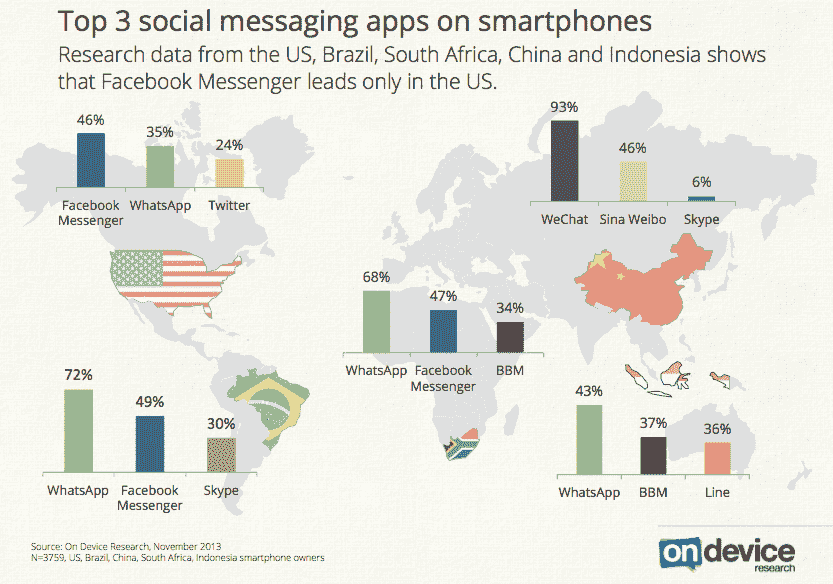

# 消息应用泛滥

> 原文：<https://web.archive.org/web/https://techcrunch.com/2013/12/06/overrun-with-messaging-apps/>

因为我会在 iPhone 上安装几乎所有的应用程序，只是为了看一眼，所以我有一个名为“消息应用程序”的文件夹，现在有五页厚。它只包括大牌、地区巨头和那些在 TechCrunch 或其他科技博客上引起足够关注的新来者。要知道，*最近*。

局势正在失去控制。

毫无疑问，手机短信现象正在蓬勃发展，每个人都想从中分一杯羹。Ovum [的分析师上个月](https://web.archive.org/web/20230325120912/https://techcrunch.com/2013/11/28/massively-mobile-messaging/)估计，到 2014 年底，在这些类型的应用上发送的消息数量将从今年的 27.5 万亿增长到 71.5 万亿。该报告称，社交信息“不仅仅是一种时尚”，而是一种“将长期存在”的服务

“开发者，”他们可能会说，“启动你的引擎。”

在其他地方，有[报道称【Whatsapp 等即时通讯客户端正在取代 Facebook Messenger，脸书承认](https://web.archive.org/web/20230325120912/http://www.businessinsider.com/whatsapp-facebook-comparison-2013-11)[青少年使用量正在下降](https://web.archive.org/web/20230325120912/https://techcrunch.com/2013/10/30/facebook-teens-drop/)。有传言称 Snapchat 拒绝了 30 亿美元的收购要约。

但是，即使手机短信本身并不是一种时尚，今天发布到 App Store 的许多产品都是如此。

太多有才华的人正在开发消息应用程序或 Snapchat 替代品，而这些应用程序或产品的功能集只是略有改进或差异化。更糟糕的是，他们正在开发消息应用程序。一个给[眨眼自拍的 app](https://web.archive.org/web/20230325120912/https://techcrunch.com/2013/11/20/selfie-messenger/)？这足以让我们真正为后代担忧。

几乎每天，由能够拼凑出一点 iOS 代码的开发人员匆忙雇用的公关人员都会一个接一个地发布最新、最棒的消息服务——就像洪水一样，文字开始变得模糊，描述听起来几乎是从之前的应用程序复制粘贴而来……就像上周一样。

*你看到了吗？，*他们写。*【编校】是目前最安全的私人短信应用。[Redacted]让您安全轻松地共享私人信息、拨打电话、共享照片和视频！一切都是私人的！*

嗯，听起来很熟悉。

一些人试图专注于 Snapchat 缺乏的一个小功能，并以此作为他们存在的基础。其他人选择一个单一的功能，把它变成一个完整的应用程序，希望成为下一个新的噱头，洛杉矶前锋的双照片。这个做 [GIFs](https://web.archive.org/web/20230325120912/https://techcrunch.com/2013/08/08/gif-chat/) ！这个发[歌](https://web.archive.org/web/20230325120912/https://techcrunch.com/video/fly-or-die-rithm-for-ios/517877686/)！这个[太](https://web.archive.org/web/20230325120912/https://techcrunch.com/2013/11/29/pingtune-raises-1-6m-and-unleashes-messaging-app-based-around-music/)了！这个有游戏！这个可以让你发自拍！(哦，等等。他们都这样做。)

消息应用 vine 的几十个小分支已经涌现，增加了一些额外的功能，并交叉手指。让他们来吧，应用程序开发者在掷骰子后恳求道。让用户来。

新来的约翰尼不明白的是，手机短信不是一夜成名，真正的病毒式成功是罕见的。多年来，这一领域一直充斥着即时通讯公司，直到现在，随着智能手机在关键的成熟市场达到临界质量，而中国和印度等新兴市场大量采用移动设备，我们才看到之前建立的足迹的结果。

例如，Whatsapp 成立于 2009 年，通过周期性地从付费应用程序转向免费应用程序，反复瞄准应用程序商店的排行榜，稳步扩大了用户群，使其受益于新用户的抢购热潮，因为它登上了免费应用程序排行榜的榜首。今年，它终于感觉足够好，成为免费的顶级竞争者之一，目前它在美国应用商店排名第 28 位，吃掉了更多的下载量。

与此同时，KakaoTalk、LINE、微信等许多较大的即时通讯应用都受益于对地区的关注，这些应用都在吹嘘自己惊人的用户数量。后来[通过用户的家人和朋友的个人网络将](https://web.archive.org/web/20230325120912/https://techcrunch.com/2013/06/13/messaging-apps/)扩展到全球。

至于受欢迎的新来者，有一点好时机和运气。例如，Snapchat 在洛杉矶高中迅速发展，这对该公司来说是幸运的，因为它之前一直在努力吸引用户。他们几乎意外地进入了一个可寻址且服务不足的市场，而仅仅几年前这个市场还不会存在:拥有昂贵智能手机的青少年，试图在脸书避开父母的“喜欢”。

当然，这款应用很聪明，但消失消息在它出现时并不是一个新的想法(这有点好笑，因为关于谁想出 Snapchat 这个主意的法律纠纷[。例如，在 2010 年初，一款名为 TigerText 的 iPhone 应用声称](https://web.archive.org/web/20230325120912/https://techcrunch.com/2013/07/01/new-snapchat-docs/)[将从用户的手机上消失短信](https://web.archive.org/web/20230325120912/http://www.wired.com/gadgetlab/2010/03/tigertext-deletes-text-messages-from-receivers-phone/)。在此之前，一些[在线](https://web.archive.org/web/20230325120912/http://answers.yahoo.com/question/index?qid=20080624141647AAkHsmM) [网站](https://web.archive.org/web/20230325120912/http://www.ask.com/question/how-do-you-send-a-private-text-message-on-a-cell-phone)让用户从网络发送私人短信到手机。事实证明，Snapchat 实际上是一个重新设计的想法，在正确的时间击中了正确的学生群体，然后起飞了。

但是对于乐观(或者可能天真)的应用发行商来说，Snapchat 的故事看起来像是他们自己病毒式成功的公式。为孩子们开发一个应用程序，突出它的私密性… [盈利](https://web.archive.org/web/20230325120912/http://www.marketing-for-accountants.com/wp-content/uploads/2013/11/underpants-gnomes-2.jpg)。当然，事情没那么简单。

随着越来越多的开发者发布不成熟的尝试，以驾驭更大的消息传递浪潮，今天对更新的移动消息传递体验仍然积极的氛围可能会变成沮丧。毕竟，这些应用程序不会相互交流，而且每个应用程序都希望你在首次注册时重新创建你的社交图谱。有些人甚至会黑掉你的通讯录。用户能被烧几次？我们要邀请多少次朋友才能加入？在说“忘了这个吧，我要回到 iMessage/Kik/Snapchat/Whatsapp/etc”之前，我们可以尝试多少次每个愚蠢的小傻瓜永远吗？

说真的，一个人需要多少个移动通讯应用程序？一个？半打？更多？

如果手机短信正在成为 2010 年代的社交网络，那么看起来我们就要找到答案了。