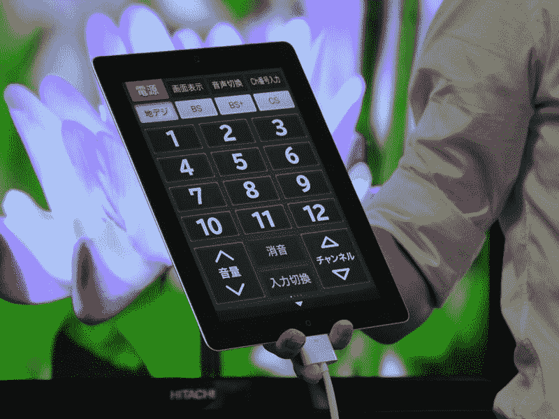

# P50-GP08:日立的最后(？)旗舰电视可通过 iPad/iPhone 控制 TechCrunch

> 原文：<https://web.archive.org/web/https://techcrunch.com/2011/08/11/p50-gp08-hitachis-last-flagship-tv-can-be-controlled-via-ipadiphone/>

# P50-GP08:日立的最后(？)旗舰电视可以通过 iPad/iPhone 控制

就在上周，[日立](https://web.archive.org/web/20230203135836/https://techcrunch.com/tag/hitachi)决定[在年底前停止国内电视制作业务](https://web.archive.org/web/20230203135836/https://techcrunch.com/2011/08/03/hitachi-to-stop-producing-tvs-by-year-end/)，但这并不意味着该公司不会大获成功。今天，[在日本发布了总共六款日立 Wooo 电视](https://web.archive.org/web/20230203135836/http://www.hitachi.co.jp/New/cnews/month/2011/08/0811.html)【JP】，其中 50 英寸的 3D 型号 P50-GP08 抢尽了风头。

等离子电视很可能是日立最后一款自主生产的旗舰机型，看看规格表就会发现这确实令人遗憾:

*   50 英寸全高清 3D 等离子屏幕
*   像素管理器 EX 引擎提供更清晰的 3D 图像
*   对比度:500 万:1
*   5 个电视调谐器
*   集成 500GB 硬盘(可移动)
*   DLNA 支持
*   4 个 HDMI 插槽
*   用户离开房间后(5-60 分钟后)，运动传感器会自动关闭电视
*   网络连接(即视频点播、访问雅虎日本等。)
*   将于本月晚些时候发布的“Wooo Remote for iPhone/iPad”应用程序(用于访问电视功能、查看电视节目、播放录制的材料等。/见下文)

日立计划于 8 月 27 日开始在日本销售这款美颜，售价 4200 美元。该公司尚未表示这款电视是否也会在海外销售。

Via [AV 手表](https://web.archive.org/web/20230203135836/http://av.watch.impress.co.jp/docs/news/20110811_466875.html) [JP]