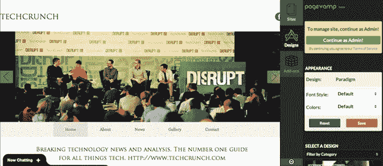

# 在第一轮宿舍基金的支持下，Pagevamp 将脸书网页变成了网站 TechCrunch

> 原文：<https://web.archive.org/web/https://techcrunch.com/2013/06/19/pagevamp-dorm-room-fund/>

# 在第一轮宿舍基金的支持下，Pagevamp 将脸书网页变成了网站

感觉创业公司正在采取越来越多的措施，让网站创建过程尽可能简单。有像 [Weebly](https://web.archive.org/web/20221007195218/http://www.weebly.com/) 这样的公司，[为建立网站](https://web.archive.org/web/20221007195218/https://beta.techcrunch.com/2013/05/03/with-over-15m-sites-built-weebly-launches-new-planner-and-mobile-editor-brings-website-creation-service-to-android/)提供拖放界面。还有大麦，[根本不需要任何排版工作](https://web.archive.org/web/20221007195218/https://beta.techcrunch.com/2013/05/04/barley-launch/)。现在又有了 [Pagevamp](https://web.archive.org/web/20221007195218/http://www.pagevamp.com/) ，它可以让你把一个脸书页面变成一个网站。

这家公司是由 Atulya Pandey、Fred Wang 和 Vincent Sanchez-Gomez 三位宾夕法尼亚大学的学生(现已毕业)创建的，他们在大学期间经营了一家小型 WordPress 设计公司。桑切斯-戈麦斯说，他们发现这个过程对许多人来说还是太复杂了。另一方面，脸书页面很容易创建，但是不太容易定制。

“我想有些人，比如我妈妈或我奶奶，如果你说，‘嘿，做个 WordPress 网站吧’，他们会不知道该怎么做，”他说。“对他们来说，制作一个脸书页面更有可能。有了 Pagevamp，如果他们能做到这一点，那么他们就能建立一个网站。”

今天早上我亲自尝试了一下，我将 Pagevamp 指向 TechCrunch 的脸书页面，几秒钟之内我就有了一个看起来并不可怕的网站。(你可以在下面看到该网站的截图，以及 Pagevamp 的管理控件。)我可以做一些基本的编辑工作，比如从不同的设计中进行选择，但实际上，只需要输入脸书的网址。

Pagevamp 在 3 月底推出了公共测试版，桑切斯-戈麦斯表示，来自 80 多个国家的用户创建了 7000 多个网站。你可以看到 Pagevamp 为印度非营利组织[、](https://web.archive.org/web/20221007195218/http://www.seekhoindia.org/)[、音乐家](https://web.archive.org/web/20221007195218/http://meredithbakermusic.com/)和[餐厅](https://web.archive.org/web/20221007195218/http://azwinemuseum.com/)创建的网站样本。Sanchez-Gomez 说，它可以被个人和企业使用，尽管它需要从脸书页面开始，而不是个人账户。

今天，该公司宣布它得到了宿舍基金的支持，这是第一轮资本的学生管理的投资部门，这意味着它可以获得该基金的指导和网络，以及 2 万美元的资金。

如我所说，Pagevamp 最初创建的网站非常简单，但该公司计划通过添加组件来扩展其功能。目前，有两个——一个用于管理网站菜单的插件，另一个用于添加自定义页面。Sanchez-Gomez 说，还有更多正在开发中，最终他想把 Pagevamp 变成一个第三方开发者的附加平台。(事实上，已经有一个开发者注册页面[。)](https://web.archive.org/web/20221007195218/http://www.pagevamp.com/developers)

创建一个 Pagevamp 站点是免费的，但是如果你想在一个非 Pagevamp 域上发布或者想访问附加组件，你必须支付订阅费。