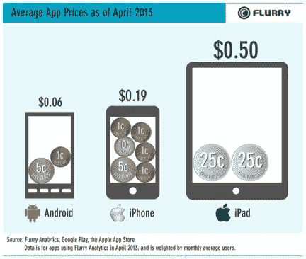
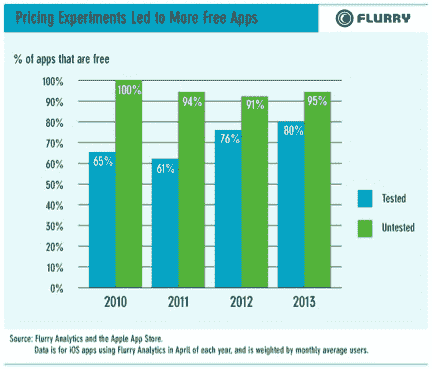

# 付费应用呈下降趋势:Flurry TechCrunch 称，90%的 iOS 应用是免费的，高于 2010-2012 年间的 80-84%

> 原文：<https://web.archive.org/web/https://techcrunch.com/2013/07/18/paid-apps-on-the-decline-90-of-ios-apps-are-free-up-from-80-84-during-2010-2012-says-flurry/>

越来越多的移动应用程序免费的趋势仍在继续，应用分析提供商 Flurry 在今天早上发布的一份新报告中证实了这一点，该报告关注的是应用程序价格随时间的变化。该公司发现，在 2010 年至 2012 年期间，大约 80%至 84%的 iOS 应用程序是免费的，但到 2013 年，其网络中 90%的 iOS 应用程序都是免费的。

当然，这并不意味着免费应用不赚钱。应用程序通常通过广告、应用内购买或通过将一部分用户推向移动应用程序的优质付费版本来产生收入——或许是为了移除广告。在后一种情况下，无广告的升级成本通常为 0.99 美元或 1.99 美元。

然而，只有一小部分移动用户愿意为高级体验付费。“比起避免广告或尽可能获得绝对高质量的内容，人们更希望获得免费内容，”报告作者 Mary Ellen Gordon 解释道，她是 Flurry 行业洞察和分析总监。

该公司还证实了传统观点，以及[其他行业](https://web.archive.org/web/20230206141341/https://techcrunch.com/2013/05/29/google-plays-app-revenue-share-up-8-since-november-but-apple-still-leads/) [关于安卓应用定价的报道](https://web.archive.org/web/20230206141341/https://techcrunch.com/2013/04/17/apple-and-googles-app-stores-now-neck-and-neck-except-on-the-metric-that-matters-most-to-developers-revenue/)——具体来说，该平台上的用户甚至比 iOS 上的用户更不愿意为移动应用付费。2013 年 4 月，安卓应用的平均价格(包括免费和付费)为 0.06 美元，而 iPhone 为 0.19 美元，iPad 为 0.50 美元。

Flurry 估计，iPad 用户愿意付费可能是因为他们的收入更高，但这并不是全部情况。当 iPad 首次推出时，总的趋势是应用程序开发者会对大屏幕版本收取更高的费用。也许最初这是因为 iPad 早期用户潜在的更高收入，或者可能是因为 iPad 应用程序[花费了额外的开发时间](https://web.archive.org/web/20230206141341/http://news.bbc.co.uk/2/hi/technology/8590300.stm)，这需要加以考虑。不管是什么原因，即使 iPad 在平板电脑市场占据领先地位，并扩大其覆盖范围以包括更多主流用户，这些相同的定价策略仍然存在。

至于是什么推动两个平台——iOS 和 Android——的开发者让他们的应用免费？Flurry 将此归因于开发者社区内的 A/B 测试和定价实验的历史。在那些仔细测试用户在不同价位的付费意愿的开发者中，最近几个月出现了一个显著的免费应用趋势。这里的结论是，这些开发者肯定已经发现，即使是 0.99 美元的应用程序价格也会显著影响需求。

报告总结道，应用程序世界开始变得更像电视、广播和网络。也就是说，人们可能不喜欢的广告，但他们愿意容忍这些广告来换取免费内容。此外，应用程序有一个潜在的收入途径，这是传统平台所没有的:应用内购买。对于获得顶级图书的出版商来说，这是非常有利可图的。例如，[根据一些报道](https://web.archive.org/web/20230206141341/http://bits.blogs.nytimes.com/2013/07/02/candy-crush-saga-is-this-summers-sweet-treat/)，今年夏天的热门电影糖果粉碎传奇每天收入 633，000 美元。

尽管如此，其他报告发现，新发行商在应用商店的上层获得应用程序的能力也变得越来越困难。Distimo 今年早些时候发布的数据表明，iPhone 顶级出版商中只有 2%是新进者，Google Play 中只有 3%是新进者。从长远来看，这可能会给应用程序制作行业带来挑战。在用户通过应用内购买转化为付费用户之前，他们首先必须找到应用并下载。事实证明，这比以往任何时候都更加困难。