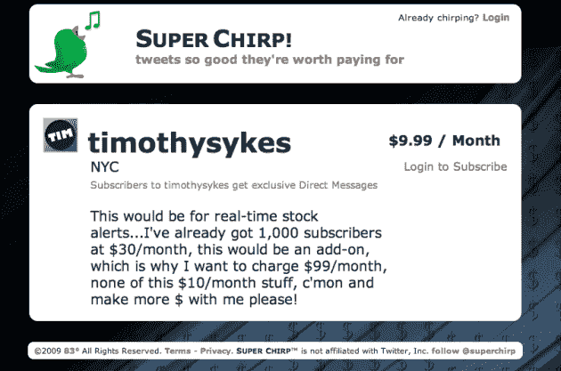

# 付费 Twitter 流在这里:超级唧唧 

> 原文：<https://web.archive.org/web/https://techcrunch.com/2009/06/07/paid-twitter-streams-are-here-super-chirp/>

来自 [83 度](https://web.archive.org/web/20230213024555/http://83degrees.com/)的一项名为 [Super Chirp](https://web.archive.org/web/20230213024555/http://superchirp.com/) 的新服务于今晚推出，让 Twitter 用户为他们的内容流付费。

这是一个我们过去曾触及过的主题。超级唧唧喳喳的名人粉丝页面有着巨大的市场。事实上，83 Degrees 首席执行官纳伦德拉·罗谢尔去年在这里写了一篇名为[错过的机会——布兰妮在推特](https://web.archive.org/web/20230213024555/https://techcrunch.com/2008/10/26/a-missed-opportunity-britney-on-twitter/)上谈论这个想法。Twitter 是移动的，而且是实时的，这是超越普通粉丝网站的两大优势。而且还会不断刷新新的内容。布兰妮·斯皮尔斯拥有 170 万推特粉丝。他们中有多少人愿意每月支付 1 美元或 10 美元来观看她的优质内容？

超级啁啾是这样工作的。不像 [Twitpub](https://web.archive.org/web/20230213024555/http://www.crunchbase.com/company/twitpub) 发布者必须创建一个新的 Twitter 账户，Super Chirp 通过直接消息(Twitter 的私人消息系统)工作。这意味着出版商可以利用他们现有的 Twitter 账户来推广付费流。用户订阅 Super Chirp 网站上的内容，通过 Paypal 支付，然后通过 DM 获取消息。他们还可以访问 Super Chirp 来查看所有付费信息，并按出版商进行分类。

这是名人拥抱的自然产物。但对于慈善机构来说，这也很有趣——忠实的支持者可以向慈善机构捐款，并获得与该慈善机构相关的一系列新闻或其他信息。一些新闻媒体也可能试图对流媒体收费。我可以想象，如果有足够的价值，至少我们的主 Twitter 账户[上的一些关注者会付费获取额外的信息。](https://web.archive.org/web/20230213024555/http://twitter.com/techcrunch)

任何想注册的出版商都可以，只要他们有一个 Twitter 账户。出版商设定价格，在每月 0.99 美元到 9.99 美元之间。Super Chirp 保留总收入的 30%,其中包括贝宝费用。所以出版商最终得到了 70%

我认为这是一个奇妙的想法，至少可以证明 Twitter 本身的产品。如果 Twitter 直接推出这样的东西，Super Chirp 可能会很快变得无关紧要。虽然，如果我在运行 Twitter，Super Chirp 获得了牵引力，我会购买服务，并通过出版商和付费用户来维持它的运行。

83 Degrees 是推出 [Power Twitter](https://web.archive.org/web/20230213024555/https://techcrunch.com/2009/01/03/power-twitter-for-firefox-inline-media-integrated-search-and-a-lot-more/) 的同一家公司，这是一项我绝对上瘾的服务。

你可以[在 83 度博客上阅读更多关于超级唧唧声](https://web.archive.org/web/20230213024555/http://83degrees.com/post/Introducing_Super_Chirp_and_Paid_Streams)的内容。

**更新**:这里有一个人[已经报名了。看起来他将做](https://web.archive.org/web/20230213024555/http://twitter.com/timothysykes)[$ 9.99/月](https://web.archive.org/web/20230213024555/http://superchirp.com/timothysykes)的股票提示——但是他喜欢超级唧唧声来扩大范围。

看起来 1938 年媒体的 Loren Feldman 刚刚以每月 0.99 美元的价格注册了“Twitter 上最有趣的人”。如果你也注册了，并说你将专攻什么，请在评论中留下你的超级唧唧简介。

