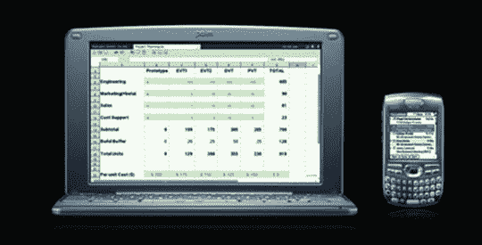

# Palm 对 Foleo Delay 的回应:仍然准时发货 

> 原文：<https://web.archive.org/web/http://techcrunch.com/2007/08/24/palms-response-to-foleo-delay-still-shipping-on-time/>

# Palm 对 Foleo Delay 的回应:仍准时发货

几天前我对 T2 发脾气后，有了一些令人平静的消息；Palm 表示，Foleo 仍将在“今年夏天”推出，而且还没有错过最初的发货日期。因此，如果 Palm 的话是可信的，那么关于 8 月 22 日 Foleo 船运的谣言是假的，关于它被推迟的谣言也是假的。

我假设 Palm 不会将劳动节作为夏季的最后一天，而是选择秋分前的最后一天。所以 9 月 21 日是 Foleo 发布的最后一天。一次真正的约会是很好的，但我只是一个消费者。

令我惊讶的是，有这么多网站对 Foleo 的评价如此之低。没错，是小众产品。这并不适合所有人。记住我的话，虽然；这种设备的巨大市场将由技术恐惧者组成，他们只想要一台电脑来上网和发送电子邮件，其中大部分是老年人。这对他们来说是完美的设备。没有什么比这更好的了。一台便宜的 Windows 个人电脑是不够的——它还是太复杂了。即使是 Mac 也是一个令人生畏的命题。Foleo 将会为这些人完美地工作。

他们永远不会使用任何高级同步或蓝牙功能。他们只需打开它，在他们的孩子为他们设置的无线网络上使用它。它代表了下一代的“互联网设备”(不管 Palm 是否是这样计划的)，这种设备在很多年前从未流行过。不过，这一次，我认为它会坚持。

[Palm 坚持 Foleo 将准时发货](https://web.archive.org/web/20220929123451/http://www.macworld.com/news/2007/08/24/foleo/index.php?lsrc=mwrss)