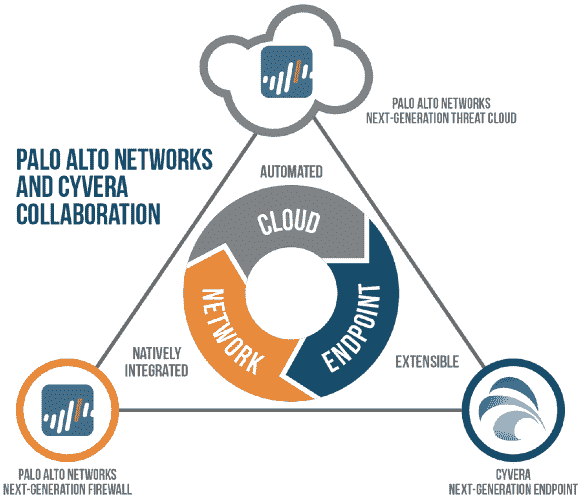

# 帕洛阿尔托网络公司以 2 亿美元收购网络安全公司 cy vera 

> 原文：<https://web.archive.org/web/https://techcrunch.com/2014/03/24/palo-alto-networks-buys-cyber-security-company-cyvera-for-200m/>

# 帕洛阿尔托网络公司以 2 亿美元收购网络安全公司 Cyvera

安全公司帕洛阿尔托网络公司[收购了以色列的网络安全公司](https://web.archive.org/web/20230130100805/http://media.paloaltonetworks.com/lp/endpoint-security/index.html) [Cyvera](https://web.archive.org/web/20230130100805/http://cyvera.com/paloaltonetworks/) 。这笔交易价值 2 亿美元。该收购预计将于 2014 年下半年完成。Cyvera 已经从 Battery Ventures、Blumberg Capital、Ehud Weinstein 教授和 Ofir Shalvi 博士那里筹集了 1300 万美元。

正如我们[去年所写的，](https://web.archive.org/web/20230130100805/https://techcrunch.com/2013/08/13/goodbye-firewall-hello-obstruction-cyvera-gets-11m-from-battery-ventures-a-us-tech-giant-and-more-to-build-out-its-military-style-zero-day-defense-solution/) Cyvera 已经精心设计了一种新的方法来对抗零日攻击，使用的编码相当于军事风格的游击阻挠防御技术。零日网络攻击是企业、政府和服务提供商组织面临的主要威胁之一，这些组织依赖各种系统、应用程序和设备来运营业务。这些网络攻击通常利用只有攻击者知道的漏洞。虽然攻击者可以瞄准成千上万个漏洞，但他们可以用来瞄准该漏洞的利用技术却少得多。

Cyvera 在恶意软件有机会运行之前，在利用阶段的端点提供对核心攻击技术的实时防护。该公司的 TRAPS(有针对性的远程攻击预防系统)是一个 16 点控制系统，它不是试图阻止或监控和识别所有通过的东西，而是创造障碍，足以阻止或减缓恶意入侵者，以便在他们接触敏感服务器之前将其消灭。

Cyvera 的方法很有效——自从他们第一次开始部署产品以来，他们已经成功地阻止了每一次发布的零日攻击。

作为背景，Palo Alto Networks 的专有硬件和软件可以检测进入企业环境的数据威胁。它是针对通过网络以恶意软件形式出现的新型攻击而设计的。该公司的产品是为人们访问网络的所有方式而设计的，无论是通过笔记本电脑还是移动设备。Palo Alto Networks 的独特之处在于它超越了传统防火墙的能力。大多数网络技术都是针对来自基本电子邮件或网页浏览的威胁。但是今天的威胁来自僵尸网络攻击和其他现代技术，如网络钓鱼攻击。

Palo Alto Networks 表示，Palo Alto Networks 的下一代防火墙 Cyvera 和该公司的威胁云的结合将创建市场上最强大的集成和自动化企业安全平台之一。

这是帕洛阿尔托网络公司的第二次收购，该公司在今年早些时候收购了 [Morta Security。](https://web.archive.org/web/20230130100805/https://techcrunch.com/2014/01/06/in-its-first-acquisition-palo-alto-networks-buys-cyber-security-startup-founded-by-former-nsa-engineers-morta/)