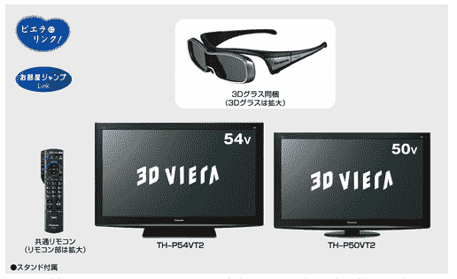
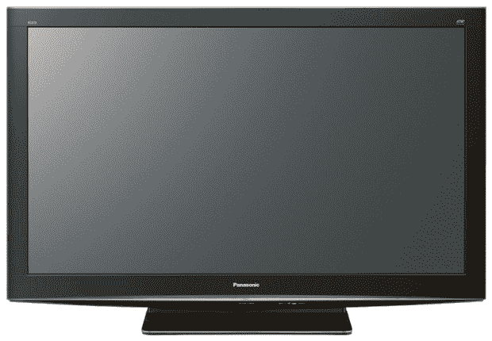

# 松下的 3D 全高清电视定价和日期(日本)

> 原文：<https://web.archive.org/web/https://techcrunch.com/2010/02/09/panasonics-3d-full-hd-tvs-get-priced-and-dated-in-japan/>

# 松下的 3D 全高清电视定价和日期(在日本)

松下今天继续 3D 狂欢，展示了 6 款即将推出的 3D 产品。该公司还为新的电视、蓝光录像机和播放器定价并标注了日期(至少在日本市场是这样)。他们中的一些在上个月的 CES 上展示过，关于他们的[酷 3D 摄像机](https://web.archive.org/web/20230322164156/http://www.crunchgear.com/2010/01/06/panasonic-finally-releases-its-3d-camcorder-and-it-looks-like-wall-e/)没有新的消息，但无论如何，这里先介绍一下 [3D 电视](https://web.archive.org/web/20230322164156/http://panasonic.co.jp/corp/news/official.data/data.dir/jn100209-3/jn100209-3.html)【JP】。

VIERA TH-P54VT(如上图)和 TH-P50VT2 分别采用 54 英寸和 50 英寸的屏幕尺寸。这两款等离子电视都是全高清的(第一款 3D 电视)，需要你戴上主动快门眼镜(63g)才能获得 3D 体验。其他规格包括 5，000，000:1 的(原生)对比度、VIERA link、网络连接、4 个 HDMI 端口、多个电视调谐器、eco-mode、全频 16×4cm×2 扬声器和 10cm 超低音扬声器。

这两款电视都将于 4 月 23 日在日本上市。价格:VIERA TH-P54VT 为 5900 美元，较小型号为 4800 美元。松下今天也宣布了一些类似的非 3D 等离子，看起来 3D 功能让买家花费 800 美元左右。

该公司尚未透露 3D VIERAs 将在国际上销售的时间和价格。