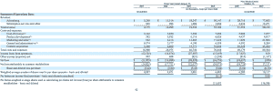

# 拥有 8000 万用户的 Pandora 申请上市 TechCrunch

> 原文：<https://web.archive.org/web/https://techcrunch.com/2011/02/11/pandora-files-to-go-public/>

# 拥有 8000 万用户的 Pandora 申请上市

音乐流媒体服务[潘多拉](https://web.archive.org/web/20221205145812/http://www.pandora.com/)已经申请上市。它最终可能会筹集多达 1 亿美元的资金。摩根士丹利和摩根大通共同管理这笔交易。正如我们[早些时候报道](https://web.archive.org/web/20221205145812/https://beta.techcrunch.com/2010/12/21/the-pandora-elevation-deal-that-never-closed-and-a-mid-2011-ipo/)的那样，这份文件使他们走上了 2011 年年中 IPO 的轨道。

SEC 文件[中的一些财务数据:2010 年前九个月，该公司收入 9000 万美元，亏损 32.8 万美元。(迈克尔·罗伯逊的 1 亿美元收入估计](https://web.archive.org/web/20221205145812/http://www.sec.gov/Archives/edgar/data/1230276/000119312511032963/ds1.htm)[我们早些时候发布了](https://web.archive.org/web/20221205145812/https://beta.techcrunch.com/2010/06/16/tc-teardown-pandora-the-tough-business-of-webcasting/)这个撕裂非常接近)。潘多拉的财政年度于 1 月 31 日结束(很奇怪)，但在截至 2010 年 1 月 31 日的上一财年，它的收入为 5500 万美元，亏损 1670 万美元。因此，你可以看到从那时起，它的财政状况有多好，增加了 3500 万美元的收入，实际上消除了亏损。(点击下方财务表格放大)

潘多拉 86%的收入(7800 万美元)来自广告，其余的(1200 万美元)来自订阅费。潘多拉在 2010 年前九个月(截至 10 月 31 日)的收入增长了 187%，这一增长率略高于 2010 财年(实际上是 2009 年加上 1 月份)185%的收入增长率。它将其收入的一半用于“内容获取”，即每流音乐授权。截至 2010 年 10 月 31 日，该公司仍有 4100 万美元现金。

根据文件，Pandora 拥有 8000 万注册用户和来自 8 万名艺术家的 80 万首歌曲。注册用户从一年前的 4600 万增长到 2009 年的 2200 万。在这项服务上听音乐的时间也翻了一番，从 2009 财年的 10 亿小时增加到 2010 财年的 21 亿小时。

作为网络上占主导地位的免费互联网音乐服务，Pandora 希望扩展到手机、汽车和其他设备。去年，创始人蒂姆·韦斯特格伦[向查理·罗斯](https://web.archive.org/web/20221205145812/https://beta.techcrunch.com/2010/07/02/pandora-charlie-rose/)解释了 iPhone 如何使潘多拉的增长率翻倍，以下是一个月前莎拉·莱西与首席技术官汤姆·康拉德就潘多拉的汽车雄心接受的更近的 [TCTV 采访:](https://web.archive.org/web/20221205145812/https://beta.techcrunch.com/2011/01/06/pandora-and-the-final-crucial-internet-radio-frontier-the-car-tctv/)