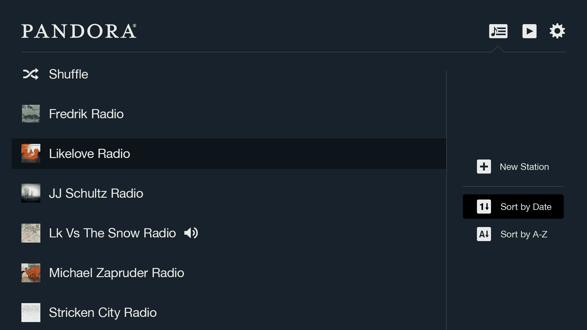

# Pandora 推出基于 HTML5 的全新电视体验，从 Xbox 360 和 PS3 开始 

> 原文：<https://web.archive.org/web/https://techcrunch.com/2013/06/05/pandora-launches-new-html5-based-tv-experience-starting-with-xbox-360-and-ps-3/>

# Pandora 推出基于 HTML5 的新电视体验，从 Xbox 360 和 PS3 开始

潘多拉今天发布了一个新的基于浏览器的电视界面，它希望这将有助于在客厅使用这项服务的标准。第一批支持这种基于 HTML5 的新界面的设备是 Xbox 360 和 PS3，由于这个新版本，这两款设备最终都将获得 Pandora 的第一个半原生实现。

Pandora 的首席技术官 Tom Conrad 本周早些时候告诉我，Pandora 的目标是像今天的收音机一样无处不在。在过去的几年里，Pandora 一直专注于进入更多的汽车(它现在与 23 个汽车品牌有合作关系，可用于 90 种不同的汽车型号)和其他平台。然而，大约三分之一的无线电收听发生在家里，因此为了实现这一目标，该公司必须弄清楚如何才能让它在现在主宰我们客厅的大屏幕上变得无处不在。

已经有超过 1000 万人通过电视和电视机顶盒收听了 Pandora，但正如 Conrad 所指出的，为了让这一点发挥作用，该团队必须为其支持的所有电视、机顶盒和蓝光播放器创建定制实现(或者放弃控制权，允许原始设备制造商创建自己的体验)。这种分散使得 Pandora 很难快速创新并向这些平台添加新功能，这些平台通常由原始设备制造商严格控制。当然，这里的希望是，从长远来看，更多的这些平台将转向基于标准的接口。

“这个世界不需要更多的专有平台来分散各地开发者的创新努力，”康拉德在今天的一篇博客文章中说。然后，基于浏览器的版本让该公司完全控制体验，并且，由于该系统的智能实现，用户仍然可以用他们的常规遥控器控制体验。这个新的“10 英尺”界面还允许用户拇指向上和拇指向下播放歌曲，以及播放、暂停和跳过歌曲，就像潘多拉的其他应用程序一样。

如果你有一台 Xbox 360 或 PS3，你现在可以在[tv.pandora.com](https://web.archive.org/web/20221007024801/http://tv.pandora.com/)试用这个新版本。

【T2