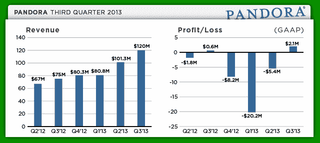

# Pandora Beats 2013 年第三季度收入增长 60%，至 1.2 亿美元，净收入 210 万美元；第四季度预测远低于预期

> 原文：<https://web.archive.org/web/https://techcrunch.com/2012/12/04/pandoras-q3-2013/>

# Pandora Beats 2013 年第三季度收入增长 60%，至 1.2 亿美元，净收入 210 万美元；第四季度预测远低于预期

网络广播服务 [Pandora](https://web.archive.org/web/20230304221301/http://www.pandora.com/) 发布了截至 2012 年 10 月 31 日的 2013 年第三季度财务业绩。与 2012 年第三季度相比，收入增长了 60%，达到 1.2 亿美元。Pandora 报告非 GAAP 每股收益为 0.05 美元。它代表了 205.2 万美元的 GAAP 净收入。广告收入为 1.063 亿美元，同比增长 61%。订阅和其他收入为 1370 万美元，同比增长 52%。

[分析师](https://web.archive.org/web/20230304221301/http://www.marketwatch.com/story/pandoras-misses-targets-shares-tumble-2012-12-04)预计收入为 1710 万美元，非 GAAP 每股收益在盈亏平衡和 0.01 美元之间。潘多拉的收益高于预期。与此同时，该公司下调了第四季度的预期，这令投资者失望。

潘多拉最重要的支出仍然是音乐版税。最近，它一直在游说降低内容成本。

Pandora 目前拥有 8050 万美元的现金、现金等价物和短期投资。这比上一季度有所下降。

本季度，它拥有 5990 万活跃用户，高于上个季度的 5490 万。一个重要的指标是听众的总小时数。本季度同比增长 67%，达到 35.6 亿小时。增长速度正在放缓，上个季度为 33 亿小时。

对于 2013 年第四季度，Pandora 预计收入在 1.2 亿美元至 1.23 亿美元之间，非 GAAP 每股亏损。除了远低于预期之外，MarketWatch 的不准确报告也导致股价下跌。在盘后交易中，股价目前下跌了 17.57%。

此次修订可能是由于增长放缓和运营成本增加。该公司计划继续为其广告活动雇用销售人员。

苹果和微软可能会在未来几个月准备好潘多拉的竞争对手。但是苹果遇到了一些许可问题。它可能会推迟发射。

Pandora 已经摆脱了一系列净亏损，但显然不会持续太久，因为该公司预计下个季度将出现亏损。

*布莱斯·德宾制作的图形*