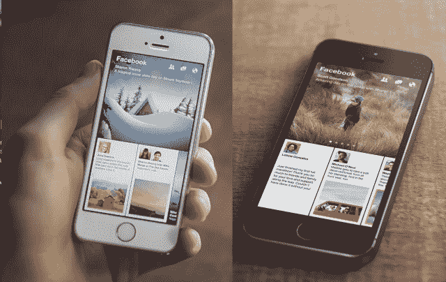
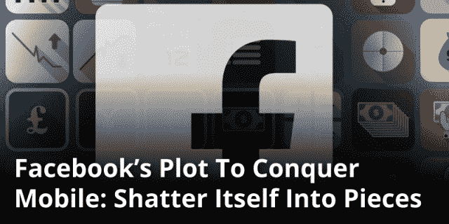

# 这份文件现在在美国的 iOS 上可以使用，它可能是脸书的替代品

> 原文：<https://web.archive.org/web/https://techcrunch.com/2014/02/03/paper-now-available-for-ios-in-the-us-and-it-could-be-a-facebook-replacement/>

脸书的新独立应用 [Paper 现在可以在 iOS 上下载](https://web.archive.org/web/20230404070659/https://itunes.apple.com/us/app/paper-stories-from-facebook/id794163692)给美国的每个人，它不仅仅是一个内容阅读器。Paper 有消息、通知、搜索和完全重新设计的个人资料。

当我问 Paper 背后的团队领导他们是否还在使用旧的产品时，产品经理 Michael Reckhow 外交地回答“嗯嗯，是的”，但设计师 Mike Matas 只是害羞地笑了笑。我猛扑过去，重复我的问题只是他。“偶尔”。他说漏了嘴。纸张可能是脸书杀手。

“我主要使用这张[纸]”Matas 继续说道。“它有一些不具备的功能，比如……事件就是一个很好的例子，比如我需要去找一个事件。”我追问，“但除此之外，你觉得这样就足够了？”“对我来说，是的”，Matas 回答。

[上周四脸书公布了今天的发布论文](https://web.archive.org/web/20230404070659/https://techcrunch.com/2014/01/30/facebook-paper/)。你可以查看它如何工作的细节和它的意义[那里](https://web.archive.org/web/20230404070659/https://techcrunch.com/2014/01/30/facebook-paper/)，但本质上它是首席执行官马克·扎克伯格对脸书[的愿景的下一步，产生一系列具有不同特定目的的移动应用](https://web.archive.org/web/20230404070659/https://techcrunch.com/2014/01/29/one-app-at-a-time/)。

更新:请点击此处查看我们完整的[论文实践评论](https://web.archive.org/web/20230404070659/https://techcrunch.com/2014/02/04/hands-on-with-facebook-paper/)和下面的视频演示/评论:

[Paper 是脸书新的“创意实验室”独立应用计划](https://web.archive.org/web/20230404070659/https://techcrunch.com/2014/01/30/facebook-creative-labs/)的一部分，它可以让你选择不同的内容“板块”添加到一种数字报纸中。然后，您可以浏览重新设计的新闻源和您的报纸部分，以风格化的全屏格式阅读来自朋友、大型出版商、公众人物和新兴内容创作者的故事。Paper 还允许您与可视化编辑器共享内容，该编辑器可以预览您的帖子对其他用户的显示效果。

[任何拥有 iOS 7 或更高版本的美国人都可以免费下载 iOS 白皮书](https://web.archive.org/web/20230404070659/https://itunes.apple.com/us/app/paper-stories-from-facebook/id794163692)。脸书没有提到任何 iPad 或 Android 版本的近期计划。它与几个现有的应用程序同名，包括由第五十三届 T2 会议开发的绘图工具，该工具要求脸书改变其新产品的名称。[更新时间:11:15am PST:脸书表示“无可奉告”，但可能会保留该名称，因为[第 53 家将其商标注册为“第 53 家造纸公司”](https://web.archive.org/web/20230404070659/https://techcrunch.com/2014/02/03/facebook-vs-fiftythree/)而非“造纸公司”。]

当我周五参观黑客之路演示纸时，我知道我会看到很多复杂的动画和下一级用户界面技巧。但我对我们如何使用 Paper 不太感兴趣，而更感兴趣的是它会如何改变我们使用脸书主应用程序的方式。我曾听到传言说，该公司的某些高层已经几乎完全从脸书转而购买 iOS 到 Paper，而且一些独立应用的团队成员已经几个月没有在手机上安装旧的脸书了。

扎克伯格当然喜欢纸。Reckhow 告诉我，“他喜欢它。他使用它，他很兴奋能像我们一样发射。我们定期与他会面……在此过程中，他会给出反馈。我认为，他明确向我们提出挑战的一个方面是，把内容看得非常广泛，不要局限于浏览内容的典型领域。”

Reckhow 对其发布的希望持保守态度，称该团队没有具体的下载或参与目标，而是希望他们创造出人们喜欢使用的东西。他告诉我:

> “对于我们来说，这是一个非常好的机会，人们可以去 App store 查看，看看它如何适应他们的生活和主屏幕，安装它，然后尝试它，这不会影响他们已经拥有的体验，他们可以找到使用脸书的正确方法。告诉他们‘这就是你现在应该如何使用脸书，每个人都必须以同样的方式使用它’并不是我们真正的工作"

但 Matas 和 Reckhow 坦率地表示，他们认为 Paper 改进了当前脸书移动应用程序的不足之处。马塔斯告诉我:

> “我曾经遇到过这样一种情况，你看着大峡谷的日落，你会说‘这是我见过的最美丽、最神奇的东西。我需要和人们分享这些。你把照片放在脸书上，它被一堆蓝色的铬合金弄得乱七八糟，照片超级小而且像素化，它完全吸走了照片的灵魂。"

纸开始是作为一种方式来给这些内容应有的呈现，但这种美化已经蔓延到脸书的其他地方。信息和通知可以在纸的上面打开，这样它们就不会把你从当前屏幕拖开。个人资料、页面和事件现在有了真正的移动优先设计，以图像和可滑动的全屏卡片为中心来传达最重要的图像。任何不必要的东西都被删掉了。最终，Paper 是一个成熟而简化的脸书客户端，为社交网络带来了美学的新焦点。

[太平洋标准时间下午 5:45 更新:事实上，纸张被有意设计成脸书杀手。悄悄埋藏在设置中的是在脸书打开纸质推送通知的功能，而不是在 iOS 的脸书。脸书实际上是在帮你完全转向纸张。]

如果纸张变得如此流行，开始成为人们在脸书的默认移动体验，那会怎样？Reckhow 说“这是一个好问题”。

—

*欲知更多书面信息，请阅读:*

【T2

今天晚些时候，我们将进行更多的分析和实际操作。