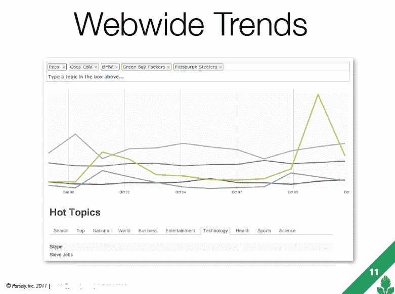

# Parse.ly 将于本月推出名为“Dash”的页面浏览量生成机器 

> 原文：<https://web.archive.org/web/http://techcrunch.com/2012/01/03/parse-ly-will-launch-its-pageview-generating-machine-called-dash-this-month/>

我们获悉，面向出版商的隐形数据驱动预测内容优化平台 Parse.ly 正准备在本月底推出其首款产品 [Dash](https://web.archive.org/web/20230209124938/http://cogtree.wufoo.com/forms/learn-more-about-parsely-dash/) 。这家初创公司最初是在 2009 年从 DreamIt Ventures 中脱颖而出的，当时有 2 万美元的种子资金。2010 年 12 月，它从 [ff 风险投资](https://web.archive.org/web/20230209124938/http://www.crunchbase.com/financial-organization/ff-asset-management)和[布隆伯格资本](https://web.archive.org/web/20230209124938/http://www.crunchbase.com/financial-organization/blumberg-capital)获得了总计 180 万美元的 A 轮融资。

Dash 旨在帮助出版商增加浏览量，提供对哪些主题是热门话题以及他们应该多写或少写哪些主题的见解。但最重要的是，它的预测分析引擎能够推荐出版商现在应该覆盖哪些主题*以掌握未来趋势。简单来说，就是一台产生浏览量的机器。*

 *该公司目前正在向出版商推销解释 Dash 工作原理的幻灯片(见下文)。广告将 Dash 定位为出版商的第三种分析服务。Google Analytics 告诉你已经发生了什么，实时分析提供商 Chartbeat 告诉你正在发生什么，Dash 告诉你将要发生什么。

为了做到这一点，Dash 分析了出版商的内容与需求的匹配程度，以提供“可预测、可操作的洞察力来推动额外的页面浏览量，”甲板上写道。它使用语义分析来做到这一点，告诉出版商什么主题在他们的网站上以及整个网络上最受欢迎，以及主题的趋势有多快。

除了内容分析，Dash 还可以跟踪与单个作者相关的趋势，显示哪些主题上谁的阅读量最大，谁获得的入站链接最多，等等。

要实现 Dash，出版商只需在他们的网站上插入一行 javascript，Parse.ly 承诺不会影响网站性能。

Dash 将这种“未来”分析作为其产品的一部分，这可能是其服务中最具转换性的部分，但这将对出版商产生广泛的吸引力——事实上，它已经这样做了。根据资料，Dash 已经被《大西洋月刊》、《公寓疗法》、《新闻企业》、《美国新闻与世界报道》和《未来网络》使用。虽然没有列出来，但是也是每日 Dot 用的。需要明确的是，这些是真实的客户，而不是“测试者”

当然，站在潮流的顶端来保持一个网站的相关性和简单地根据潮流来写页面浏览量是有区别的。正如 TechCrunch 撰稿人 [MG Siegler 去年在他的个人博客上解释的那样](https://web.archive.org/web/20230209124938/http://parislemon.com/post/480899019/pageviews)，获得浏览量已经成为出版商的一种游戏，一些出版商使用不太好的策略来实现这一点(例如，链接诱饵、塞满搜索引擎优化关键词的标题、幻灯片和基于当前[谷歌趋势](https://web.archive.org/web/20230209124938/http://www.google.com/trends)写帖子)。

理论上，Dash 所做的是通过使用数据来使这种页面浏览量提升过程合法化，这有助于更好地了解网站上哪些内容做得好，*为什么，*以及哪些内容将来会做得好。这是可操作的数据，出版商可以选择使用(根据他们的判断)来提高他们网站的浏览量。

许多作者、读者和出版商都感叹浏览量是今天网络内容货币化的驱动力，但这是严峻的现实。在改进的指标被广告商接受之前，它仍将是“浏览量时代”在这种情况下，Parse.ly 应该比 Dash 更有优势。

Parse.ly 由萨钦·卡姆达尔(CEO)和安德鲁·蒙塔伦蒂(CTO)创建，他们是在 NYU 大学上学时认识的。最初，[的说法是 Parse.ly 将作为某种以消费者为中心的新闻服务发挥](https://web.archive.org/web/20230209124938/http://blog.louisgray.com/2009/08/parsely-spices-up-news-based-on-your.html)的作用。显然，关注出版商的需求是更好的主意。Dash 将于 1 月下旬公开发布。

*