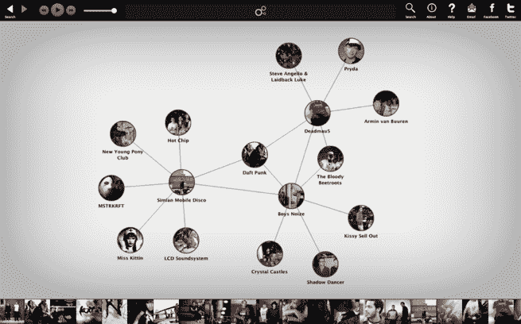

# 通过 100 万次下载，Discovr 融资 110 万美元；在 Mac App Store 上发布 

> 原文：<https://web.archive.org/web/http://techcrunch.com/2011/10/26/passing-1-million-downloads-discovr-raises-1-1-million-launches-on-mac-app-store/>

今天，[discover](https://web.archive.org/web/20230204230349/http://discovr.info/)，这个允许用户发现 iOS 新应用(通过交互式图表的方式)的令人敬畏的工具宣布，它已经突破了 100 万次下载的里程碑，并完成了由澳大利亚领先的风险投资公司 Yuuwa Capital 牵头的 110 万美元的种子轮投资。当然，庆祝这些成就的最好方式莫过于发布一个苹果桌面应用的新版本，对吗？今天，这家初创公司还宣布发布其[discover 音乐应用](https://web.archive.org/web/20230204230349/http://itunes.apple.com/app/discovr-music-discover-new/id470126178?ls=1&mt=12)，现在在你附近的 Mac 应用商店中售价 5 美元。简单地说，Discovr Music 可以让您在笔记本电脑和台式机上轻松发现新音乐。

为了给人一种背景感，今年 1 月，Discovr 推出了一款漂亮的 iPad 应用，本质上为用户提供了一个音乐世界的互动地图，在一个图形网络中显示乐队和艺术家之间的联系(以及其他内容)。只需快速点击几下，用户就可以在 YouTube 上看到音乐家的视频、乐队信息和其他额外内容，同时体验一个相当独特的视觉界面，提供一种简单的方法来浏览乐队之间的联系，以发现新的音乐和酷的应用程序。

该应用程序在三天内吸引了 15 万次下载，到 6 月份，discover 已经将其用于 iOS 的音乐发现和可视化模型推广到整个应用程序世界。Discovr 应用程序使用户能够搜索他们最喜欢的应用程序，从 Discovr 的精选应用程序中进行选择，此时该工具将在一个互联的相关应用程序网络中显示您的选择，这些应用程序根据其相似性链接在一起。

Discovr 是如何确定这些相似性的？谢谢你的关心。像许多其他推荐服务一样，Discovr 基于机器算法和人类监管的综合，通过其相似性网络为用户服务。这些类似应用的网络可以随着用户的浏览而扩展，表面上看，如果页面足够大，正如我在 6 月写的那样[，人们可能会“创建一个巨大的、令人神魂颠倒的 App Store 上所有应用的地图”。](https://web.archive.org/web/20230204230349/https://techcrunch.com/2011/06/14/discovr-launches-awesome-tool-to-find-and-discover-new-apps-think-interactive-graphs/)

不是说你会，而是你可以，如果你愿意的话。

说到更大的屏幕，如上所述，随着新推出的 Mac 应用商店 Discovr Music，discover 现在又回到了音乐游戏中。虽然 Discovr 的 iPad 功能非常棒，但其视觉布局几乎更适合你的台式机和笔记本电脑的大屏幕。用户体验与 Discovr 的第一款应用相同，因为它使用数据可视化和音乐推荐来提供音乐世界的可视化地图。用户可以在音乐生态系统中导航，并根据个人喜好发现新音乐。

更重要的是，该应用程序是从头开始构建的，以充分利用 OSX 狮子，但也支持向后兼容雪豹。它是双猫兼容的。

为了配合 Mac App Store 上 Discovr Music 的发布，Filter Squad(discover 应用程序背后的公司)宣布，它已经筹集了 110 万美元的种子资金，由澳大利亚风险投资公司 Yuuwa Capital 牵头。在这次加薪之前，Filter Squad 最近在澳大利亚创业大赛[【tech 23】](https://web.archive.org/web/20230204230349/http://www.tech23.com.au/)中获胜，获得了 25，000 美元的奖金，被评为“最具潜力”的澳大利亚创业公司。

我认为很容易说 Filter Squad 有潜力，因为在短短 9 个月内，它已经吸引了超过 100 万次 iOS 设备下载。现在，我们将看到 Discovr 能够在苹果桌面上找到什么样的应用。

还有一件事:Android 粉丝们，不要害怕，Filter Squad 目前正在构建其 Discovr 应用程序的 Android 版本，这些应用程序正在开发中，有望在今年年底到来。

更多关于 Mac 版 Discovr 音乐的信息，请观看下面的视频:

http://youtu.be/6zS_c57LLUU