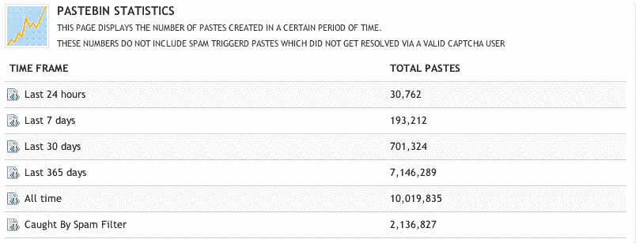

# Pastebin 超过 1000 万个“活跃”粘贴 

> 原文：<https://web.archive.org/web/https://techcrunch.com/2011/10/26/pastebin-surpasses-10-million-active-pastes/>

# Pastebin 超过 1000 万个“活跃”粘贴

Pastebin.com 花了 8 年时间(对于不相关的人来说，这有点像互联网的剪贴板。任何人都可以粘贴一大堆文字，并与他人分享，通常是匿名的)以达到 100 万的“活跃”(阅读:不是垃圾邮件或过期)粘贴。在那之后的一年半时间里，它一路飙升至 1000 万。

有趣的是，Pastebin 的原主人选择在股价大幅上涨之前卖掉它——我打赌你猜不到为什么！

Pastebin 在十年的大部分时间里以相当稳定的速度发展，主要是由 IRC 用户驱动的。在 IRC 上粘贴一大段文字是很糟糕的做法，就像在对话中突然对其他人大喊大叫一样。相反，用户将他们的史诗粘贴到一个类似 Pastebin 的网站上，分享 IRC 中的链接给任何感兴趣的人。

然后 Twitter 出现了。突然间，简洁不仅仅是礼貌，而是强制性的。啰嗦的推特用户蜂拥而至，以此作为发表长篇大论的一种方式。使用率开始飙升。

接着不久就来了。最出名的是他们无数的在线恶作剧行为，Anonymous 转向 Pastebin(以其合适的匿名上传)作为分发新闻稿的一种方式。随着这些新闻稿在互联网上传播，它成为了帕斯捷宾的免费口碑宣传活动。使用量激增。

唉，对于网站的原所有者保罗·迪克逊来说，更邪恶的帖子引起的法律关注有点太多了。迪克森在 2010 年以未披露的价格出售了该网站。在八月我们在 [Pastebin 上写的一篇文章中，Dixon 评论道:](https://web.archive.org/web/20230203151116/https://techcrunch.com/2011/08/05/pastebin-now-home-to-8-million-active-pastes/)

> 我在 2002 年创办了 pastebin.com，但在 2010 年把它卖给了现在的主人，因为处理那些引起执法机构兴趣的帖子太耗费时间了！我很高兴我这么做了，因为我不认为我会喜欢处理 Lulzsec 的风险敞口。我为现在的老板鼓掌，我认为他们给最初的想法增加了很多东西…

