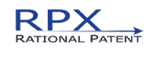

# 专利风险咨询公司 RPX 申请 IPO 

> 原文：<https://web.archive.org/web/http://techcrunch.com/2011/01/24/patent-risk-advisory-firm-rpx-files-for-an-ipo/>

# 专利风险咨询公司 RPX 申请首次公开募股

 *“防御性专利聚合器”* [ RPX ](https://web.archive.org/web/20230202233954/http://rpx.com/) (Rational Patent)周五向 SEC 提交了一份 [S-1 表格](https://web.archive.org/web/20230202233954/http://sec.gov/Archives/edgar/data/1509432/000119312511012087/ds1.htm)，陈述其上市意向。根据该表格，RPX 希望在由高盛、巴克莱、艾伦公司和其他公司承销的首次公开募股中出售至多 1 亿美元的股份。

由前知识风险投资公司副总裁约翰·阿姆斯特和杰弗里·巴克共同创立的 RPX 公司仅在两年前成立，但是它的收入却直线上升，从 2008 年的 80 万美元增长到 2009 年的 3280 万美元，这一年它实现了盈利。该公司 2010 年前九个月的收入为 6520 万美元，利润为 1000 万美元。

RPX 目前有超过 70 个客户，它说了一些关于[如何打破](https://web.archive.org/web/20230202233954/https://techcrunch.com/2010/08/27/paul-allen-google-faceboo/)专利制度的事情，那就是对表面上的[专利流氓保险有如此多的需求。](https://web.archive.org/web/20230202233954/https://techcrunch.com/2008/11/24/is-rpxs-defensive-patent-aggregation-simply-patent-extortion-by-another-name/)