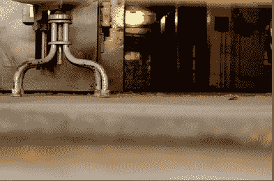

# 保罗·格拉厄姆针对即将到来的核冬天的创业生存指南:做一只蟑螂

> 原文：<https://web.archive.org/web/https://techcrunch.com/2008/10/17/paul-grahams-startup-survival-guide-for-the-coming-nuclear-winter-be-a-cockroach/>

# 保罗·格拉厄姆针对即将到来的核冬天的创业生存指南:做一只蟑螂

金融[核冬天](https://web.archive.org/web/20230305024054/https://techcrunch.com/2008/10/10/sequoia-capitals-56-slide-powerpoint-presentation-of-doom/)可能即将来临，但许多创业公司仍将在这种环境下生存甚至茁壮成长。Y Combinator 的保罗·格拉厄姆认为，事实上，现在可能是创业的最佳时机。在一篇名为[“为什么要在经济不景气时创业”](https://web.archive.org/web/20230305024054/http://www.paulgraham.com/badeconomy.html)的文章中，他指出“重要的是你是谁，而不是你什么时候创业。”

经济可能会走下坡路，投资者现在也很害怕，但竞争也会减少。投资者和市场变化无常。聪明的企业家需要适应不断变化的环境。最好的方法之一就是尽可能少地生存。你需要变成一只蟑螂。格雷厄姆的建议是:

> 去年，你必须准备好解释你的创业是如何病毒式传播的。明年，你必须解释它是如何抵御衰退的。
> 
> 幸运的是，让一家初创公司不受衰退影响的方法就是做你无论如何都应该做的事情:尽可能便宜地运营它。多年来，我一直告诉创业者，最可靠的成功之路是成为企业界的蟑螂。创业公司死亡的直接原因总是资金耗尽。你的公司运营成本越低，越难干掉。幸运的是，运营一家初创公司已经变得非常便宜，如果有什么不同的话，经济衰退会让运营成本更低。
> 
> 。。。不景气的另一个好处是竞争少了。科技列车每隔一段时间就会离开车站。如果其他人都蜷缩在角落里，你可能有一整辆车。

前进吧，蟑螂和繁殖。

(照片由[穆格利](https://web.archive.org/web/20230305024054/http://www.flickr.com/photos/mugley/2108641744/)拍摄)。