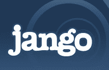

# 付费播放来到在线电台。这是件坏事吗？TechCrunch

> 原文：<https://web.archive.org/web/https://techcrunch.com/2009/03/08/pay-for-play-comes-to-online-radio-is-that-a-bad-thing/>

当谈到推广新音乐时，付费播放计划通常是不被认可的。这种做法，包括唱片公司或艺术家支付电台播放他们的歌曲，可以追溯到地面广播的开始。它在 20 世纪 50 年代变得如此糟糕，以至于国会不得不进行干预，但它一直以新的形式抬头。

现在，付费播放已经成为在线广播。[赞高](https://web.archive.org/web/20221006193931/http://www.jango.com/)，一家声称每月拥有 600 万听众的音乐流媒体服务公司，正在通过其上周推出的一个名为[赞高 Airplay](https://web.archive.org/web/20221006193931/http://airplay.jango.com/music+promotion/home) 的项目向唱片公司和艺术家出售付费广告。只需 30 美元，一个乐队就可以在赞高上购买 1000 场演出。每首歌曲都有在亚马逊或 iTunes 上购买歌曲的链接。

考虑到地面广播付费播放的丑闻历史，人们怀疑把它带到网络上是否是个好主意就不足为奇了。Cnet [的 Matt Rosoff 总结道](https://web.archive.org/web/20221006193931/http://news.cnet.com/8301-13526_3-10190726-27.html):

> 这给整个服务蒙上了一层明显的“差劲”的色彩。

罗塞夫的印象是，好的艺术家不需要花钱推广。我不太清楚。没有某种形式的推广，乐队是不会成功的，无论这种推广是由他们的唱片公司支付的，还是通过新的算法和社交推广获得的，我们可以从 Pandora 和 MySpace Music 的在线音乐服务中看到，从 iLike 到 imeem。

如果我们在搜索结果中接受付费排名，为什么在线音乐会有所不同呢？真正的问题是相关性。要么付费促销会让赞高成为更好的听众，实验会有回报，要么会让它变得糟糕，疏远它的听众。

与常规电台的付费播放不同，赞高的 Airplay 歌曲是针对特定电台的，在常规电台，相同的歌曲会不加区别地播放给每一个听众。艺术家自己选择他们希望旁边播放的其他类型的音乐，就像谷歌上的广告客户选择哪些关键词应该触发他的广告一样。比起鲍勃·迪伦的电台，重金属乐队可能更适合在金属乐队的电台上购买剧目。重点是找到更容易成为粉丝的听众。

除了更有针对性，赞高提供了一个反馈环，这是不存在的常规广播。听众可以阻止歌曲再次播放，或者给它们一个积极的评价。任何获得 50 个积极评价的歌曲都可以免费定期播放。事实上，一个下拉窗口鼓励听众对每首 Airplay 歌曲进行评级。我对这种工作方式的唯一问题是，下拉框将这首歌描述为属于“新兴艺术家”，而不是明确地将其标记为广告([见此处](https://web.archive.org/web/20221006193931/http://airplay.jango.com/music+promotion/how_it_works))。

这是一个广告，应该清楚地标明。只要 t 针对我的听力偏好，我可以接受这种推广方式。赞高现在的运作方式是，任何特定的听众每两个小时听到一首 Airplay 歌曲不超过一次，没有任何听众一天听到同一首 AirPlay 歌曲超过一次。这当然比每 20 分钟听一次同样刺耳的汽车保险广告要好。

但是赞高需要让它的推广算法更复杂一点。甚至在将获得 50 个正面评价的歌曲推广到定期轮换之前，获得高评价的 Airplay 歌曲应该更经常播放，或者推广起来更便宜。正如点击次数越多的付费搜索广告对广告商来说越便宜，因为它们更相关，与目标受众产生更多共鸣的歌曲应该得到更多的推广播放。

如果设计正确，付费推广在音乐领域是有一席之地的，不管纯粹主义者会怎么想。