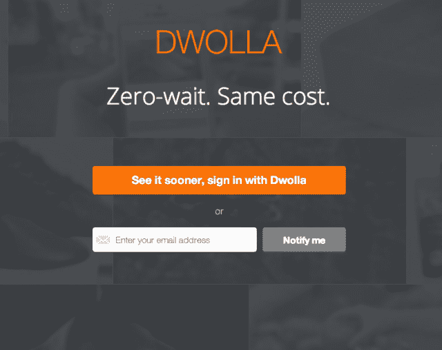

# 随着与 ADS TechCrunch 合作推出“Dwolla Credit ”,支付网络 Dwolla 超越了现金

> 原文：<https://web.archive.org/web/https://techcrunch.com/2013/10/22/payments-network-dwolla-moves-beyond-cash-with-launch-of-dwolla-credit-in-partnership-with-ads/>

总部位于得梅因的德沃拉公司(Dwolla)今天推出了“[德沃拉信用(Dwolla Credit)](https://web.archive.org/web/20221007190837/https://realtime.dwolla.com/)，这是一家为管理数字支付构建网络连接基础设施的公司，它迈出了超越现金支持的第一步这项面向消费者和商家的新服务是与品牌信用卡程序提供商 Alliance Data Systems Corp (ADS)合作推出的，但 Dwolla 预计未来还会有其他类似性质的合作伙伴。

作为两家公司之间新的多年协议的一部分，ADS 的零售服务业务将通过 Dwolla 的网络提供无卡、私人标签信用产品。

 顾名思义，这项服务是向消费者提供信用额度，消费者在网上购物时，可以在结账时选择一个新的 Dwolla 资金来源。在推出时，已经有 40 家在其网站上接受 Dwolla 的商家宣布支持 Dwolla 信用，随着该服务从测试版转向公开发布，更多商家将及时加入。

其中包括许多 TechCrunch 读者和其他在线购物者熟悉的公司，包括 Ribbon、Grand St .、Fiverr、Twice、Humble Bundle、Karma、ManPacks、Lolly Wolly Doodle、Namecheap、littleBits、Shoptiques、WunWun、Tikly、Jane.com、Zady 和许多其他公司。(参与商户的完整目录可在此获得:[dwolla.com/storefront](https://web.archive.org/web/20221007190837/https://www.dwolla.com/storefront)。)

ADS 将实际处理批准和向消费者提供信用，这部分过程与今天的工作方式没有太大变化。消费者仍将像以前一样接受信用风险评估，ADS 还将管理与提供信用相关的其他任务，包括争议、客户支持、设定 APR、信用限额等。但现在，这种信用以前只能通过传统的银行卡等方式获得，现在可以通过 Dwolla 的在线服务本身获得。

Dwolla 信用商户可以选择使用购物车插件将该选项集成到他们的电子商务网站中，这些插件提供 Dwolla 作为结帐选项，例如 Spree、Shopify、Magento 或 3D Cart，或者他们可以选择使用该公司提供的 API 进行自定义集成，就像之前基于现金的 Dwolla 结帐选项一样。

此外，像 Dwolla 基于现金的结账选项一样，Dwolla Credit 也有相同的条款:10 美元以下的交易是免费的，对于 10 美元以上的交易，将资金从消费者转移到商家只需支付 25 美分。此外，资金是实时转移的，这一直是该公司价值主张的一部分，因为它试图利用我们现有的更现代的技术，按照今天的方式建立支付基础设施。这意味着商家在付款后可以立即获得资金——至少在 Dwolla 的网络内，尽管将资金从银行转移到另一个银行账户仍需要标准时间。

实时资金转账一直是 Dwolla 的一个关键卖点。它今天的产品套件包括实现在线结账、点对点支付和 B2B 支付的工具，如 [MassPay](https://web.archive.org/web/20221007190837/https://beta.techcrunch.com/2012/10/22/with-masspay-dwolla-takes-on-paypal-mass-pay-by-offering-lower-fees-support-for-more-recipients/) ，这是一种替代企业支票和电汇的工具，以及 [FiSync](https://web.archive.org/web/20221007190837/https://beta.techcrunch.com/2012/06/15/dwolla-fisyncs-first-banking-customer-goes-live-eliminates-ach-delays-with-real-time-bank-transfers/) ，这是一种面向银行和其他金融服务提供商的[汇款系统](https://web.archive.org/web/20221007190837/https://fisync.dwolla.com/)。在某些情况下，Dwolla 与 PayPal 等其他数字支付技术竞争，但在其他情况下，它会采用 ACH(自动结算所)等过时的银行技术，这是一种有 40 年历史的遗留基础设施，根据所涉及的机构，它可以在两到五天内在银行之间转移资金。看起来，有了 Dwolla Credit，它就有了 PayPal 的 Bill Me Later 产品。

Dwolla Credit 并不是该公司第一次努力吸引商家。它之前推出了在线结账选项，如使用 Dwolla 按钮支付的[和 POS 集成。今天，该公司称有超过 25，000 个商家、非营利组织和政府在使用这项服务。然而，作为金融服务领域的一个新品牌，尽管 Dwolla 的费用较低，但一些商家过去可能对使用 dw olla 犹豫不决。(或者说得有趣一点，正如一些小企业主对我说的:*“Dwolla 到底是什么，我为什么要使用它？是新的贝宝吗？”*)](https://web.archive.org/web/20221007190837/https://beta.techcrunch.com/2012/11/30/dwolla-launches-guest-checkout-option-for-merchants-allows-shoppers-to-pay-with-dwolla-without-signing-up/)

Dwolla 与 ADS 的合作可能会改变商家的看法，给初创公司带来一种合法性感，而仅靠 Dwolla 品牌还无法传达这种感觉。

“有像这家公司这样的人站出来，用信用向我们介绍这个行业的这一方面——而我们一直是受现金启发的——这真是一件幸运的事情，”德瓦拉传播部门负责人乔丹·兰佩承认道。但他补充说，具有前瞻性思维的金融服务公司和组织明白消费者的期望和行为正在发生变化，并引用了 Square 和 Simple 等该领域的其他初创公司，以帮助这些老牌公司对该领域产生兴趣。

“许多这样的组织——不仅仅是这一家，还有我们在后端与之交谈的其他组织——现在都在摸索将其金融服务和产品插入 Dwolla 的新方法，看看会发生什么。这是你将在 2014 年看到的众多例子之一。”

该服务现在处于测试阶段，最初将允许少量测试人员在各种问题解决时提供早期反馈。我们被告知，随着时间的推移，该公司将推出[邀请](https://web.archive.org/web/20221007190837/https://realtime.dwolla.com/)，因此可能会有 500 名用户或 5000 名用户被允许进入。Dwolla Credit 将于 2014 年在 Q1 向公众推出。

【YouTube = http://www . YouTube . com/watch？v=dfcmnsQr6NU&w=640&h=360]