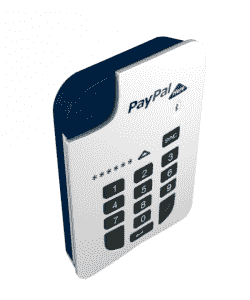

# PayPal 即将进军英国，这是它在欧洲的第一个移动支付市场，配备了一种新的读卡方式 TechCrunch

> 原文：<https://web.archive.org/web/https://techcrunch.com/2013/02/21/paypal-here-is-coming-to-the-uk-its-first-market-in-europe-armed-with-a-new-way-to-read-your-card/>

为欧洲移动支付领域的又一个玩家让路，而且是一个大玩家。今天，在线支付巨头 PayPal 宣布，从今年夏天开始，它将在英国推出 PayPal，这是它首次进军欧洲市场，配备了一种新的硬件，以适应世界这一地区流行的基于芯片的卡。

PayPal 还没有为这项服务设定明确的推出日期或透露定价，但该公司告诉我，它将与竞争对手的现有产品“竞争”。其中目前交易的标准费用是 2.75%，最近推出芯片阅读器的两家公司定价为€49 英镑(65 美元)。

PayPal 表示，它选择英国作为其在欧洲移动支付的第一个尝试，因为英国拥有 1800 万
客户(全球共有 1.23 亿)，是该公司在美国以外的第二大市场，也是欧洲智能手机普及率最高的国家之一——根据 Kantar Worldpanel Comtech 的数据，目前约为 61%。

在英国建立 PayPal 将被用作向欧洲其他地区进一步扩张的杠杆。“我们今年夏天在这里推出，但随着我们的前进，我们将扩展到其他市场，”英国 PayPal 总经理卡梅伦·麦克林在接受 TechCrunch 采访时指出。

这也意味着贝宝总裁大卫·马库斯(David Marcus)有机会兜一圈，最终将贝宝的移动支付服务带到自己的本土市场。(来自法国的马库斯创建了移动运营商计费初创公司 Zong，并将其出售给 PayPal，先是成为移动业务负责人，最终成为整个运营的总裁。)

马库斯在一份声明中说:“PayPal 自去年推出以来一直大受欢迎，我很高兴我们能为欧洲和其他地区带来一个全新的版本。”PayPal 不会透露它在美国从 PayPal 获得了多少收入，但它是它提供的许多不同服务之一，以增加与企业及其客户的接触点。该公司表示，2012 年，它处理了约 1450 亿美元的移动和网络支付。

到目前为止，易贝所有的 PayPal 的努力都集中在一个三角形的加密狗上，这个加密狗可以插入 iPhone 或 Android 设备，读取卡背面的磁条——类似于其美国大竞争对手 square 生产的方形加密狗(尚未进入欧洲)。欧洲将会看到与 PayPal 不同的方式。

为了适应欧洲使用的芯片卡，以及欧洲 Visa 等公司的要求，PayPal 将生产一种单独的芯片和密码设备，让客户插入卡并输入密码来验证他们的身份。

这也是所有其他类似 Square 的欧洲移动支付公司不得不走的方向。其中一家公司，iZettle，昨天才推出了它的芯片和密码阅读器，毫无疑问是为了在贝宝上获得一点公关上的提升(同时也是为了解决它在 Visa 使用加密狗时遇到的一些 T2 问题)。

也可能是这样的情况，虽然美国目前仍有磁条，但像 Visa 这样的公司正在[努力将这项技术带到美国](https://web.archive.org/web/20221124021531/http://pressreleases.visa.com/phoenix.zhtml?c=215693&p=irol-newsarticlePR&ID=1780934&highlight=)，所以 PayPal 的欧洲读卡器最终可能会在旧世界之外拥有更多货币。

PayPal 加入了许多欧洲的创业公司，比如美国运通支持的 iZettle [Samwer/Rocket 互联网的 Payleven](https://web.archive.org/web/20221124021531/https://beta.techcrunch.com/2013/02/08/payleven-the-samwer-square-clone-surmounts-visa-hurdle-with-chip-and-pin-reader-now-sold-in-europe/)； [SumUp](https://web.archive.org/web/20221124021531/http://www.sumup.com/) 和[MP OWA](https://web.archive.org/web/20221124021531/http://www.mpowa.com/)；以及美国的竞争对手 Intuit，以解决英国(及其他地区)的大量中小型企业尚未接受信用卡支付的问题，因为过去传统信用卡服务的银行费用太高。

英国成为 PayPal 在美国以外的第五个市场，PayPal 于 2012 年 3 月[首次在美国推出](https://web.archive.org/web/20221124021531/https://beta.techcrunch.com/2012/03/15/paypal-here/)。PayPal 在加拿大、澳大利亚、香港和日本也可以使用——日本是 PayPal 与软银的合资企业。

芯片和密码读卡器将使用蓝牙连接与商家的智能手机配对，读取并处理卡号和密码。然后，商家将使用智能手机上的应用程序来完成交易并生成收据。麦克莱恩告诉我，这种读卡器不仅仅用于信用卡交易。它还将允许商家记录现金和支票支付，以及进行贝宝支付。

下面发布。

> **PAYPAL 通过新芯片& PIN 装置**让基于现金的企业接收数字支付变得更加简单
> 
> **–成功的全球支付解决方案 PAYPAL 的新版本**
> **–于 2013 年夏季在英国上市**
> 
> PayPal 的口袋大小的芯片和密码解决方案将使企业更容易随时随地进行面对面的安全卡支付
> 
> 企业再也不需要拒绝销售，因为客户没有现金，也不再需要在银行存款
> 
> 伦敦，2013 年 2 月 22 日——15 年来引领支付领域创新的 PayPal 公司，推出了其屡获殊荣的全球企业支付解决方案 PayPal Here 的突破性芯片和密码版本。
> 
> 这种袖珍手持设备是小型企业的游戏规则改变者。这将使他们无论在哪里做生意都能轻松高效地接受信用卡、借记卡和 PayPal 支付，从而增加潜在销售额。
> 
> PayPal 的芯片和密码版本专门针对传统上依赖现金或支票的企业，旨在用于信用卡依赖芯片和密码技术而不是刷卡进行交易的国家。
> 
> 在今年夏天在英国全面推出之前，它将在未来几个月内可供选择的英国企业使用。芯片和 PIN 版本将在英国上市后在其他相关市场上市。
> 
> PayPal 是独一无二的:一个完整的支付解决方案，允许任何企业简单而安全地接受 PayPal、信用卡和借记卡支付，记录现金和支票，甚至发送发票和收据，这样他们就不会错过销售。没有合同或正在进行的费用，只有最初的有竞争力的购买价格和每笔交易的少量费用。
> 
> 商人和女性可以将设备与智能手机配对，随时随地接受安全支付，无论是在市场摊位、商店、餐馆、出租车上，甚至是在客户家中。
> 
> PayPal 总裁大卫·马库斯(David Marcus)表示:“PayPal 自去年推出以来一直大受欢迎，我很高兴我们能为欧洲和其他地区带来一个全新的版本。我们的目标是为英国和其他国家的企业创造改变游戏规则的设备，在这些国家，芯片和密码支付是标准的。其结果是一个美丽的设备，为企业，更重要的是，为他们的客户提供了一个强大而安全的解决方案。小型企业是全球经济的核心，我们很高兴推出这款产品来帮助他们取得成功。
> 
> “在 PayPal，我们花了大量时间与小企业交流和倾听。他们是 PayPal 的业务核心，他们告诉我们，他们想要一种简单、安全的方式，在任何时候、任何地方进行交易时都可以用卡支付。我们利用这些反馈创造了我们认为是有史以来最好的支付设备。这是我们对 PayPal 的愿景的一个很好的例子:从下载 PayPal Here 应用程序的那一刻起，到从盒子中取出设备并接受第一笔付款，这是一个美妙的客户体验。我们甚至在应用程序中加入了“点击呼叫我们”按钮，以便在需要帮助时，只需一次点击就可以联系到我们的客户服务团队。”
> 
> 贝宝英国公司的董事总经理卡梅隆·麦克林说:“这些年来，现金和支票为我们大家提供了很好的服务，但依赖它们的企业可能会错过宝贵的销售机会。PayPal 将允许他们为客户提供额外的支付方式，同时省去他们带现金和支票去银行的麻烦。PayPal 在英国的到来是我们如何帮助英国企业充分利用互联商务的最新例子:网络世界和商业街的融合创造了新的机遇。”
> 
> “企业国家”的创始人艾玛·琼斯说:“英国小企业面临的挑战之一是如何获得报酬。现金和支票看起来很容易，但很快人们开始意识到缺乏安全性，给客户带来不便，以及周五下午在银行等待存钱。同样，由于高昂的费用、长期合同承诺和笨重的手机，许多人不愿与传统的信用卡处理公司签约。PayPal 承诺改变这一切，为初创企业和老牌企业提供更智能的支付方式，并帮助英国企业像 PayPal 已经为英国和世界各地的许多小企业所做的那样发展。”
> 
> Greedy Goat ice cream 是 PayPal Here UK 推出的合作伙伴，在伦敦的 Borough Market 进行交易，来自 Greedy Goat ice cream 的马克·托马斯(Mark Thomas)评论道:“在市场上，现金是王道，但人们很快就会用完现金，我们经常会失去销售，因为客户无法忍受周末在自动取款机前的漫长等待。PayPal 对我们来说是一个完美的解决方案，因为它让我们的客户有机会用卡支付，并由机器上的 PayPal 名称作为保证。这意味着今年会有更多的人喜欢我们的羊奶冰淇淋，这对我们的生意非常有利。"
> 
> PayPal 在 2012 年处理了 1450 亿美元的支付，拥有超过 1.23 亿个活跃账户，仅在英国就有 1800 万个。
> 
> 希望在这里注册 PayPal 的英国企业可以在 www.paypal.co.uk/here.注册