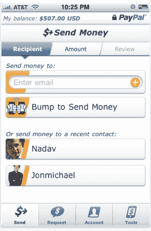

# PayPal 推出改进的 iPhone 应用程序，与 Bump 合作进行电话窃听转账 

> 原文：<https://web.archive.org/web/https://techcrunch.com/2010/03/15/paypal-iphone-app-bump/>

# PayPal 推出改进的 iPhone 应用程序，与 Bump 合作进行电话窃听转账

 [PayPal](https://web.archive.org/web/20221207070810/http://www.paypal.com/) 刚刚推出了一款升级版的 iPhone 应用程序，该程序增加了新功能，包括一个旨在帮助灌输更大安全感的改版。这也为 Bump Technologies 带来了重大消息，Bump Technologies 是一家初创公司，让你只需轻敲智能手机就可以交换信息:Bump 现在是 PayPal iPhone 应用程序中的一个突出功能，作为一种快速启动交易的方式。你可以在这里下载免费应用[。](https://web.archive.org/web/20221207070810/http://itunes.apple.com/us/app/paypal/id283646709?mt=8)

自从 2008 年年中 App Store 推出以来，PayPal 已经为 iPhone 提供了一个免费的应用程序，并且随着时间的推移，它已经在逐渐改进。今天的版本带来了一些重要的新功能。首先，它现在允许你向你的联系人发送汇款请求(本质上是一张账单)。其次，你现在可以从你的 PayPal 账户中取钱，存入你的银行账户。还有 Bump 集成，允许你只需轻按两部 iPhones 并输入交易金额就可以换钱——最后，这是一种从那些似乎总是没有现金的朋友那里收钱的简单方法。

PayPal 应用程序包括一些更小的新功能。现在有一个集成的小费计算器和账单分离器，以及一个提醒功能，当你需要汇款或取款时会提醒你。该应用程序现在集成了“PayPal For Kids”程序，允许儿童和青少年访问与他们父母的账户关联的 PayPal 子账户。

PayPal 的 iPhone 应用只是该公司移动战略的一个组成部分。去年春天，它与 RIM 合作推出了黑莓应用程序世界商店，还整合了易贝的移动应用程序。iPhone 开发者可以使用 PayPal 库轻松集成 PayPal 功能。除了 iPhone 应用程序，它还为 Android 和 RIM 手机提供原生 PayPal 应用程序(该公司计划在未来几个月的新 iPhone 发布中加快这些应用程序的速度)。

对于 Bump 来说，这显然也是一个非常大的消息，Bump 仍然是一家年轻的初创公司(该公司[参与了 Y Combinator 的](https://web.archive.org/web/20221207070810/https://beta.techcrunch.com/2009/07/08/y-combinator-endorses-bump-technologies-in-the-quest-to-destroy-the-business-card/)，并于去年秋天获得了红杉的[投资)。Bump 和 PayPal 拒绝透露合作的细节。](https://web.archive.org/web/20221207070810/https://beta.techcrunch.com/2009/10/24/sequoia-capital-invests-in-bump-technologies-the-iphone-tapping-data-swap-app/)