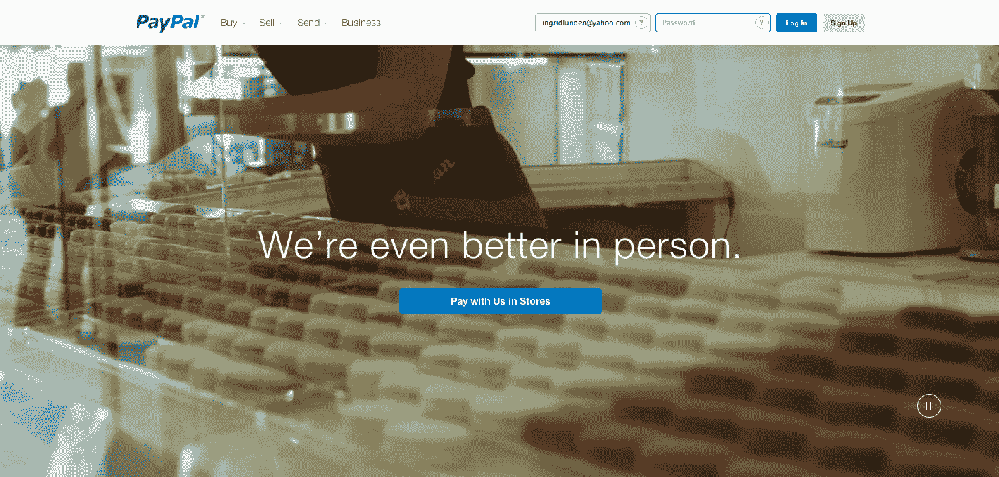
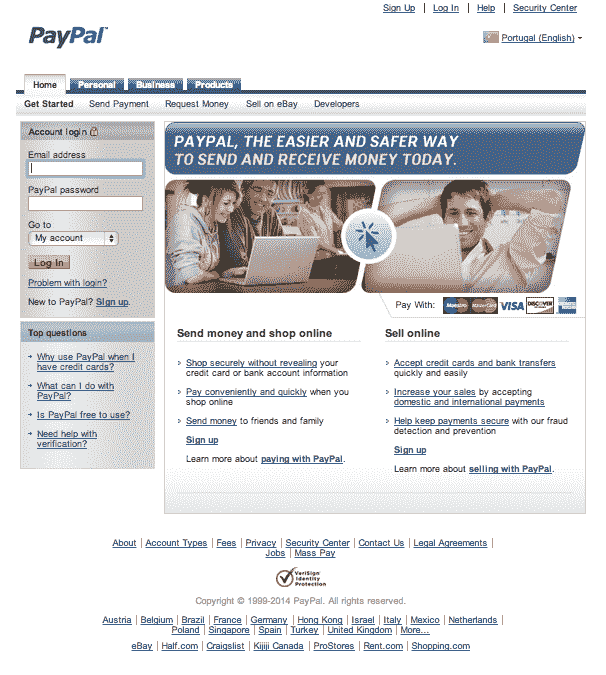

# PayPal 在全球推出新的“移动优先”网站 TechCrunch

> 原文：<https://web.archive.org/web/https://techcrunch.com/2014/03/08/paypal-is-rolling-out-its-new-mobile-first-website-globally-with-less-words-more-images/>

易贝旗下的在线支付平台 PayPal 2013 年为其 T2 160 亿美元的收入贡献了约 40%的份额，该公司开启了一个重新设计的网站——这是迄今为止最大的一次尝试，将一个古老的网络服务(成立于 1998 年)赋予现代、简化的面貌；并向用户介绍一些新功能，如移动支付和实体店支付，该公司希望这些功能能够迅速发展。

上个月[首次公布了这个设计](https://web.archive.org/web/20221007041318/https://www.paypal-forward.com/leadership/introducing-the-new-paypal.com/)，但是关于页面外观的细节却很少。现在，美国、英国和法国等国家的用户可以自己看了。

在第一次到达时，网站访问者会发现一个更简单的“前门”,这是一个全屏的 15 秒钟的无声视频剪辑，随着每次访问(或每次刷新)而变化。这个视频以一种非常熟悉的方式表现得很流畅，让人想起脸书过去用来宣传其 Android launcher Home 的视频，以及无数其他应用程序的主页。在无声视频的中间是一个单独的行动号召(“现在就汇款”等)。).一个例子如上所示，另一个例子如下:

PayPal 全球品牌副总裁克里斯蒂娜·史沫特莱(Christina Smedley)表示，去掉大部分文字的想法是为了让整个体验更加“移动优先”。除了视频之外，触摸屏友好的滚动也是如此，它在页面下方进一步介绍其他服务。同样，这是轻文本，重图像。

(是的，对于那些不是第一次访问 PayPal 或者并不真正关心新歌曲和舞蹈的人来说，你仍然可以在顶部找到一个简单、实用的标签列表，直接带你到网站上的不同操作，向人付款、要钱等等。)

这已经不是 PayPal 最近第一次对其网站进行美学更新了。(例如，它在 2012 年制造了另一个[。)但随着公司在新总裁大卫马库斯(David Marcus)领导下的大方向，你会感觉到它试图加快迭代和跟上时代的步伐。](https://web.archive.org/web/20221007041318/https://beta.techcrunch.com/2012/06/19/a-redesigned-slicker-paypal-is-coming-tomorrow-some-seeing-new-look-today/)

随着激进投资者卡尔·伊坎(Carl Icahn)一直在制造的所有噪音，主张易贝剥离其贝宝支付部门，这种加速和增长在这个电子商务巨头的羽翼下可能会变得更加紧迫。

除了触摸屏的友好性，网站的这一轮更新最重要的可能是它是更广泛的改革的一部分，包括前端和后端，以及更深入的 PayPal 内部的具体服务。

史沫特莱写道:“想象一下，这是我们通向贝宝的新‘大门’，随着时间的推移，后面的页面也将反映我们的新方法。”“因此，尽管主页和更多内容将有新的外观和感觉，但我们会继续剔除那些不能反映我们想要带给您的最佳内容的旧内容。更多的来了。”她没有提到 StackMob，PayPal 在 2013 年 12 月收购的移动后端服务提供商，但你不得不怀疑这是否正是他们发挥作用的地方。

~~一位读者[向我们展示了一些新功能的](https://web.archive.org/web/20221007041318/https://twitter.com/dbl/status/442337374270652417)之旅，这些新功能不会出现在网站的桌面版本中，但可以通过[这个链接](https://web.archive.org/web/20221007041318/https://www.paypal.com/webapps/mpp/new-features-tour#tour-overview)访问。它解释了一个新的界面，用于管理您的 PayPal 余额、通知、最近的交易和在宽限期内购买的物品。PayPal 指出，这些都不是新功能。)~~

但很可能还会有更多。我已经看到 PayPal 的[承诺](https://web.archive.org/web/20221007041318/http://www.forbes.com/sites/stevenbertoni/2014/02/07/can-a-facelift-make-paypal-friendlier/)改善第三方商业网站的用户体验——例如，不必再去新的 PayPal 窗口付款(可能是对 Stripe 等新进入者非常简化的用户界面的回应)。但就在今天早些时候，我不得不通过 PayPal 支付一些东西，尽管我可以在英国看到 PayPal 的新界面，但商家体验的外观和行为一如既往地受到传统的束缚。

看来我不是唯一注意到这一点的人。

不过，这也指向了另一个问题。鉴于第三方商家在自己的网站上广泛使用 PayPal，更新将不仅涉及 PayPal，还试图让数以千计的合作伙伴加入进来。

PayPal 在 2 月份指出，它最终将在其所有 194 个市场推出新的外观，但并非所有国家都看到了新的外观。以[葡萄牙](https://web.archive.org/web/20221007041318/https://www.paypal.com/pt)为例——提醒所有用户不久前登录 PayPal 时会得到什么。

