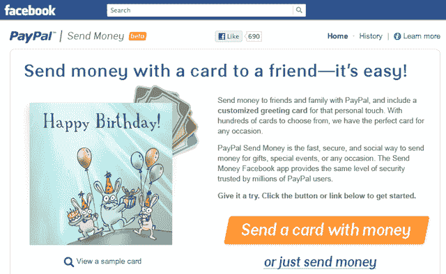

# PayPal 的汇款应用，以及为什么脸书从未建立 P2P 信用支付 TechCrunch

> 原文：<https://web.archive.org/web/http://techcrunch.com/2011/11/17/paypal-p2p-credits/>

PayPal 今天重新发布了一款点对点支付脸书应用，一些新闻媒体将其误解为两家公司之间的合作。我已经和脸书确认过了。这只是平台上的一个标准应用程序，脸书无法阻止 PayPal。但为什么脸书没有建立自己的方式，让朋友们使用虚拟货币信用互相汇款呢？因为它有很大的欺诈风险，而且它专注于让信用更好地为虚拟商品购买服务，在虚拟商品购买中它赚取 30%的利润。

送钱的第一个化身是 2009 年 12 月推出的。它可以让你通过信用卡或你的贝宝账户支付给朋友。新的是，你现在也可以选择包括一个数字贺卡，有利于在生日和其他节日寄钱。该应用程序需要的唯一脸书数据是你的朋友列表，即使这样，你仍然需要在转移资金之前找到付款接收人的电子邮件地址。Send Money 没有与脸书自己的支付系统集成，不需要任何秘密数据或 API，我听说它甚至不是内置在 PayPal 中的。

脸书有自己的支付系统，让用户通过信用卡、贝宝和其他方式付款，换取虚拟货币信用。用户在社交游戏中花费积分来增加能量或延长游戏时间，开发者将这些积分兑换成其价值的 70%，而脸书保留其 30%的税收。

信用点数只能在游戏和应用程序中使用，而不能发送给其他用户的主要原因是欺诈。用户可以通过多种方式赚取积分，而不是支付积分，例如完成现场优惠，或者通过像 [ifeelgoods](https://web.archive.org/web/20230205020332/https://techcrunch.com/2010/09/20/ifeelgoods/) 这样的公司进行积分奖励的场外购买。如果用户可以将积分转让给其他人，那么“积分矿工”的职业就会出现。这些人会想尽一切办法赚取积分，然后以高于他们的成本但低于脸书的价格卖给其他人。这将从本质上创造一个信贷二级市场，削弱脸书利用信贷赚钱的能力。

P2P 信用转移也会让用户成为黑客更有利可图的目标。有人可以窃取您的帐户信息，将您现有的信用余额转储到他们自己的帐户中，甚至以您的名义购买更多的信用并发送给他们自己。当脸书最初开发信贷时，它正确地认定，通过禁止 P2P 转账，它可以显著降低欺诈风险。

P2P 支付没有信用的另一个主要原因是，由于开发者生态系统政治、长期货币化和脸书精益创业风格的混合，这不是脸书的重点。脸书和贝宝关系密切。他们是战略合作伙伴，PayPal 帮助社交网络处理信用购买，PayPal 的创始人彼得·泰尔是脸书的早期投资者和顾问。转向 P2P 支付可能会破坏这种合作关系，并导致 PayPal 不再作为一种信用购买方式。

为了具有竞争力，脸书只能收取交易的百分之几，但它仍然没有通过易贝培养的商家贝宝的基础。相反，脸书正专注于将积分作为其平台对开发者的强制性虚拟商品支付处理器，并从中赚取丰厚的 30%的分成。由于 Zynga 这样的游戏巨头，这项业务正在增长，所以没有必要进入 P2P 支付这样的风险行业，因为它超出了核心竞争力，由现有公司主导。

脸书仍是一家相对较小的公司。它需要其信用团队优化支付流程，培养合作伙伴关系，以挤占虚拟商品市场。它还需要作为一个更好的应用支付处理器来赚钱，更多的内容公司通过它来销售数字媒体，如电影租赁。

目前，脸书根本没有资源将注意力转移到 P2P 支付上，而且没有迹象表明这种需求没有被贝宝在场外满足，即使送钱应用程序不存在。有一天，这种情况可能会改变，特别是如果社交电子商务起飞，允许使用信用从经批准的商家购买实物商品。就目前而言，脸书在 P2P 支付方面做出了与它在虚拟礼物、社交游戏、音乐和品牌管理方面相同的明智选择——将它交给第三方，专注于改善其核心基础设施。

