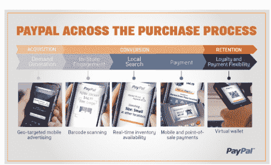

# PayPal 将为商家推出新的支付平台，将包括基于位置的优惠等 

> 原文：<https://web.archive.org/web/https://techcrunch.com/2011/09/14/paypal-to-unveil-new-payments-platform-for-merchants-will-include-location-based-offers-and-more/>

# PayPal 将为商家推出新的支付平台，将包括基于位置的优惠等

PayPal 今天在洛杉机举办了一场活动，让商户们提前了解这家易贝支付巨头的新技术。正如首席执行官斯科特·汤普森在博客文章中所说， *PayPal 正在重新想象金钱，让它更好地为商家和消费者服务——无论你在什么设备上，无论你在世界的什么地方，无论你喜欢什么支付方式(无论是现金、信用卡还是分期付款)。*

该公司表示，将为在线和本地商家推出一站式商店，以管理客户的支付。具体细节尚不清楚，但 PayPal 表示，新功能将包括基于位置的服务，使任何设备都可以进行支付，并在顾客结账后为他们提供更大的支付灵活性。

因此，在这篇文章的视频中，你可以看到 PayPal 将允许当地企业使用扫描技术和二维码，通过客户的移动设备接受 PayPal 支付。今年早些时候，易贝首席执行官约翰·多纳霍[提到了 PayPal 的店内体验](https://web.archive.org/web/20230203161807/https://techcrunch.com/2011/07/20/ebay-beats-the-street-revenue-up-25-percent-to-2-8b-paypal-posts-first-1b-quarter/)。你也可以在商店的实体支付网关中使用 PayPal(通常你会在这里完成信用卡刷卡过程)。

用户将能够访问实时商店库存，接收店内报价，以及来自商店的实时位置广告。

PayPal 全球产品和体验副总裁 Sam Shrauger 告诉我们，这个新平台不仅仅是支付。这些服务将允许商家和消费者更好地联系，从搜索过程到购买后的时间段。

他解释说，国内和国际商家已经集成了这个平台，到明年将有 20 家商家使用这个平台。

[YouTube http://www.youtube.com/watch?v=V7q1jx8mYi8&w=560&h=345]