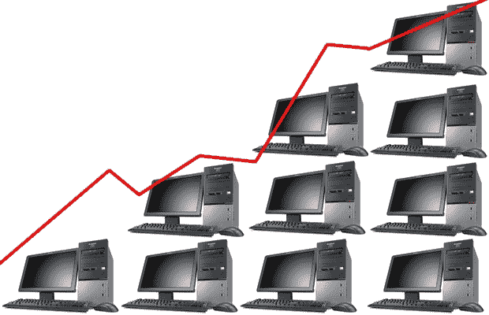
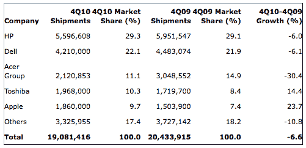

# PC 出货量有所回升；苹果公司在美国的股票暴涨

> 原文：<https://web.archive.org/web/https://techcrunch.com/2011/01/12/pc-shipments-recover-somewhat-apple-share-jumps-in-u-s/>

研究集团 Gartner[发布了全球和美国电脑出货量的最新数字](https://web.archive.org/web/20230325065707/http://www.gartner.com/it/page.jsp?id=1519417)，结果和往常一样有趣；也就是说，*有点*。从某些方面来说，2010 年是艰难的一年，尤其是上网本的销售，它在 2008 年极大地推动了个人电脑的销售，在 2009 年也有所下降。平板电脑，或者准确地说是 iPad 和其他平板电脑的承诺已经在廉价个人电脑市场上分了一杯羹，尽管许多人可能会在评论中指出，它们是非常不同的设备。然而，iPad 削弱了上网本的销售，随着平板电脑的成熟，这一趋势可能会加剧。

苹果在美国市场的份额增长相当显著:上个季度，苹果的份额跃升了 23.7%，占美国所有售出电脑的 9.7%。为什么买 MAC 的人越来越多？这是一个比听起来更复杂的问题。

我想对 iPad 给予一些肯定，它可能已经让相当多的人离开了围栏，但与此同时，许多人可能已经购买了 iPad，而不是升级他们目前的 mac。这将需要一项单独的调查来确定是否属实，不幸的是，我没有足够的时间给 iPad 用户打 3000 个随机电话。所以暂时还是个谜，但最终结果是苹果在崛起。

像往常一样，惠普独占鳌头，但它正被联想和东芝所取代，这两家公司似乎正在吞噬所有的新增长。希望惠普 webOS slate 和新的笔记本电脑系列能够说服消费者，从大家伙那里购买是可以的。

明年将是个人电脑制造商的关键一年。平板电脑将越来越多地取代上网本和其他便携式电脑，而存储、媒体、高性能处理等多用途中心将进一步边缘化(尽管它仍然充满活力)。这个市场将变得足够大，足够多样化，跟踪它将不再是跟踪“iPad”和“其他”的问题。平板电脑的总销量至少将达到 2000-3000 万台。

与此同时，英特尔的新 Sandy Bridge 平台和 AMD Fusion APUs 将使超便携电脑和笔记本电脑比去年更具吸引力和实用性，因此您也可以期待这方面的进步。台式机销售，没那么多。至少，这是我的看法。你可以在这里阅读报告并选择你自己的冒险。