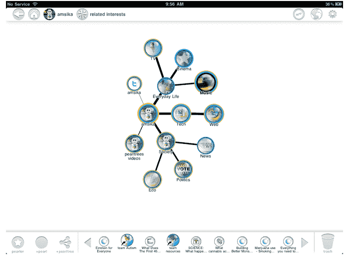

# Pearltrees 为 iPad 带来可视化内容管理和发现平台 

> 原文：<https://web.archive.org/web/http://techcrunch.com/2011/10/11/pearltrees-brings-visual-content-curation-and-discovery-platform-to-the-ipad/>

# Pearltrees 为 iPad 带来了可视化内容管理和发现平台

内容监管和地图服务公司 [Pearltrees](https://web.archive.org/web/20230203081958/http://www.pearltrees.com/) 今天发布了一款专用的 iPad 应用程序，允许用户在平板设备上培养和分享他们的网络兴趣。作为背景，Pearltrees 是一个[视觉社交书签服务](https://web.archive.org/web/20230203081958/http://eu.beta.techcrunch.com/2009/12/09/pearltrees-launches-twitter-sync-and-reveals-its-social-system/)，它允许用户在网络上组织、发现和分享他们喜欢的一切。

内容可以拖放到珍珠树上，该服务将通过一串“珍珠”来组织这些内容，然后可以移动、组织和共享这些内容。自 2009 年 12 月推出以来，Pearltrees 已经收集了超过 1000 万颗珍珠。该公司表示，它一直以每月 15%的平均速度增长，9 月份的访问量超过 50 万次。

考虑到 iPad 的视觉特性，Pearltrees 的创始人 Patrice Lamothe 表示，这款设备是 Pearltrees 的天然家园。通过这些应用，用户可以从网上收集和检索他们喜欢的内容。

该应用程序还包括一个实时协作策展功能，让用户自发地就他们喜欢的话题与其他人合作。你可以访问由 20 多万名活跃的策展人组成的 Pearltrees 社区。

Pearltrees 面临来自 T4 Pinterest 的竞争。

[YouTube http://www.youtube.com/watch?v=7zDkwN-_ySg&w=560&h=315]