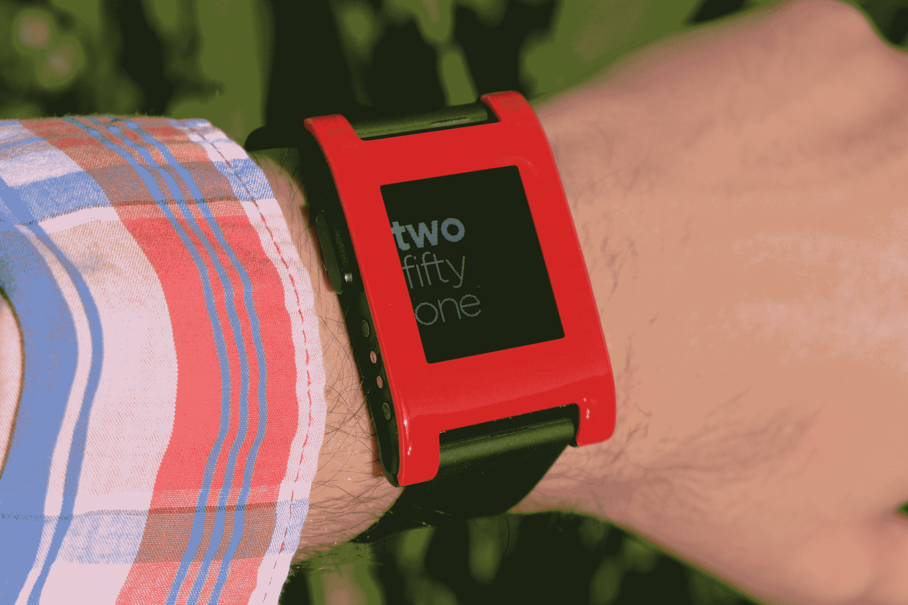

# Pebble 创始人 Eric Migicovsky 没有被三星 Galaxy Gear 和智能手表的竞争所动摇 

> 原文：<https://web.archive.org/web/https://techcrunch.com/2013/09/11/pebble-founder-eric-migicovsky-not-shaken-by-samsung-galaxy-gear-and-smartwatch-competition/>

智能手表初创公司 Pebble 的创始人 Eric Migicovsky 来到 Disrupt，接受了我们的 John Biggs 的采访。他谈到了智能手机巨头三星(Samsung)最近透露的竞争，并谈到了 Pebble 的哪些业务是其他竞争对手不一定明确的，以及为什么他认为他们的方法将继续流行，尽管顶级老牌硬件制造商的兴趣越来越大。

Migicovsky 说，每个人似乎都忽略了 Pebble 一开始就取得成功的原因，这主要与识别可穿戴设备的用例有关。他认为，智能手表应该“流入”用户生活的背景，说服人们戴上智能手表的方法是向他们展示智能手表如何对他们的生活有用，但同时本质上成为一个背景过程，而不是需要你在日常生活中做出重大改变的东西。

当被直接问及竞争对手时，米基科夫斯基很快指出，原始设备制造商多年来一直在生产智能手表，包括三星、LG、索尼、摩托罗拉和许多其他公司。他再次指出，所有这些公司都忽略了人们对智能手表感兴趣的原因——他们希望智能手表能够“融入你的生活”，有较长的电池续航时间，而不是因为害怕弄湿或无意中弄坏它而被溺爱。

米基科夫斯基说，Pebble 的总体愿景是“瘦客户机”。“我们认为你拥有的最好的电脑是放在你口袋里的那台，”他说，指的是我们大多数人现在携带的智能手机。这些手机有很棒的屏幕、触摸输入、3G 和 4G 连接等等。没有必要复制这一点，相反，真正的机会是不仅为那部手机，也为你生活中的其他连接设备建立一个控制设备。他提到了基于手腕的恒温控制，以及与自行车共享终端的连接，并指出 [RunKeeper 集成](https://web.archive.org/web/20221206021849/https://beta.techcrunch.com/2013/05/07/runkeeper-for-pebble-arrives-bringing-run-walk-and-bike-ride-progress-tracking-to-the-smart-watch/ "RunKeeper For Pebble Arrives, Bringing Run, Walk And Bike Ride Progress Tracking To The Smart Watch")是他们如何将 Pebble 融入人们生活的完美例子。

对于那些没有尝试过的人来说，当你启动应用程序并从手机开始跑步时，RunKeeper 的 Pebble 集成取代了屏幕，向你显示行进的距离、速度等。理想情况下，这就是 Pebble 在更广泛的基础上工作的方式，无论何时何地，它都会成为最适合你做任何事情的工具。

这就是为什么当比格斯问他关于 Pebble 2.0，或者下一代设备会是什么样子时，米基科夫斯基表示反对，并说这是你目前戴在手腕上的相同硬件。他认为，软件是 Pebble 的下一个阶段，最终目标是与开发者合作建立生态系统，并帮助 Pebble 与大量传感器和新应用程序合作，成为任何给定环境下更普遍有用的工具。

当比格斯提出一个关于苹果传闻中的 iWatch 的问题时，Migicovsky 也回避了第二次获得下一代硬件细节的尝试。这位 Pebble 创始人不愿猜测 Pebble 可能需要如何改变才能与苹果的可穿戴设备竞争，并重申软件是未来的发展方向。当然，对于一家目前已经上市的设备制造商来说，谈论下一代产品从来都不是一个好政策，但至少在目前，Migicovsky 和 Pebble 似乎都在开发软件生态系统，以探索他们已经建立的产品的全部潜力。

* * *

## 后台采访